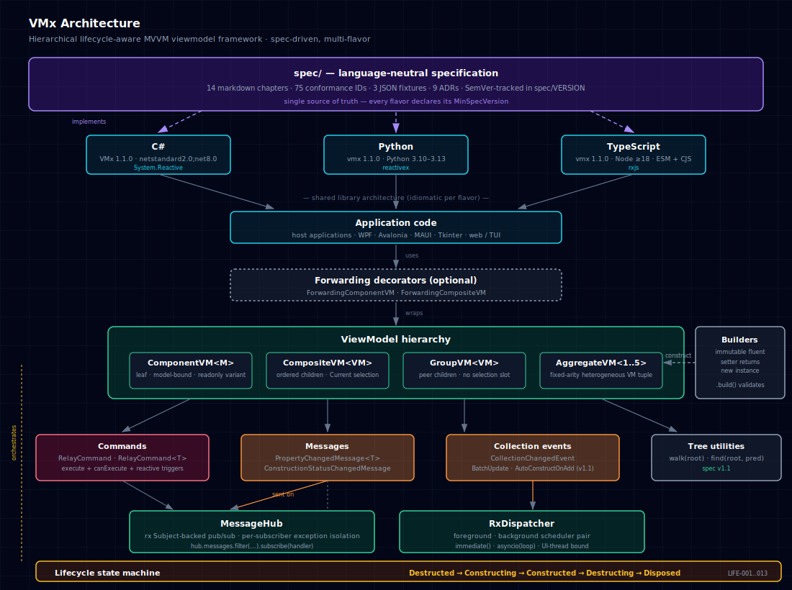
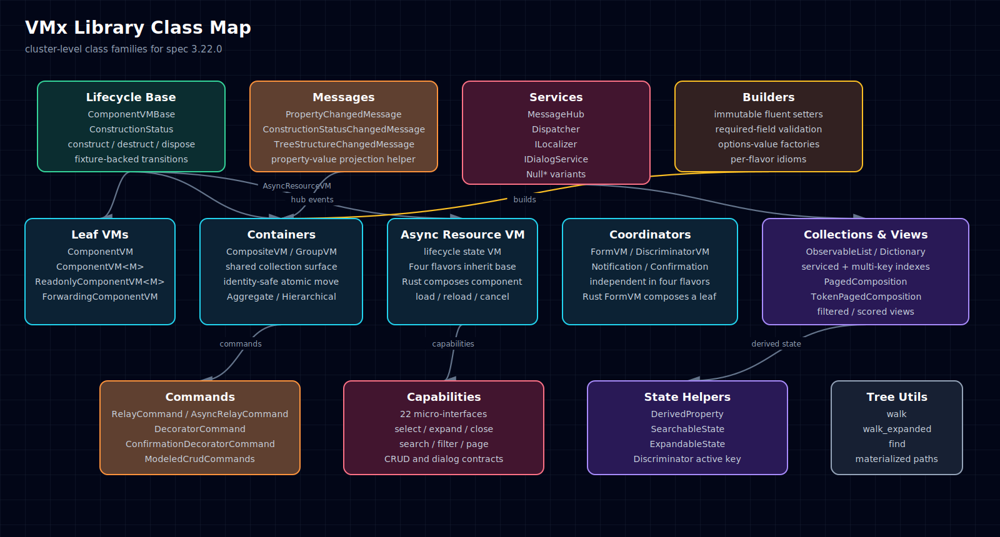

# VMx

[](https://github.com/thekaveh/VMx/actions/workflows/csharp.yml)
[](https://github.com/thekaveh/VMx/actions/workflows/python.yml)
[](https://github.com/thekaveh/VMx/actions/workflows/typescript.yml)
[](https://github.com/thekaveh/VMx/actions/workflows/swift.yml)
[](https://github.com/thekaveh/VMx/actions/workflows/conformance.yml)
[](https://github.com/thekaveh/VMx/actions/workflows/spec-discipline.yml)
[](https://github.com/thekaveh/VMx/actions/workflows/examples-contract-checks.yml)
[](https://github.com/thekaveh/VMx/actions/workflows/release.yml)
[](LICENSE)

A hierarchical, lifecycle-aware MVVM viewmodel framework — one language-neutral
specification, four idiomatic language flavors (C# / Python / TypeScript at full
parity; Swift as a subset), 236 library conformance IDs verified on every commit
(plus 5 THEME scenario IDs exercised by the example-app suites).

## Contents

1. [Overview](#1-overview)
2. [Architecture](#2-architecture)
   - 2.1 [Architecture diagram](#21-architecture-diagram)
   - 2.2 [Class diagram](#22-class-diagram)
   - 2.3 [Layers](#23-layers)
3. [Flavors](#3-flavors)
   - 3.1 [Versions and packages](#31-versions-and-packages)
   - 3.2 [Spec ↔ flavor compatibility](#32-spec--flavor-compatibility)
4. [Getting started](#4-getting-started)
   - 4.1 [Install](#41-install)
   - 4.2 [Quickstart guides](#42-quickstart-guides)
   - 4.3 [Examples](#43-examples)
5. [Repository layout](#5-repository-layout)
   - 5.1 [Documentation map](#51-documentation-map)
6. [Versioning and conformance](#6-versioning-and-conformance)
   - 6.1 [SemVer policy](#61-semver-policy)
   - 6.2 [Conformance catalog](#62-conformance-catalog)
7. [Contributing](#7-contributing)
8. [License](#8-license)

## 1. Overview

VMx is a framework for building MVVM viewmodels with explicit lifecycle and
reactive messaging. It targets WPF / Avalonia / MAUI on .NET, Tkinter / PyQt /
NiceGUI / Textual on Python, and any DOM- or rxjs-based UI on TypeScript — but
makes no assumption about the UI layer. Every flavor exposes:

- A five-state construction lifecycle (`Destructed`, `Constructing`,
  `Constructed`, `Destructing`, plus terminal `Disposed`) with reversible
  `construct`/`destruct`, `reconstruct()`, and a synchronous depth-first
  `dispose()` cascade that can be invoked from any state.
- A reactive message hub for `PropertyChangedMessage` and
  `ConstructionStatusChangedMessage`, plus collection-change events on
  container VMs.
- Four hierarchy primitives — leaf `ComponentVM`, selectable `CompositeVM`,
  peer `GroupVM`, fixed-arity `AggregateVM1..6` — plus forwarding decorators
  for instrumentation.
- A `RelayCommand` with reactive `canExecute` triggers, plus v2.0 decorators
  (`CompositeCommand`, `DecoratorCommand`, `ConfirmationDecoratorCommand`)
  and a modeled-CRUD helper (`ModeledCrudCommands`).
- Tree utilities (`walk`, `find`, `walk_expanded`) for introspection.
- 22 opt-in capability micro-interfaces (`ISelectable`, `IExpandable`,
  `IClosable`, `IFilterable`, `IPageable`, …) and helper state classes
  (`ExpandableState`, `SearchableState`) for layering behaviour onto VMs
  additively.
- `DerivedProperty<T>` for N-source computed values, an opt-in notification
  sub-package (`INotificationHub`), null-object service variants
  (`NullMessageHub`, `NullDispatcher`, `NullNotificationHub`,
  `NullLocalizer`), and an `ILocalizer` hook for i18n.

The shape is identical across flavors; only the surface idiom changes
(PascalCase in C#, snake_case in Python, camelCase in TypeScript — codified in
ADR-0006).

## 2. Architecture

### 2.1 Architecture diagram



The diagram source is at [`assets/architecture.svg`](assets/architecture.svg);
a browsable HTML version with summary cards is at
[`assets/architecture.html`](assets/architecture.html).

### 2.2 Class diagram

A cluster-level class map of the entire library — what every class family is, and how the families relate.



The diagram source is at [`assets/class-diagram.svg`](assets/class-diagram.svg);
a browsable HTML version with summary cards is at
[`assets/class-diagram.html`](assets/class-diagram.html). Five bands:

1. **Lifecycle base** — `ComponentVMBase` + `ConstructionStatus`; every VM derives from here.
2. **VM family** — five idioms: leaf, composite (homogeneous + selectable), group (homogeneous peers), aggregate (heterogeneous, fixed arity 1..6), and specialized (`FormVM`, `NotificationVM`, `ConfirmationVM`, forwarding decorators).
3. **Commands & capabilities** — `RelayCommand` family + `DecoratorCommand` chain + `ModeledCrudCommands`, alongside the 22 capability micro-interfaces (Selection / Expansion / Lifecycle / Query / Dialog / CRUD).
4. **Services · Messages · State · Collections** — the constructor-injected runtime (`MessageHub`, `Dispatcher`, `ILocalizer`, `IDialogService` — each with its `Null*` sibling per ADR-0017), hub envelope types, v2.0+v2.1 state helpers (`SearchableState`, `ExpandableState`, `DerivedProperty`), v2.1 observable collections, fluent immutable builders, and tree utilities.
5. **Notifications sub-package (opt-in)** — `INotificationHub`, `ConfirmHelper`, bridged to `ConfirmationDecoratorCommand` in band 3 and to `NotificationVM` / `ConfirmationVM` in band 2.

Boxes are cluster-level (one box per related set of classes); the exhaustive member list lives in the linked spec chapters + ADRs.

### 2.3 Layers

Each flavor implements the same conceptual stack:

- **Spec** — `spec/` is the source of truth: 22 markdown chapters, 55 ADRs,
  4 JSON fixtures, 241 conformance IDs, version pinned in `spec/VERSION`.
- **Application code** — your host app instantiates VMs through builders.
- **Forwarding decorators** *(optional)* — `ForwardingComponentVM` and
  `ForwardingCompositeVM` wrap an inner VM for instrumentation, selective
  override, or composition.
- **Viewmodel hierarchy** — `ComponentVM<M>`, `CompositeVM<VM>`,
  `GroupVM<VM>`, `AggregateVM1..6`.
- **Commands** — `RelayCommand` and `RelayCommand<T>` with `execute`,
  `canExecute`, and reactive trigger observables.
- **Messages and collection events** — `PropertyChangedMessage`,
  `ConstructionStatusChangedMessage`, `CollectionChangedEvent` with
  `BatchUpdate()` and `AutoConstructOnAdd` options.
- **Tree utilities** — `walk(root)`, `walk_expanded(root)`, and
  `find(root, predicate)` over any VM hierarchy.
- **Services** — `MessageHub` (rx Subject-backed pub/sub) and
  `RxDispatcher` (paired foreground / background schedulers).
- **Lifecycle state machine** — orchestrates every VM; transitions enforced
  by a fixture-backed validator (`spec/fixtures/lifecycle-transitions.json`).
- **Builders** — immutable fluent setters that return new instances and
  validate required fields on `build()`.

## 3. Flavors

### 3.1 Versions and packages

| Flavor     | Package                                                              | Status            | Reactive primitive |
| ---------- | -------------------------------------------------------------------- | ----------------- | ------------------ |
| C#         | [`VMx`](https://www.nuget.org/packages/VMx/) on NuGet                | v2.6.0            | System.Reactive    |
| Python     | [`vmx`](https://pypi.org/project/vmx/) on PyPI                       | v2.6.1            | reactivex          |
| TypeScript | [`@thekaveh/vmx`](https://www.npmjs.com/package/@thekaveh/vmx) on npm | v2.6.0            | rxjs               |
| Swift      | `VMx` Swift Package (skeleton, not yet published)                    | v2.6.0 *(subset)* | Combine            |

The **Swift flavor is a skeleton subset** (41 of 241 conformance IDs as
of v2.6.0), covering the lifecycle + leaf / composite / group / aggregate
viewmodel families plus builders and commands. Full
cross-flavor conformance parity
lands in a follow-up release. See
[`langs/swift/README.md`](langs/swift/README.md) §5 for the
in / deferred matrix. The C# flavor multi-targets `netstandard2.0` and
`net8.0` and ships two companion assemblies:
[`VMx.Extensions.DependencyInjection`](https://www.nuget.org/packages/VMx.Extensions.DependencyInjection/)
(`services.AddVMx(...)`) and
[`VMx.Notifications`](https://www.nuget.org/packages/VMx.Notifications/) (opt-in
`INotificationHub`). The Python flavor supports Python 3.10 through 3.13,
is `mypy --strict` clean, and exposes `vmx.notifications` as an opt-in
subpackage. The TypeScript flavor (npm package `@thekaveh/vmx` — renamed
in v2.4.0 because the unscoped `vmx` name was unavailable) targets Node
≥20, emits dual ESM + CJS bundles, and exposes `@thekaveh/vmx/notifications`
as a sub-path export.

### 3.2 Spec ↔ flavor compatibility

| spec  | csharp         | python         | typescript     | swift          |
| ----- | -------------- | -------------- | -------------- | -------------- |
| 2.6.x | 2.6.0          | 2.6.1          | 2.6.0          | 2.6.0 (subset) |
| 2.4.x | 2.4.0          | 2.4.0          | 2.4.0          | 2.4.0 (subset) |
| 2.3.x | 2.3.0          | 2.3.0          | 2.3.0          | —              |
| 2.2.x | 2.2.0          | 2.2.0          | 2.2.0          | —              |
| 2.1.x | 2.1.0          | 2.1.0          | 2.1.0          | —              |
| 2.0.x | 2.0.0          | 2.0.0          | 2.0.0          | —              |
| 1.0.x | 1.0.0          | 1.0.0          | —              | —              |

See [`compatibility-matrix.md`](compatibility-matrix.md) for the full table.
Every published package declares its `MinSpecVersion` /
`__min_spec_version__` so the runtime can verify compatibility.

## 4. Getting started

### 4.1 Install

```bash
# C#
dotnet add package VMx

# Python
pip install vmx
# or
uv add vmx

# TypeScript — note the scoped package name (renamed from `vmx` in v2.4.0)
npm install @thekaveh/vmx rxjs
```

### 4.2 Quickstart guides

- [`docs/getting-started/csharp.md`](docs/getting-started/csharp.md) — build a
  modeled `ComponentVM<UserModel>`, wire a `RelayCommand`, manage a
  `CompositeVM<TabVM>`.
- [`docs/getting-started/python.md`](docs/getting-started/python.md) — same
  shape, snake_case API, immediate / asyncio dispatchers.
- [`docs/getting-started/typescript.md`](docs/getting-started/typescript.md) —
  camelCase API, ESM imports, rxjs-backed observables.
- [`docs/getting-started/swift.md`](docs/getting-started/swift.md) —
  camelCase API, Combine-backed publishers, SwiftPM install (Swift flavor
  ships as a v2.6.0 subset; see `langs/swift/README.md` §5).

### 4.3 Examples

The three **flagship Notes Workspace** apps — one per language flavor, one
per UI framework — implement the same scenario from a single language-neutral
VM API surface, exercising **16 distinct VMx features** (notebooks tree,
paged + filterable notes list, FormVM editor, capability-aware action bar,
notifications, async lifecycle, dialogs, `AggregateVM6` root, and the
v2.4.0 `ThemeVM` scenario contract). See
[`examples/notes-showcase-parity.md`](examples/notes-showcase-parity.md) for
the cross-flavor feature matrix and
[`spec/proposals/2026-05-29-notes-showcase-scenario.md`](spec/proposals/2026-05-29-notes-showcase-scenario.md)
for the canonical scenario contract.

- [`examples/csharp/avalonia/NotesShowcase/`](examples/csharp/avalonia/NotesShowcase/)
  — Notes Workspace flagship on Avalonia 11 + .NET 8 (cross-platform XAML).
  Run: `dotnet run --project examples/csharp/avalonia/NotesShowcase`.
- [`examples/python/textual/notes_showcase/`](examples/python/textual/notes_showcase/)
  — Notes Workspace flagship on Textual ≥ 0.80 (TUI). Run:
  `uv run --project examples/python/textual/notes_showcase python -m notes_showcase`.
- [`examples/typescript/react/notes-showcase/`](examples/typescript/react/notes-showcase/)
  — Notes Workspace flagship on React 18 + Vite. Run: `npm install && npm run dev`
  from the example dir; production bundle via `npm run build`.

Smaller per-flavor demos:

- [`examples/csharp/console/HelloVMx/`](examples/csharp/console/HelloVMx/) — console.
- [`examples/csharp/wpf/TodoApp/`](examples/csharp/wpf/TodoApp/) — WPF + MVVM
  (Windows only).
- [`examples/python/console/hello_vmx/`](examples/python/console/hello_vmx/) — console.
- [`examples/python/tk/todo_app/`](examples/python/tk/todo_app/) — Tkinter
  MVVM.
- [`examples/python/textual/inspector/`](examples/python/textual/inspector/) —
  Textual TUI inspector that introspects any VMx tree using
  `vmx.tree.walk`.
- [`examples/typescript/console/hello-vmx/`](examples/typescript/console/hello-vmx/) — minimal
  Node script.

## 5. Repository layout

```
.
├── spec/                  language-neutral specification (source of truth)
│   ├── 00-overview.md ... 21-collections.md   (22 chapters)
│   ├── ADRs/              architecture decision records (0001..0052)
│   ├── fixtures/          JSON test inputs shared across flavors
│   ├── proposals/         historical planning artifacts (not part of published docs)
│   └── VERSION            spec SemVer
├── langs/
│   ├── csharp/            VMx (NuGet) + VMx.Extensions.DependencyInjection + VMx.Notifications
│   ├── python/            vmx (PyPI)
│   ├── typescript/        @thekaveh/vmx (npm)
│   └── swift/             VMx Swift Package (skeleton, v2.6.0)
├── examples/              runnable example apps per flavor
├── docs/getting-started/  per-flavor quickstart tutorials
├── docs/integration/      one-page UI-framework integration recipes
├── tools/                 cross-cutting scripts (conformance coverage)
├── assets/                architecture + class diagrams, notes-showcase assets
├── .github/               issue/PR templates + CI workflows
└── compatibility-matrix.md
```

### 5.1 Documentation map

This README is the entry point; the documents below add focused detail.

- [`CONTRIBUTING.md`](CONTRIBUTING.md) — spec / ADR / conformance workflow,
  per-flavor build commands, pre-commit setup. Read before opening a PR.
- [`SECURITY.md`](SECURITY.md) — supported-version table and how to report
  vulnerabilities.
- [`CODE_OF_CONDUCT.md`](CODE_OF_CONDUCT.md) — Contributor-Covenant
  community guidelines.
- [`compatibility-matrix.md`](compatibility-matrix.md) — spec ↔ flavor
  version pairing.
- [`spec/README.md`](spec/README.md) — index of the 22 chapters, 55 ADRs,
  4 fixtures, and the 241-ID conformance catalog.
- [`spec/ADRs/README.md`](spec/ADRs/README.md) — ADR catalogue index.
- Per-flavor READMEs (status, install, API surface, dev commands):
  [`langs/csharp/README.md`](langs/csharp/README.md),
  [`langs/python/README.md`](langs/python/README.md),
  [`langs/typescript/README.md`](langs/typescript/README.md),
  [`langs/swift/README.md`](langs/swift/README.md) (subset, v2.6.0).
- Per-flavor CHANGELOGs (release history):
  [`langs/csharp/CHANGELOG.md`](langs/csharp/CHANGELOG.md),
  [`langs/python/CHANGELOG.md`](langs/python/CHANGELOG.md),
  [`langs/typescript/CHANGELOG.md`](langs/typescript/CHANGELOG.md),
  [`langs/swift/CHANGELOG.md`](langs/swift/CHANGELOG.md).
- Per-flavor release runbooks:
  [`langs/python/RELEASING.md`](langs/python/RELEASING.md) — PyPI release
  pipeline (`python-test` matrix gate → `pypi-python` environment approval →
  Trusted-Publishing-via-OIDC upload with Sigstore (PEP 740) attestations →
  `python-verify-published` fresh-venv smoke test → `python-release-notes`
  CHANGELOG-extracted GitHub Release). release-please automates routine
  version bumps + CHANGELOG entries via Conventional Commits. Other-flavor
  runbooks land as their pipelines are uplifted.
- Per-flavor getting-started tutorials (longer walkthroughs):
  [`docs/getting-started/csharp.md`](docs/getting-started/csharp.md),
  [`docs/getting-started/python.md`](docs/getting-started/python.md),
  [`docs/getting-started/typescript.md`](docs/getting-started/typescript.md),
  [`docs/getting-started/swift.md`](docs/getting-started/swift.md).
- Per-flavor examples READMEs (run instructions):
  [`examples/csharp/README.md`](examples/csharp/README.md),
  [`examples/python/README.md`](examples/python/README.md),
  [`examples/typescript/README.md`](examples/typescript/README.md).
- [`examples/notes-showcase-parity.md`](examples/notes-showcase-parity.md) —
  cross-flavor parity matrix for the three flagship Notes-Showcase apps
  (Avalonia / Textual / React); 16 spec features × 3 flavors.
- [`docs/integration/README.md`](docs/integration/README.md) — one-page
  integration recipes for 11 UI frameworks (WPF, MAUI, Avalonia, Textual,
  NiceGUI, Tkinter, React, Vue, Svelte, SolidJS, SwiftUI). Each recipe
  shows the framework-native binding + lifecycle + dispose pattern.
- [`tools/README.md`](tools/README.md) — conformance-coverage tool and
  cross-cutting scripts.

## 6. Versioning and conformance

### 6.1 SemVer policy

Each language flavor versions independently in SemVer. The spec also versions
independently in SemVer. Every published package declares the spec version it
implements (`MinSpecVersion` in C#, `__min_spec_version__` in Python,
`__minSpecVersion__` in TypeScript). A spec major bump triggers a major bump
in every active flavor; a spec minor bump (like v2.1.0) is fully backwards
compatible and ships in flavors as a minor bump.

### 6.2 Conformance catalog

`spec/12-conformance.md` enumerates 241 normative test scenarios keyed by ID
(`LIFE-001`, `HUB-007`, `COMP-013`, `UTIL-002`, `CAP-020`, `DPROP-012`,
`NOTIF-010`, `DIA-001`, `FORM-001`, `COL-001`, `HIER-001`, `AGG-006`,
`THEME-001`, …). Every flavor at full parity (C# / Python / TypeScript)
re-implements the catalog under `langs/<flavor>/tests/conformance/`, and
`tools/check-conformance-coverage.py` enforces 100% coverage in CI. The
Swift flavor implements a documented 41-ID subset as of v2.6.0
(see [`langs/swift/README.md`](langs/swift/README.md) §5).

```bash
# Verify all three flavors are at full coverage
uv run --project langs/python python tools/check-conformance-coverage.py \
    --require csharp --require python --require typescript
```

## 7. Contributing

See [`CONTRIBUTING.md`](CONTRIBUTING.md) for the spec / ADR / conformance
workflow and per-flavor build instructions. The repository uses pre-commit
hooks (ruff, mdformat, dotnet format, eslint); install them with
`pre-commit install`.

## 8. License

Apache-2.0 — see [`LICENSE`](LICENSE) and [`NOTICE`](NOTICE).
