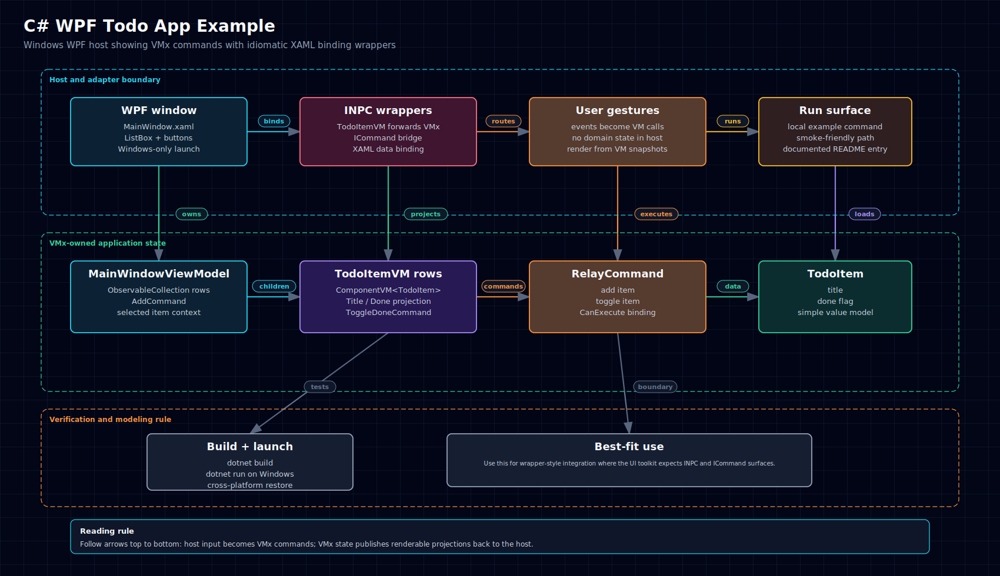
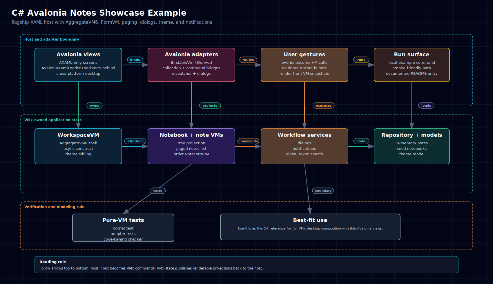
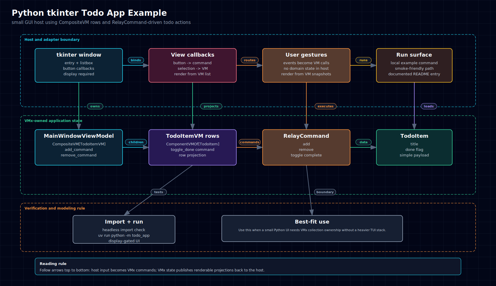
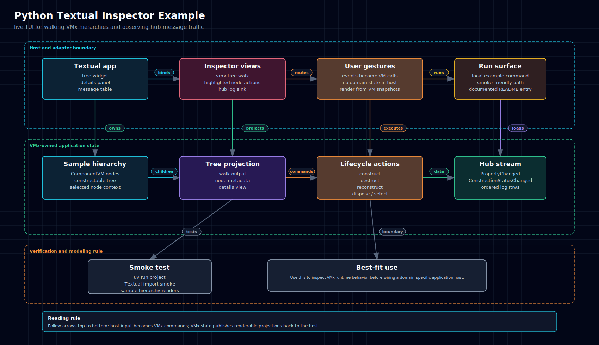
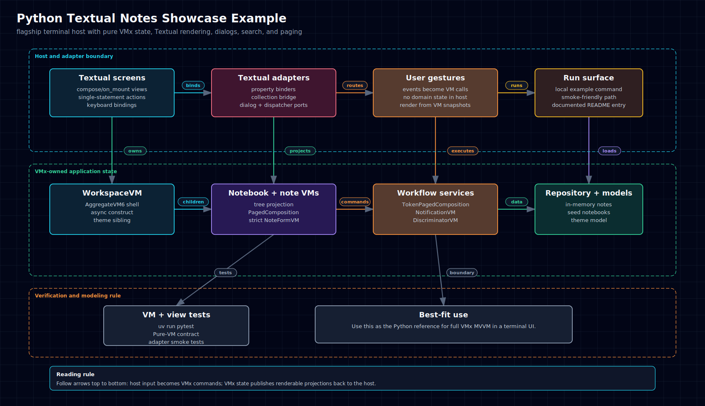
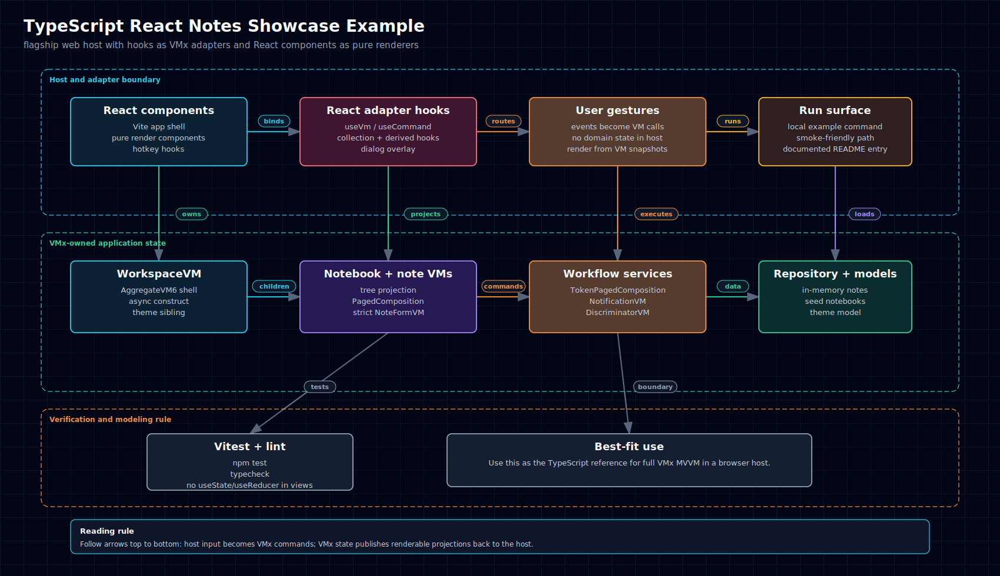
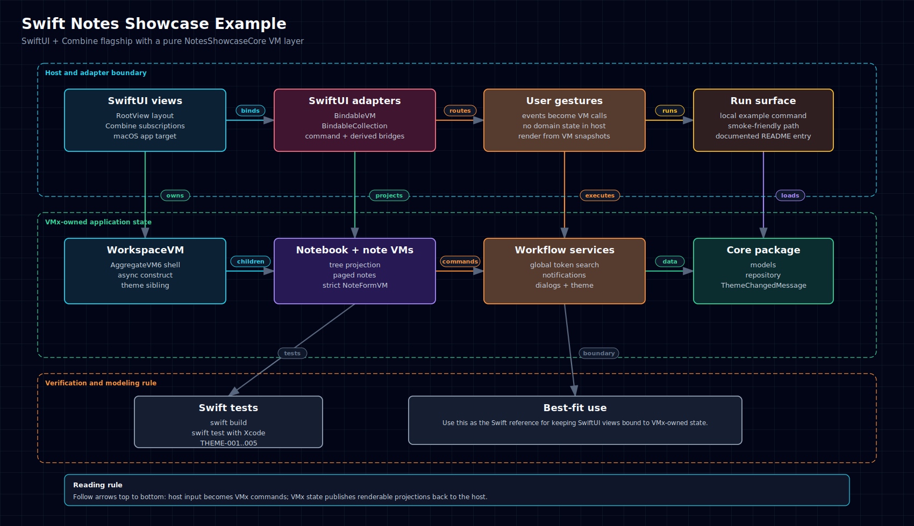
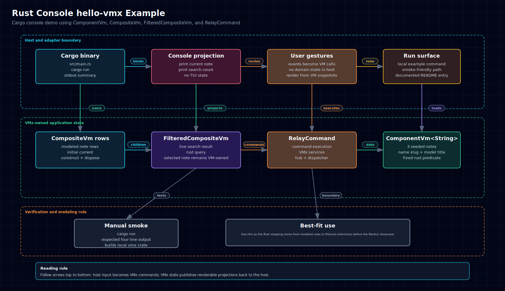

# 8.2. Example Diagram Gallery

This gallery shows one generated architecture diagram for every committed VMx
example app. Each diagram uses the same dark landscape vocabulary: host and
adapter boundary, VMx-owned application state, and verification/modeling rule.

## C\#

### C# Console HelloVMx

  <a href="../../assets/diagrams/csharp-console-hello-vmx.html">HTML</a>
  &middot;
  <a href="../../assets/diagrams/csharp-console-hello-vmx.svg">SVG</a>
  &middot;
  <a href="../../assets/diagrams/csharp-console-hello-vmx.png">PNG</a>

### C# WPF Todo App

  <a href="../../assets/diagrams/csharp-wpf-todo-app.html">HTML</a>
  &middot;
  <a href="../../assets/diagrams/csharp-wpf-todo-app.svg">SVG</a>
  &middot;
  <a href="../../assets/diagrams/csharp-wpf-todo-app.png">PNG</a>

### C# Avalonia Notes Showcase

  <a href="../../assets/diagrams/csharp-avalonia-notes-showcase.html">HTML</a>
  &middot;
  <a href="../../assets/diagrams/csharp-avalonia-notes-showcase.svg">SVG</a>
  &middot;
  <a href="../../assets/diagrams/csharp-avalonia-notes-showcase.png">PNG</a>

## Python

### Python Console hello_vmx

  <a href="../../assets/diagrams/python-console-hello-vmx.html">HTML</a>
  &middot;
  <a href="../../assets/diagrams/python-console-hello-vmx.svg">SVG</a>
  &middot;
  <a href="../../assets/diagrams/python-console-hello-vmx.png">PNG</a>

### Python tkinter Todo App

  <a href="../../assets/diagrams/python-tk-todo-app.html">HTML</a>
  &middot;
  <a href="../../assets/diagrams/python-tk-todo-app.svg">SVG</a>
  &middot;
  <a href="../../assets/diagrams/python-tk-todo-app.png">PNG</a>

### Python Textual Inspector

  <a href="../../assets/diagrams/python-textual-inspector.html">HTML</a>
  &middot;
  <a href="../../assets/diagrams/python-textual-inspector.svg">SVG</a>
  &middot;
  <a href="../../assets/diagrams/python-textual-inspector.png">PNG</a>

### Python Textual Notes Showcase

  <a href="../../assets/diagrams/python-textual-notes-showcase.html">HTML</a>
  &middot;
  <a href="../../assets/diagrams/python-textual-notes-showcase.svg">SVG</a>
  &middot;
  <a href="../../assets/diagrams/python-textual-notes-showcase.png">PNG</a>

## TypeScript

### TypeScript Console hello-vmx

  <a href="../../assets/diagrams/typescript-console-hello-vmx.html">HTML</a>
  &middot;
  <a href="../../assets/diagrams/typescript-console-hello-vmx.svg">SVG</a>
  &middot;
  <a href="../../assets/diagrams/typescript-console-hello-vmx.png">PNG</a>

### TypeScript React Notes Showcase

  <a href="../../assets/diagrams/typescript-react-notes-showcase.html">HTML</a>
  &middot;
  <a href="../../assets/diagrams/typescript-react-notes-showcase.svg">SVG</a>
  &middot;
  <a href="../../assets/diagrams/typescript-react-notes-showcase.png">PNG</a>

## Swift

### Swift Notes Showcase

  <a href="../../assets/diagrams/swift-notes-showcase.html">HTML</a>
  &middot;
  <a href="../../assets/diagrams/swift-notes-showcase.svg">SVG</a>
  &middot;
  <a href="../../assets/diagrams/swift-notes-showcase.png">PNG</a>

## Rust

### Rust Console hello-vmx

  <a href="../../assets/diagrams/rust-console-hello-vmx.html">HTML</a>
  &middot;
  <a href="../../assets/diagrams/rust-console-hello-vmx.svg">SVG</a>
  &middot;
  <a href="../../assets/diagrams/rust-console-hello-vmx.png">PNG</a>

### Rust TUI Notes Showcase

  <a href="../../assets/diagrams/rust-tui-notes-showcase.html">HTML</a>
  &middot;
  <a href="../../assets/diagrams/rust-tui-notes-showcase.svg">SVG</a>
  &middot;
  <a href="../../assets/diagrams/rust-tui-notes-showcase.png">PNG</a>

