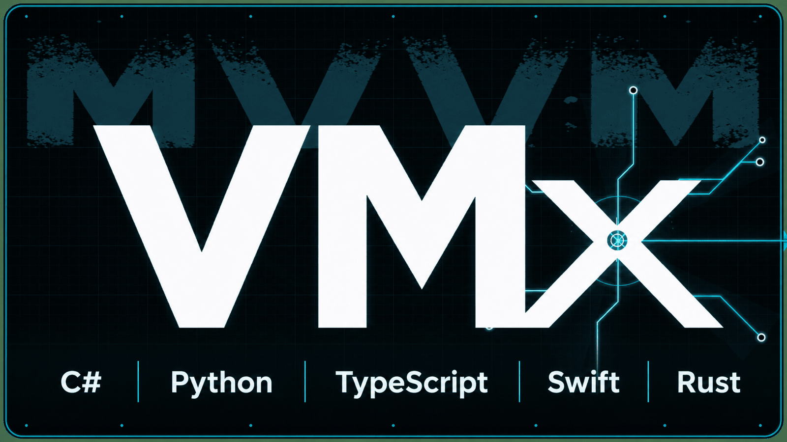

# 1. VMx

<!-- vmx-opener:start -->

One specification. Five idiomatic flavors. Predictable MVVM behavior across UI stacks.

VMx is a UI-neutral, lifecycle-aware MVVM viewmodel framework for building
hierarchical application state with explicit construction, destruction,
disposal, reactive messaging, commands, collections, and composable services.
One language-neutral specification defines observable behavior, while five
source flavors—C#, Python, TypeScript, Swift, and Rust—preserve each ecosystem’s
naming, type, concurrency, and package conventions. A shared conformance catalog
keeps those implementations aligned without erasing idiomatic APIs. The source
tree currently carries complete 403-ID library coverage in every flavor, with
flagship hosts exercising five additional THEME scenarios. Swift is publicly
available through SwiftPM; Python’s public package trails the source line, and
the C#, TypeScript, and Rust registry channels are prepared but not yet
published. VMx therefore separates source completeness from installable-release
status and documents both explicitly.

<!-- vmx-opener:end -->

  

    
<a href="installation.md">Install</a>

    
Check source-tree version status and package commands for each flavor.

  

  

    
<a href="getting-started/index.md">Quickstart</a>

    
Build the shared component-plus-composite contract in each idiomatic flavor.

  

  

    
<a href="architecture/index.md">Architecture Map</a>

    
Walk the system, class, and lifecycle diagrams, then browse the full gallery.

  

## 1.1. Why VMx

- `spec/` is the source of truth for behavior, lifecycle, and conformance.
- Every flavor implements the shared normative concepts while following native naming conventions.
- The conformance catalog keeps 403 library IDs aligned across all five
  catalog-complete source flavors, plus 5 scenario IDs for flagship examples.
- The completed
  [Rust convergence ledger](../maintenance/2026-07-16-rust-capability-parity.md)
  ties its 0.27.0 capability and behavior claims to focused tests.

## 1.2. Start Here

- Read [Installation](installation.md) for source-tree status and package availability.
- Use [Quickstart](getting-started/index.md) for the smallest multi-language setup.
- Read [Core Concepts](core-concepts.md) before choosing VM families or extension points.
- Use [Architecture Map](architecture/index.md) when you want the system view first.
