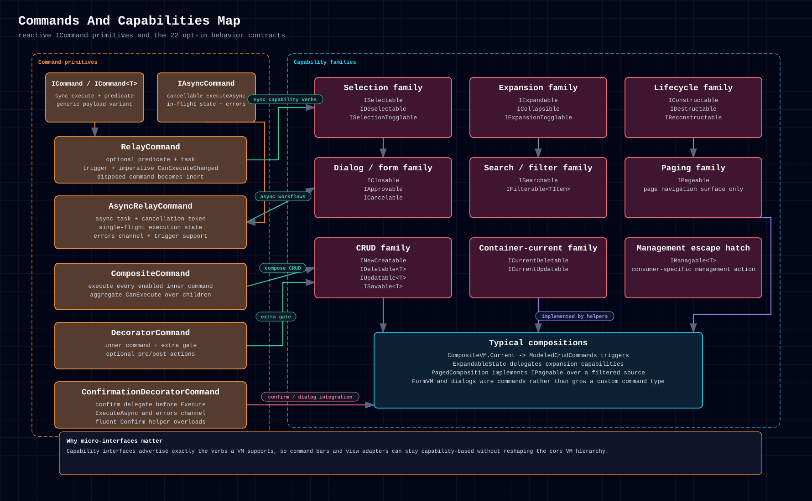

# 6.3. Command Families

## 6.3.1. When To Use It

Use the command family when behavior should be executable, bindable, and
reactively re-evaluated without baking that behavior into the VM hierarchy
itself.

Start with `RelayCommand`; add composition or confirmation only when the
workflow needs it.



<p>
  <a href="../../assets/diagrams/commands-capabilities.html">HTML</a>
  &middot;
  <a href="../../assets/diagrams/commands-capabilities.svg">SVG</a>
  &middot;
  <a href="../../assets/diagrams/commands-capabilities.png">PNG</a>
</p>

## 6.3.2. Shape And Ownership

The shipped command surface breaks down into a few layers:

- `RelayCommand`, parameterized `RelayCommand<T>`, and `AsyncRelayCommand`
- decorators: `CompositeCommand`, `DecoratorCommand`,
  `ConfirmationDecoratorCommand`
- fluent helpers: `Confirm`, `PrecedeWith`, `SucceedWith`, `WrapWith`
- `ModeledCrudCommands` for selection-driven create/update/delete bundles

Commands own their predicates, tasks, trigger subscriptions, and disposal
inertness. They do not own VM lifecycle.

The fluent helpers apply to any command, so each one's result chains further.
In Rust they come from the `CommandExt` trait (`use vmx::CommandExt;`), which
every `Command + Clone + 'static` implements; `RelayCommand` keeps the same
methods inherently, so its existing calls need no import. A command that is not
`Clone`, or an `Arc<dyn Command>`, uses the helpers through an `Arc`. Pass
`NO_PREDICATE` or `NO_HOOK` for an absent `wrap_with` argument:

```rust
use vmx::{AsyncValue, CommandExt, NO_HOOK, NO_PREDICATE};

let command = save
    .confirm(|| AsyncValue::ready(true))
    .wrap_with(NO_PREDICATE, Some(begin_busy), Some(end_busy))
    .succeed_with(refresh);
```

Each helper moves its receiver into the wrapper it returns; VMx command clones
share state, so keep a clone to keep using the receiver directly.

`AsyncRelayCommand` is also a base command in every flavor (`IAsyncCommand :
ICommand`), so it can be stored wherever a command is expected and wrapped by the
composite and decorator commands. Through that base surface, `Execute` starts
fire-and-forget execution without waiting for the async body; failures surface on
the command's error channel. In Rust this is `impl Command for AsyncRelayCommand`,
usable as `Arc<dyn Command>` or as the inner command of `DecoratorCommand` and
`ConfirmationDecoratorCommand`.

Rust's error channel is `error_stream()`, a hot `CommandErrorStream` that
delivers each fire-and-forget failure once as the original `VmxError` and
completes on disposal. A panic caught by `ConfirmationDecoratorCommand` arrives
as `VmxError::Other` carrying the panic message, because a panic payload is not a
clonable error; `execute_async().join()` still returns the payload itself. The
older `errors()` hubs carry only an `"error"` marker and are deprecated
(ADR-0137). A confirmation `AsyncValue` produced by a panicking `map` or
`and_then` callback ends `execute_async().join()` with that panic instead of
blocking, and fire-and-forget `execute` publishes it on `error_stream()`
(ADR-0138).

A Rust `AsyncRelayCommand` runs an admitted execution on one worker thread. A
rejected `execute()` (no action, an execution already running, a false
predicate, or a disposed command) returns without starting a thread.
`execute_async()` keeps returning a `JoinHandle`, so a rejected awaited call
still costs one short-lived thread whose handle completes with `Ok(())`
(ADR-0140).

## 6.3.3. Lifecycle And Messaging

Commands become interesting when triggers are involved:

- predicates are pure gates for `CanExecute`
- tasks run only when predicates allow execution
- trigger emissions force re-evaluation and raise `CanExecuteChanged`
- imperative raise methods notify bindings when a predicate depends on
  non-observable host state
- disposed commands, including composite, decorator, and confirmation wrappers,
  become inert and report `CanExecute == false`
- fire-and-forget confirmation flows surface asynchronous failures on an error
  observable instead of swallowing them

Repeated command disposal, including during an in-flight async operation,
follows the [Disposal Contract](disposal-contract.md): cancellation and terminal
completion occur at most once.

A disposed wrapper also admits no inner work that has not started yet. A
composite runs no later child after one of its children disposes it. A
decorator disposed by its predicate or pre-action skips the inner command, but
once the pre-action has run, its post-action still runs exactly once. A
confirmation that resolves after disposal, whether it confirms, declines, or
fails, runs nothing and emits nothing on `errors`. Wrappers never dispose their
inner commands, which stay owned by their creator (ADR-0134).

## 6.3.4. Cross-Language Surface

Representative naming differences:

| Concept          | C#                         | Python                        | TypeScript                 | Swift                      | Rust                          |
| ---------------- | -------------------------- | ----------------------------- | -------------------------- | -------------------------- | ----------------------------- |
| Builder entry    | `RelayCommand.Builder()`   | `RelayCommand.builder()`      | `RelayCommand.builder()`   | `RelayCommand.builder()`   | `RelayCommand::builder()`     |
| Trigger setter   | `Triggers(...)`            | `triggers(...)`               | `triggers(...)`            | `triggers(...)`            | `trigger(...)`                |
| Imperative raise | `RaiseCanExecuteChanged()` | `raise_can_execute_changed()` | `raiseCanExecuteChanged()` | `raiseCanExecuteChanged()` | `raise_can_execute_changed()` |
| Confirm helper   | extension `Confirm(...)`   | `confirm(...)` helper         | `confirm(...)` helper      | `confirm(...)` helper      | `confirm(...)`                |

## 6.3.5. Triggers Or Imperative Raise?

Use a trigger when the predicate dependency already has an observable stream.
The command owns that subscription and every trigger emission publishes one
`CanExecuteChanged` notification.

Use the imperative method when host state changes through a non-observable API,
or when a binding adapter explicitly knows that a predicate may have changed.
The method publishes one notification only: it does not call the predicate,
execute the task, or start an async command.

=== "C#"

    ```csharp
    isDirty = true;
    saveCommand.RaiseCanExecuteChanged();
    ```

=== "Python"

    ```python
    is_dirty = True
    save_command.raise_can_execute_changed()
    ```

=== "TypeScript"

    ```ts
    isDirty = true;
    saveCommand.raiseCanExecuteChanged();
    ```

=== "Swift"

    ```swift
    isDirty = true
    saveCommand.raiseCanExecuteChanged()
    ```

=== "Rust"

    ```rust
    is_dirty.store(true, Ordering::SeqCst);
    save_command.raise_can_execute_changed();
    ```

Repeated calls and trigger emissions remain additive. The same operation is
available on parameterized and async relay commands, including while an async
execution is in flight. Calls after disposal are safe no-ops.

The operation belongs to concrete relay commands. `CompositeCommand` and the
decorators forward inner `CanExecuteChanged` notifications but do not expose a
synthetic raise method. Retain the owning relay reference when decorating a
command that needs imperative invalidation.

## 6.3.6. Example

Canonical relay-command shape:

=== "TypeScript"

    ```ts
    const save = RelayCommand.builder()
      .predicate(() => form.isDirty && form.isValid)
      .task(() => {
        void form.approveAsync();
      })
      .triggers(currentChanged)
      .build();
    ```

The same normative command structure appears across all catalog-complete source
flavors with casing and trait-import changes. Rust's command-disposal and
thread-free confirmation convergence is recorded in the completed
[Rust parity ledger](../../maintenance/2026-07-16-rust-capability-parity.md).
The Notes Workspace editor and delete flows are concrete examples.

## 6.3.7. Common Pitfalls

- Depending on mutable state in `CanExecute` without a trigger that raises
  `CanExecuteChanged` or an explicit imperative raise at the mutation site.
- Polling every command on every UI render instead of subscribing to
  `CanExecuteChanged` and invalidating only when the predicate may have changed.
- Swallowing async confirmation or approve failures instead of observing their
  error channels.
- Re-implementing pre/post/confirm composition manually instead of using the
  decorator and fluent surfaces.

## 6.3.8. Related Primitives

- [Composite Family](viewmodel-families/composite-family.md)
- [FormVM](viewmodel-families/specialized/form-vm.md)
- [Services, Messages & Dispatching](services-messages-dispatching.md)
