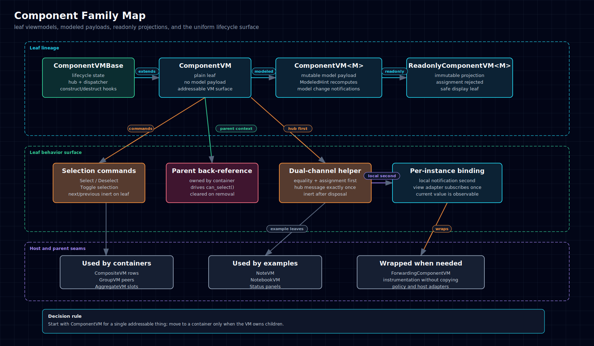

# 6.2.2. Component Family

## When To Use It

Use `ComponentVM` for any addressable leaf VM that is not itself a container.
This is the default choice for note rows, notebook rows, status panels,
capability bars, and other single-node surfaces.

Reach for the modeled variant when the VM owns a domain payload, and the
readonly variant when the payload should be fixed after construction.



<p>
  <a href="../../../assets/diagrams/component-family.html">HTML</a>
  &middot;
  <a href="../../../assets/diagrams/component-family.svg">SVG</a>
  &middot;
  <a href="../../../assets/diagrams/component-family.png">PNG</a>
</p>

## Shape And Ownership

The component family has three shipped variants:

| Variant                                               | Owns model | Model mutable | Typical use                  |
| ----------------------------------------------------- | ---------- | ------------- | ---------------------------- |
| `ComponentVM`                                         | No         | n/a           | simple leaf state            |
| `ComponentVM<M>` / `ComponentVMOf<M>`                 | Yes        | Yes           | editable or refreshable leaf |
| `ReadonlyComponentVM<M>` / `ReadonlyComponentVMOf<M>` | Yes        | No            | immutable projection         |

All variants share the same lifecycle base, built-in selection commands, and
per-instance property-changed surface. They also carry the internal `Parent`
back-reference used by selection predicates, but they never own children.

The injected hub is publicly readable on every component (`Hub` in C# and
`hub` elsewhere) but remains application-owned shared infrastructure. Disposing
a VM never disposes that hub.

## Lifecycle And Messaging

Construction is leaf-local: there is no child orchestration. The family still
publishes the same status transitions and property-changed messages as every
other VM.

Important behavior from the spec:

- `Model` changes publish only on real value change.
- `ModeledHint` recomputes only when the model actually changes.
- `SelectNextCommand` and `SelectPreviousCommand` exist for uniform surface,
  but the base leaf implementation is inert.
- `can_select()` depends on `Parent`, current-selection state, and the leaf
  being constructed.

## Cross-Language Surface

| Concept           | C#                       | Python                     | TypeScript                 | Swift                      | Rust                     |
| ----------------- | ------------------------ | -------------------------- | -------------------------- | -------------------------- | ------------------------ |
| Unmodeled leaf    | `ComponentVM`            | `ComponentVM`              | `ComponentVM`              | `ComponentVM`              | `ComponentVm`            |
| Modeled leaf      | `ComponentVM<M>`         | `ComponentVMOf[M]`         | `ComponentVMOf<M>`         | `ComponentVMOf<M>`         | `ComponentVm<M>`         |
| Readonly leaf     | `ReadonlyComponentVM<M>` | `ReadonlyComponentVMOf[M]` | `ReadonlyComponentVMOf<M>` | `ReadonlyComponentVMOf<M>` | `ReadonlyComponentVm<M>` |
| Builder entry     | `Builder()`              | `builder()`                | `builder()`                | `builder()`                | `with_model(...)`        |
| Property channel  | `INotifyPropertyChanged` | `property_changed`         | `propertyChanged`          | `propertyChanged`          | `property_changed()`     |
| Shared hub        | `Hub`                    | `hub`                      | `hub`                      | `hub`                      | `hub()`                  |
| Own until dispose | `Own(...)`               | `_own(...)`                | `own(...)`                 | `own(...)`                 | `own(...)`               |

## Owning Long-Lived Resources

Subclass authors can register subscriptions and cleanup callbacks that should
live until terminal VM disposal. The registry drains once in LIFO order after
the subclass disposal hook; one cleanup failure is isolated, and registration
after disposal cleans immediately. Reconstruct does not drain the registry.

```typescript
class SearchVM extends ComponentVMBase {
  constructor(hub: IMessageHub, dispatcher: IDispatcher) {
    super({ name: "search", hint: "", hub, dispatcher });
    this.own(hub.messages.subscribe(message => this.receive(message)));
  }
}
```

Use `OnConstruct`/`OnDestruct` (or their flavor equivalents) for resources that
must be replaced on every reconstruct. The helper deliberately does not expose
two mutable lifetime bags.

The NNx Studio pilot removed 16 inherited hub getters, two subscription fields,
two manual disposal overrides, and its two-case VMx hub-getter regression test
(10 additions, 104 deletions). Its viewmodel package remained type-clean and
all 319 remaining tests passed. The application-owned `WorkspaceVM` hub getter
remained because that class does not derive from a VMx component base.

## Authoring A Mutable Property

A component property has two audiences: cross-VM coordination through the
message hub and host binding through the VM's local property-change surface.
The subclass helper keeps those channels paired and ordered.

| Flavor     | Subclass helper            |
| ---------- | -------------------------- |
| C#         | `NotifyPropertyChanged`    |
| Python     | `_notify_property_changed` |
| TypeScript | `_notifyPropertyChanged`   |
| Swift      | `_notifyPropertyChanged`   |
| Rust       | `notify_property_changed`  |

The caller first determines that a change was accepted. A setter still owns its
equality check and assignment; a computed refresh runs only after its
underlying state changes. One helper call invokes exactly one hub
`PropertyChangedMessage` send, then exactly one local notification carrying the
current value. A call begun after disposal is inert, while a call admitted
before disposal completes both channels even if a hub observer disposes the VM.
Property names follow the flavor idiom (`ActiveTab`, `active_tab`, or
`activeTab`). The lower-level local-only raise primitive stays available for
framework lifecycle properties that deliberately do not publish to the hub.

Ordinary top-level delivery is observed hub first. Inside a hub transaction or
re-entrant drain, the hub queues its delivery, so a local observer may run
before the queued hub observer even though the helper invoked the hub first.

```typescript
set activeTab(value: string) {
  if (this._activeTab === value) return;
  this._activeTab = value;
  this._notifyPropertyChanged("activeTab");
}
```

Do not wrap fields with a VMx property decorator or descriptor. Explicit
setters preserve each flavor's idioms and make equality, assignment, and
notification order visible at the mutation site.

This pattern was piloted against NNx Studio's `ConsoleVM`: two hand-written
hub-plus-local emission sequences collapsed to the helper call, the viewmodel
package remained type-clean, and its focused test suite passed all 7 tests,
including an assertion that the hub event precedes the local event.

VMx's C#, Python, TypeScript, and Swift Notes Showcase viewmodels use the same
helper, eliminating their former hand-written hub-plus-local pairs.

## Example

Representative modeled leaf shape across the five source flavors:

- `C#`: `ComponentVM<TabModel>.Builder().Name("home-tab").Model(model).Services(hub, dispatcher).Build()`
- `Python`: `ComponentVMOf.builder().name("home-tab").model(model).services(hub, dispatcher).build()`
- `TypeScript`: `ComponentVMOf.builder<TabModel>().name("home-tab").model(model).services(hub, dispatcher).build()`
- `Swift`: `try ComponentVMOf<TabModel>.builder().name("home-tab").model(model).services(hub: hub, dispatcher: dispatcher).build()`
- `Rust`: `ComponentVm::with_model("home-tab", model, hub, dispatcher)`

The Quickstart page uses exactly this pattern before composing those leaves into
a `CompositeVM`.

## Common Pitfalls

- Using a component when the VM really owns a collection. Move up to
  `CompositeVM`, `GroupVM`, or `AggregateVM`.
- Expecting the built-in next/previous commands on a leaf to walk siblings.
  Container-driven navigation is the intended model.
- Subclassing to add domain behavior instead of composing around the sealed VM.
- Forgetting that a detached leaf has no `Parent`, so selection predicates stay
  false until a container owns it.
- Disposing `vm.hub` from the VM. Public visibility does not transfer ownership.
- Registering per-construct work with `own`; it would survive reconstruct.

## Related Primitives

- [Composite Family](composite-family.md)
- [Group Family](group-family.md)
- [Aggregate Family](aggregate-family.md)
- [FormVM](specialized/form-vm.md)
- [State & Reactive Helpers](../state-reactive-helpers.md)
