# Diagram Gallery

The gallery collects the current documentation diagrams in one place. Use the
standalone HTML pages for zoomable browsing and the PNG exports for sharing.

## Architecture

### VMx System Architecture

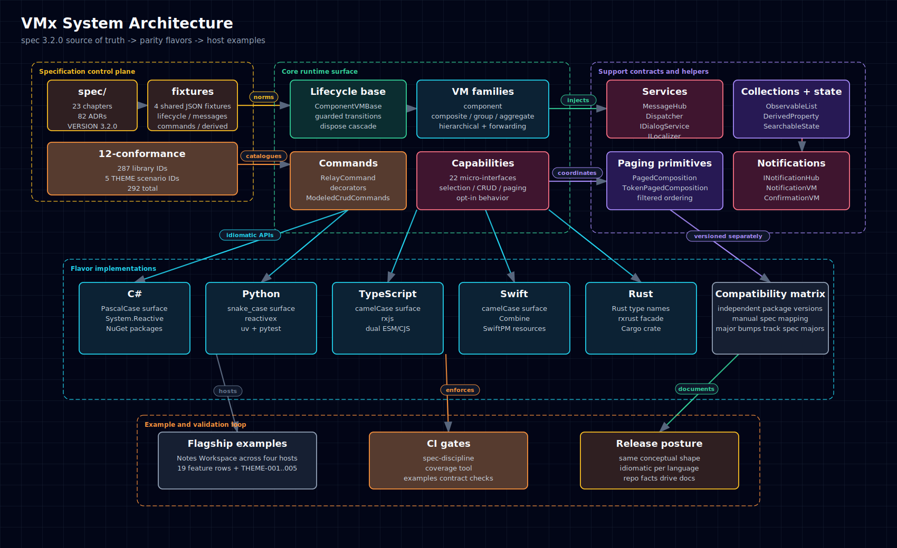

  <a href="../../assets/diagrams/system-architecture.html">HTML</a>
  &middot;
  <a href="../../assets/diagrams/system-architecture.svg">SVG</a>
  &middot;
  <a href="../../assets/diagrams/system-architecture.png">PNG</a>

### Class Architecture Map

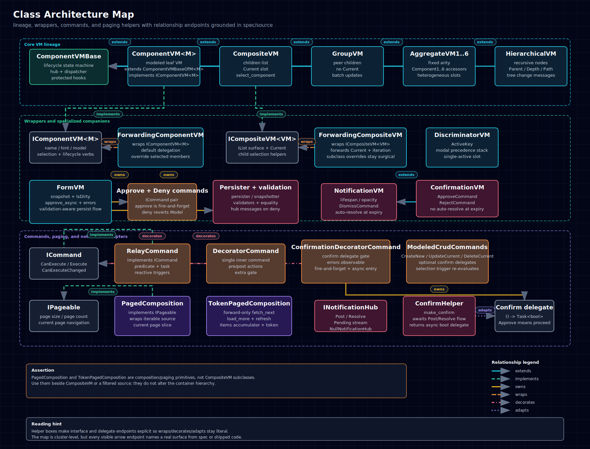

  <a href="../../assets/diagrams/class-architecture.html">HTML</a>
  &middot;
  <a href="../../assets/diagrams/class-architecture.svg">SVG</a>
  &middot;
  <a href="../../assets/diagrams/class-architecture.png">PNG</a>

### Lifecycle And Messaging Flow

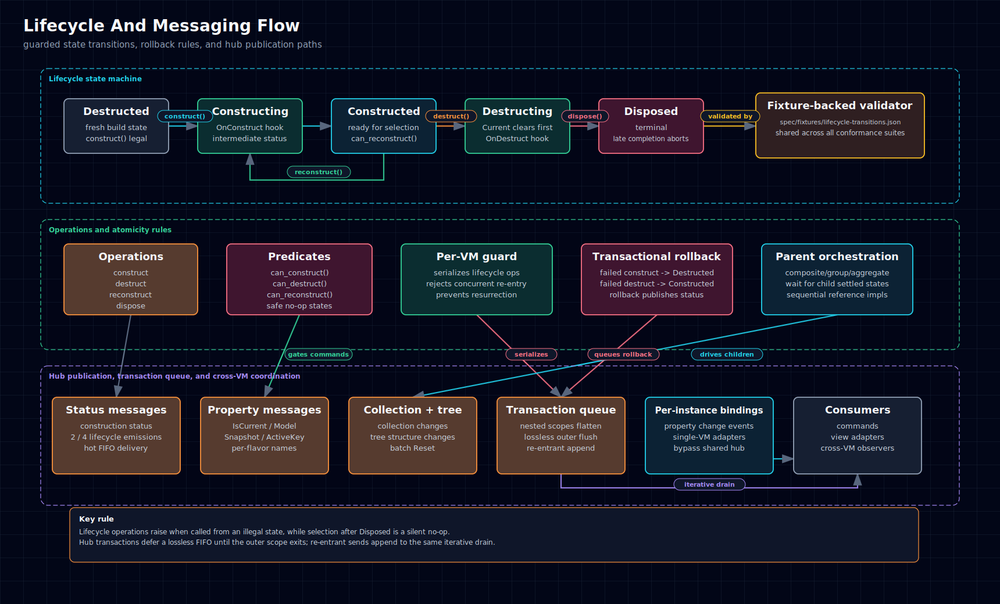

  <a href="../../assets/diagrams/lifecycle-messaging.html">HTML</a>
  &middot;
  <a href="../../assets/diagrams/lifecycle-messaging.svg">SVG</a>
  &middot;
  <a href="../../assets/diagrams/lifecycle-messaging.png">PNG</a>

## Primitives And Examples

### ViewModel Families Map

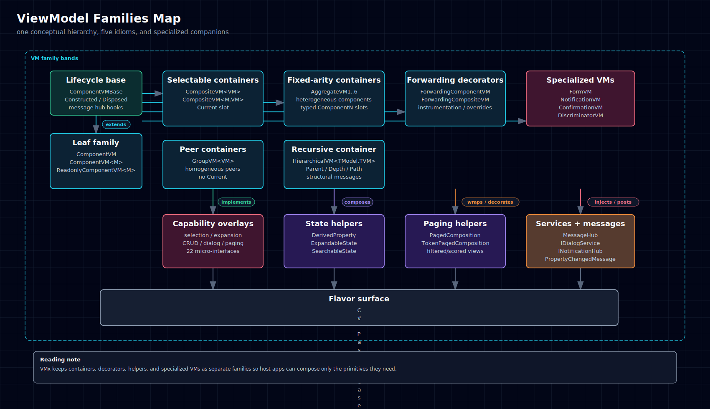

  <a href="../../assets/diagrams/viewmodel-families.html">HTML</a>
  &middot;
  <a href="../../assets/diagrams/viewmodel-families.svg">SVG</a>
  &middot;
  <a href="../../assets/diagrams/viewmodel-families.png">PNG</a>

### Component Family Map

  <a href="../../assets/diagrams/component-family.html">HTML</a>
  &middot;
  <a href="../../assets/diagrams/component-family.svg">SVG</a>
  &middot;
  <a href="../../assets/diagrams/component-family.png">PNG</a>

### Aggregate Family Map

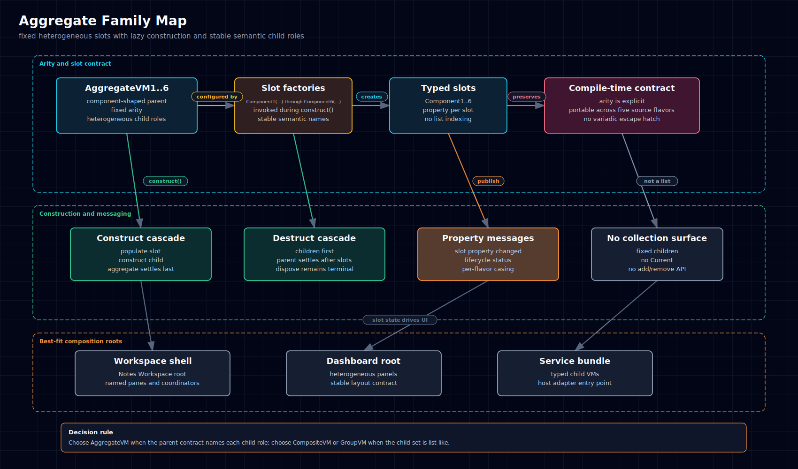

  <a href="../../assets/diagrams/aggregate-family.html">HTML</a>
  &middot;
  <a href="../../assets/diagrams/aggregate-family.svg">SVG</a>
  &middot;
  <a href="../../assets/diagrams/aggregate-family.png">PNG</a>

### Group Family Map

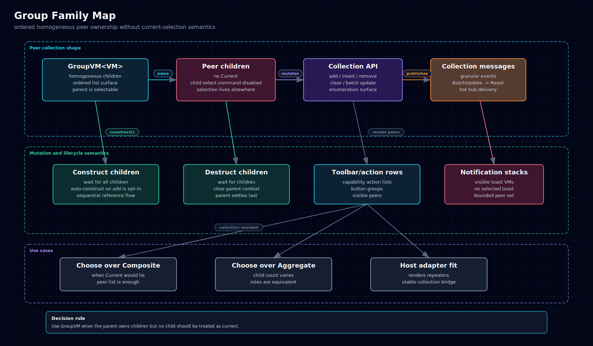

  <a href="../../assets/diagrams/group-family.html">HTML</a>
  &middot;
  <a href="../../assets/diagrams/group-family.svg">SVG</a>
  &middot;
  <a href="../../assets/diagrams/group-family.png">PNG</a>

### Composite Family Deep Dive

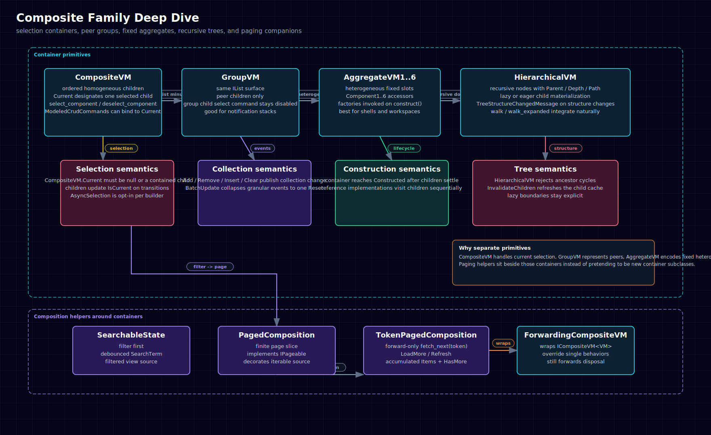

  <a href="../../assets/diagrams/composite-family.html">HTML</a>
  &middot;
  <a href="../../assets/diagrams/composite-family.svg">SVG</a>
  &middot;
  <a href="../../assets/diagrams/composite-family.png">PNG</a>

### Hierarchical Family Map

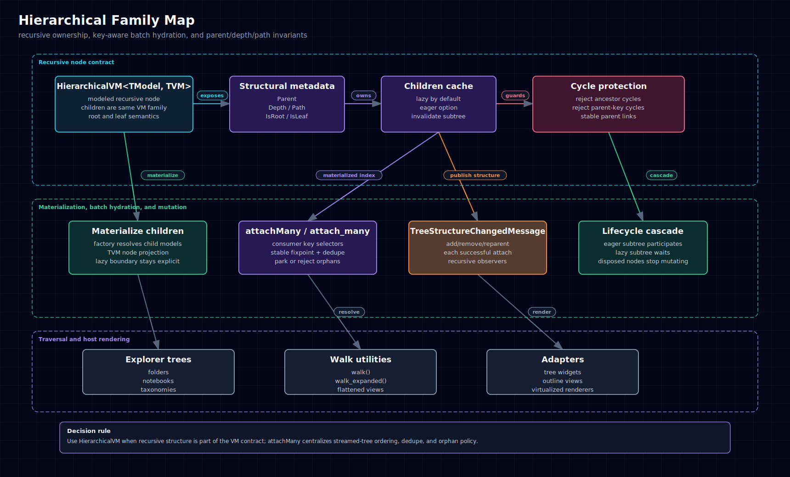

  <a href="../../assets/diagrams/hierarchical-family.html">HTML</a>
  &middot;
  <a href="../../assets/diagrams/hierarchical-family.svg">SVG</a>
  &middot;
  <a href="../../assets/diagrams/hierarchical-family.png">PNG</a>

### Forwarding Wrapper Family Map

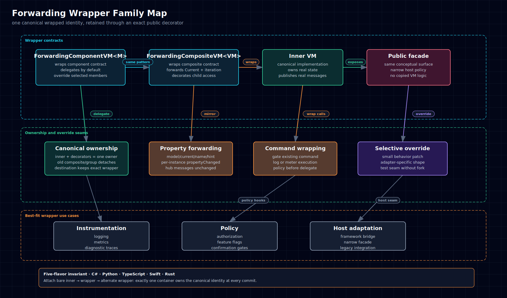

  <a href="../../assets/diagrams/forwarding-wrapper-family.html">HTML</a>
  &middot;
  <a href="../../assets/diagrams/forwarding-wrapper-family.svg">SVG</a>
  &middot;
  <a href="../../assets/diagrams/forwarding-wrapper-family.png">PNG</a>

### Specialized ViewModel Coordinator Map

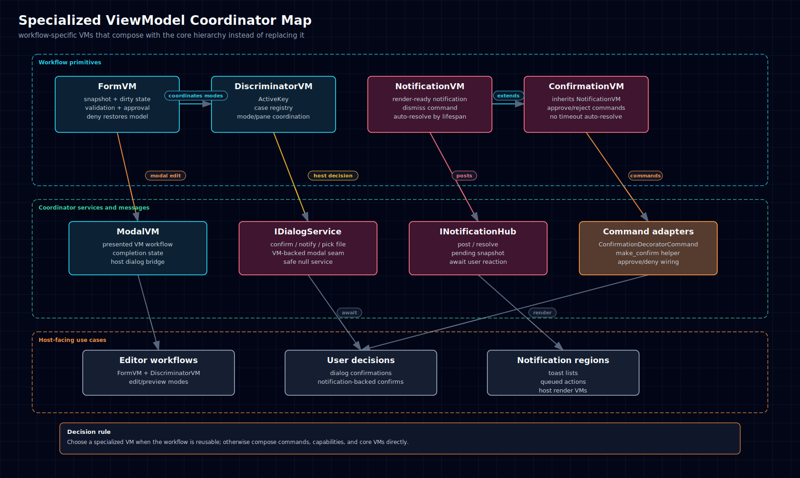

  <a href="../../assets/diagrams/specialized-vm-family.html">HTML</a>
  &middot;
  <a href="../../assets/diagrams/specialized-vm-family.svg">SVG</a>
  &middot;
  <a href="../../assets/diagrams/specialized-vm-family.png">PNG</a>

### Commands And Capabilities Map

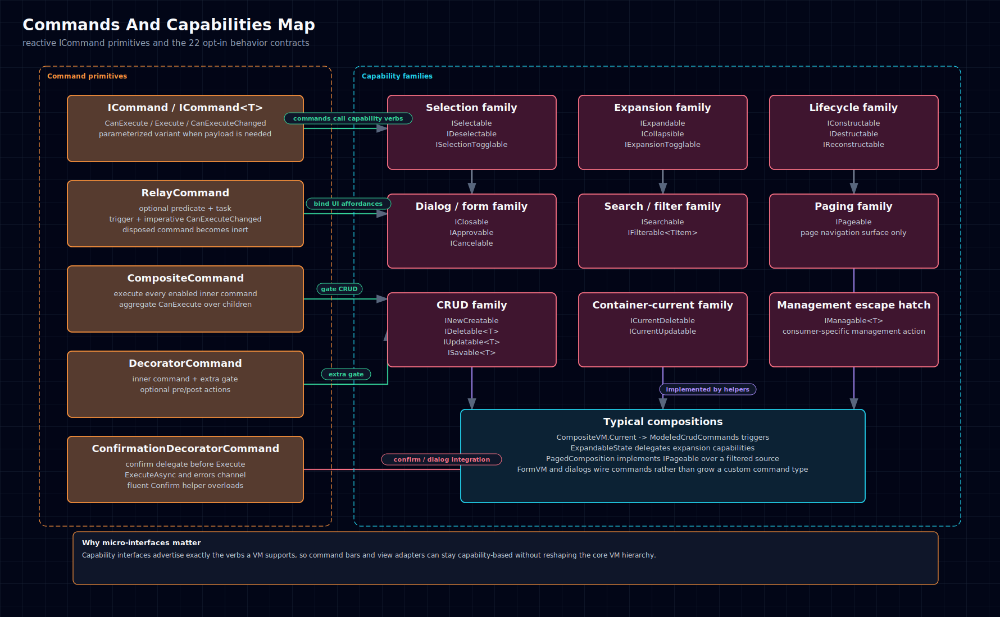

  <a href="../../assets/diagrams/commands-capabilities.html">HTML</a>
  &middot;
  <a href="../../assets/diagrams/commands-capabilities.svg">SVG</a>
  &middot;
  <a href="../../assets/diagrams/commands-capabilities.png">PNG</a>

### Forms Dialogs And Notifications Flow

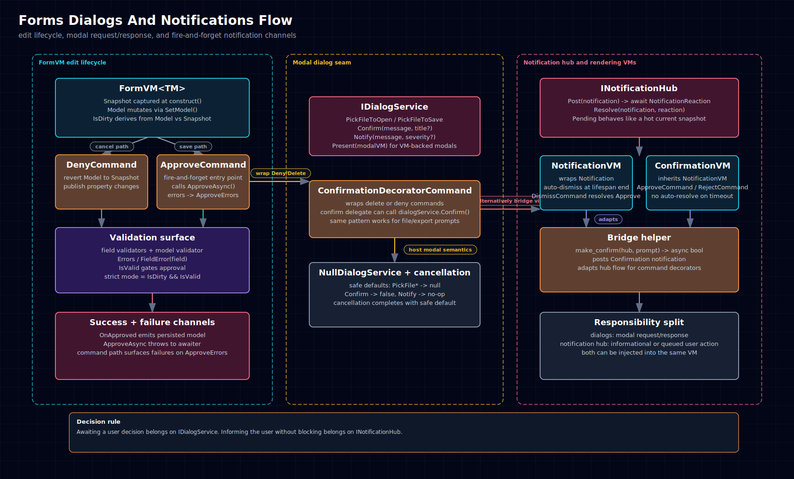

  <a href="../../assets/diagrams/forms-dialogs-notifications.html">HTML</a>
  &middot;
  <a href="../../assets/diagrams/forms-dialogs-notifications.svg">SVG</a>
  &middot;
  <a href="../../assets/diagrams/forms-dialogs-notifications.png">PNG</a>

### Examples VM Layer Map

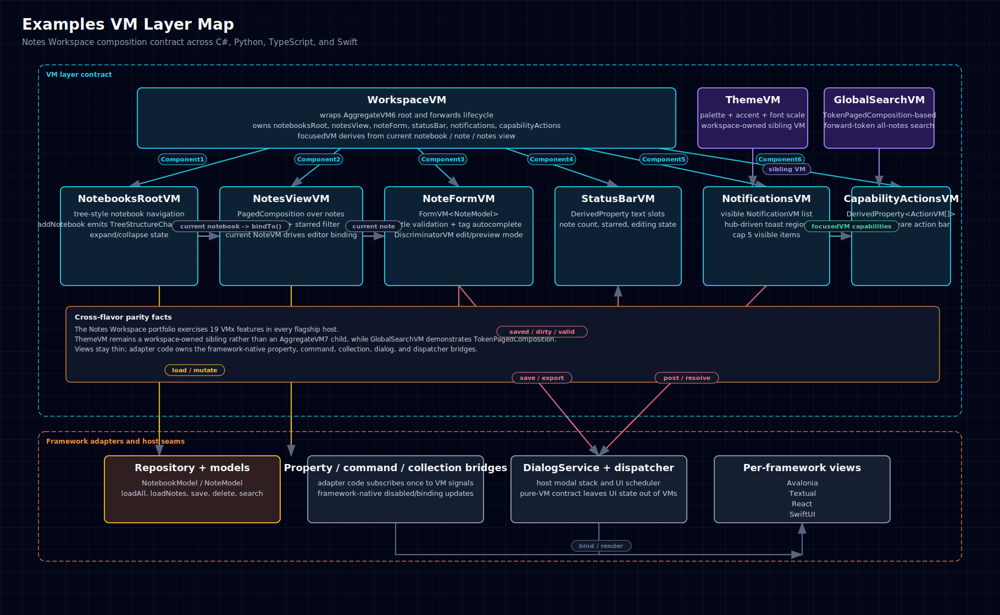

  <a href="../../assets/diagrams/examples-vm-layer.html">HTML</a>
  &middot;
  <a href="../../assets/diagrams/examples-vm-layer.svg">SVG</a>
  &middot;
  <a href="../../assets/diagrams/examples-vm-layer.png">PNG</a>

### Rust TUI Notes Showcase VM Layer

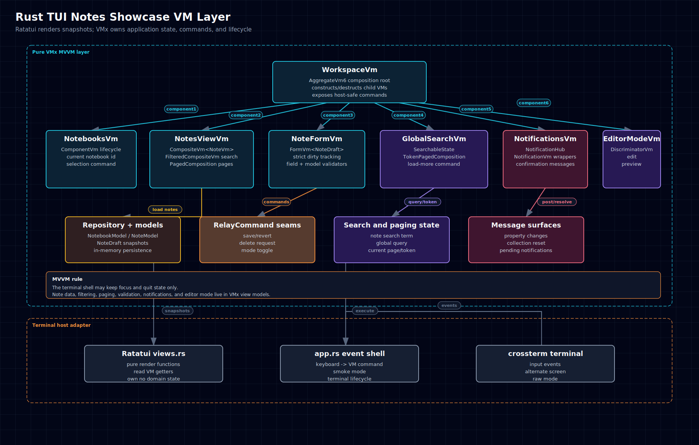

  <a href="../../assets/diagrams/rust-tui-notes-showcase.html">HTML</a>
  &middot;
  <a href="../../assets/diagrams/rust-tui-notes-showcase.svg">SVG</a>
  &middot;
  <a href="../../assets/diagrams/rust-tui-notes-showcase.png">PNG</a>

