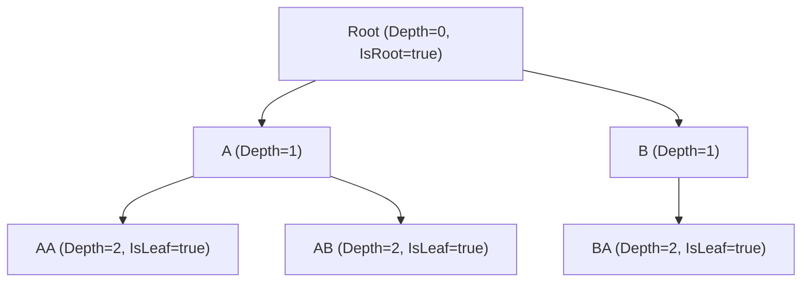
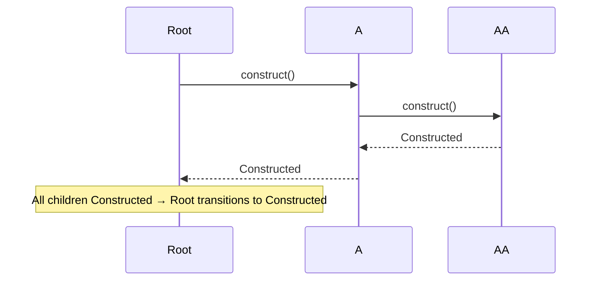

# VMx Absorption Audit — Stage 2 (HierarchicalVM) Implementation Plan

> **For agentic workers:** REQUIRED SUB-SKILL: Use `superpowers:subagent-driven-development` (recommended) to execute this plan task-by-task. Steps use checkbox (`- [ ]`) syntax for tracking. This is the Stage 2 detail expansion of the master audit plan at `docs/superpowers/plans/2026-05-27-vmx-absorption-audit.md`.

**Goal:** Add a first-class recursive `HierarchicalVM<TModel, TVM>` to the spec and all three flavors, subsuming the deferred `spec/proposals/hierarchical-vm.md` proposal.

**Architecture:** New chapter `18-hierarchical-vm.md` introduces the type; ADR-0028 records six concrete design decisions (lazy children, recursive generic, depth-first construct, hub messages, materialized path, no auto-IExpandable). Per-flavor implementations use recursive generic constraints idiomatic to each language. Integrates with `walk`/`walk_expanded` (ch.13), `ExpandableState` (ch.14), and `SearchableState` (ch.14) without coupling them.

**Tech Stack:** Markdown spec + ADRs + diagrams (mermaid for tree/sequence); C# with recursive generic constraints + `System.Reactive` + xUnit + FluentAssertions; Python with `TypeVar` bound recursion + `reactivex` + pytest + mypy strict + ruff; TypeScript with recursive type parameters + `rxjs` + vitest + eslint.

______________________________________________________________________

## Context (recap, for subagents picking up cold)

- **Branch:** `feat/v2.1-absorption-audit` (Stage 1 closed at commit `c2873b2`; 82 commits on branch).
- **Spec version:** `2.1.0-dev` (will become `2.1.0` at Stage 6 release).
- **Current conformance count:** 181 IDs. This stage adds ~14 HIER- IDs → ~195.
- **Latest ADR:** 0027 (fluent commands). This stage adds 0028.
- **Repo conventions:** see master plan §"Repository conventions"; key invariants are: spec/ changes require an ADR in the same PR; conformance IDs require stubs in every flavor in the same PR; commits never include AI attribution; pre-commit may reformat (re-stage and re-commit, never `--amend`).

## Six design decisions resolved by ADR-0028

The predecessor proposal at `spec/proposals/hierarchical-vm.md` listed 6 open design questions. This plan locks the following answers (subagents must use these throughout; do NOT re-litigate):

| #   | Question                      | Decision (this plan)                                                                                                                                                         |
| --- | ----------------------------- | ---------------------------------------------------------------------------------------------------------------------------------------------------------------------------- |
| 1   | Lazy vs eager child loading   | **Lazy by default, opt-in eager** via a builder option. Children are not materialized until `Children` is first accessed or `Expand()` (if `IExpandable`) is called.         |
| 2   | Recursive generic constraint  | **Recursive** — C# `where TVM : HierarchicalVM<TModel, TVM>`, Python `TVM = TypeVar("TVM", bound="HierarchicalVM[Any, TVM]")`, TS `TVM extends HierarchicalVM<TModel, TVM>`. |
| 3   | Construction order            | **Depth-first**, mirroring `LIFE-013`'s depth-first dispose order. Parent transitions to `Constructed` only after all descendants reach `Constructed`.                       |
| 4   | Hub messages                  | **Two messages**: `PropertyChangedMessage` on `Parent` change (per existing `HUB` rules); a new `TreeStructureChangedMessage` on add/remove/reparent of descendants.         |
| 5   | Path semantics                | **Materialized + cached**, invalidated and recomputed only when the path actually changes (parent change). `Path` returns an `IReadOnlyList<...>` snapshot per access.       |
| 6   | Auto-implement `IExpandable`? | **No.** Per ADR-0010 capabilities are opt-in. Consumers compose `ExpandableState` if they want tree-expansion.                                                               |

## Files to be created or modified

### Created

- `spec/ADRs/0028-hierarchical-vm.md` — the design ADR
- `spec/18-hierarchical-vm.md` — new chapter
- `spec/diagrams/hierarchical-vm-tree.md` (or `.svg`) — tree-structure diagram
- `spec/diagrams/hierarchical-vm-construct-order.md` (or `.svg`) — construct-order sequence
- `langs/csharp/src/VMx/Hierarchical/HierarchicalVM.cs` — recursive base class
- `langs/csharp/src/VMx/Hierarchical/TreeStructureChangedMessage.cs` — new message type
- `langs/csharp/tests/VMx.Conformance.Tests/HIER_*_Tests.cs` — conformance tests (one grouped file)
- `langs/csharp/tests/VMx.Tests/Hierarchical/HierarchicalVMTests.cs` — unit tests
- `langs/python/src/vmx/hierarchical/__init__.py`
- `langs/python/src/vmx/hierarchical/hierarchical_vm.py`
- `langs/python/src/vmx/messages/tree_structure_changed.py`
- `langs/python/tests/conformance/test_hier_*.py`
- `langs/python/tests/unit/hierarchical/test_hierarchical_vm.py`
- `langs/typescript/src/hierarchical/hierarchicalVm.ts`
- `langs/typescript/src/hierarchical/index.ts`
- `langs/typescript/src/messages/treeStructureChanged.ts`
- `langs/typescript/tests/conformance/hier-*.test.ts`
- `langs/typescript/tests/unit/hierarchicalVm.test.ts`

### Modified

- `spec/ADRs/README.md` — register ADR-0028
- `spec/README.md` — add chapter 18 to TOC; bump ID count to ~195
- `spec/12-conformance.md` — add HIER- block
- `spec/06-composite-vm.md` — cross-reference HierarchicalVM as recursive specialization
- `spec/13-tree-utilities.md` — note `walk`/`walk_expanded` support for HierarchicalVM
- `spec/14-capabilities.md` — note that `IExpandable` integration is consumer choice (not auto)
- `langs/python/src/vmx/messages/__init__.py` — export `TreeStructureChangedMessage`
- `langs/typescript/src/messages/index.ts` — export `TreeStructureChangedMessage`
- `langs/typescript/src/index.ts` — export `HierarchicalVM` and `TreeStructureChangedMessage`
- `docs/superpowers/plans/2026-05-27-vmx-absorption-audit.md` — tick Stage 2 box at close

### Deleted

- `spec/proposals/hierarchical-vm.md` — superseded by chapter 18 + ADR-0028

______________________________________________________________________

## Stage 2 progress tracker

- [x] **Substage 2A** — Spec foundation (ADR + chapter + IDs + stubs)
- [x] **Substage 2B** — Cross-chapter integration (06, 13, 14) + diagrams
- [x] **Substage 2C** — Per-flavor implementation (C# / Python / TypeScript)
- [x] **Substage 2D** — Cleanup (delete superseded proposal)
- [x] **Substage 2E** — Stage 2 audit close (2 consecutive zero-finding passes)

______________________________________________________________________

# Substage 2A — Spec foundation

### Task 2A.1: Write ADR-0028

**Files:**

- Create: `spec/ADRs/0028-hierarchical-vm.md`

- Modify: `spec/ADRs/README.md`

- [x] **Step 1: Write the ADR.**

Create `spec/ADRs/0028-hierarchical-vm.md` with the standard 4-section template. Use the exact format of ADR-0022 / ADR-0024 (read both for style reference). The Decision section MUST record all 6 answers from the §"Six design decisions" table above.

Outline:

```markdown
# ADR 0028 — `HierarchicalVM<TModel, TVM>` (recursive composite specialization)

**Status:** Accepted (2026-05-28)
**Spec version:** introduced in 2.1.0

## 1. Context

The 2012 VMx predecessor included a commented-out `HierarchicalViewModel<...>` research draft (`ToDo/HierarchicalViewModel*.cs`) — a first-class tree-structured VM whose nodes were themselves containers of the same type. The previous absorption cycle (per `spec/proposals/hierarchical-vm.md`) captured the draft but deferred six design questions to a later cycle.

In v2.0, consumers achieve tree shape by manually recursing `CompositeVM<M, VM>`. The recursion works but lacks "this is a tree node" semantic, doesn't compose with `walk`/`walk_expanded`, and forces consumers to re-invent parent / depth / path bookkeeping.

The current absorption audit (see `spec/proposals/2026-05-27-vmx-absorption-audit.md` item C1) elevates HierarchicalVM to a first-class chapter, resolving the six open questions.

## 2. Options considered

1. Skip — keep recursive `CompositeVM<M, VM>` as the workaround.
1. Add `HierarchicalVM<TModel, TVM>` with **eager** child loading and **breadth-first** construction (the 2012 draft's apparent intent).
1. Add `HierarchicalVM<TModel, TVM>` with **lazy** child loading and **depth-first** construction (mirroring `LIFE-013` dispose order).

## 3. Decision

Option 3, with the following six specific resolutions:

1. **Lazy child loading by default.** Children are not materialized until `Children` is first accessed or `Expand()` is invoked (if the VM also implements `IExpandable`). A builder option enables eager loading for consumers who want it.
1. **Recursive generic constraint.** Per-flavor: C# `where TVM : HierarchicalVM<TModel, TVM>`, Python `TVM = TypeVar("TVM", bound="HierarchicalVM[Any, TVM]")`, TS `TVM extends HierarchicalVM<TModel, TVM>`. Cross-flavor divergence is noted in ADR-0009.
1. **Depth-first construction order.** A parent transitions to `Constructed` only after every descendant reaches `Constructed`. Mirrors `LIFE-013` depth-first dispose order; preserves invariant "children exist before parent reports ready".
1. **Hub messages.** Parent changes emit a standard `PropertyChangedMessage` (per ADR-0013 + chapter 03 rules). Structural changes (add/remove/reparent of descendants) emit a dedicated `TreeStructureChangedMessage` with `(Source, Change: Added | Removed | Reparented, Affected)` payload.
1. **Path materialized + cached.** `Path` returns a read-only snapshot of `root → … → self`. It is computed lazily on first access and invalidated only when the path actually changes (i.e., when `Parent` reference changes anywhere on the chain to root).
1. **No auto-implementation of `IExpandable`.** Per ADR-0010 capabilities are opt-in. `HierarchicalVM` does NOT implement `IExpandable` by default; consumers compose `ExpandableState` if they want tree-expansion semantics. This preserves the audit-time guarantee that no capability is implicit.

## 4. Consequences

- New chapter `spec/18-hierarchical-vm.md` defines the contract.
- Fourteen conformance IDs `HIER-001..HIER-014` cover identity, recursion, parent/depth/path invariants, lazy-vs-eager, depth-first construct, hub messages, and integration with `walk`/`walk_expanded`, `ExpandableState`, `SearchableState`, `ModeledCrudCommands`.
- New `TreeStructureChangedMessage` type per flavor.
- Per-flavor implementations in `langs/<flavor>/<src>/hierarchical/`.
- `spec/proposals/hierarchical-vm.md` is removed (superseded by chapter 18 + this ADR).
- Cross-flavor recursive-generic-constraint divergence is noted in ADR-0009.
```

- [x] **Step 2: Register ADR-0028 in `spec/ADRs/README.md`.**

Add a new row matching the format of existing rows (link, title, spec version 2.1.0, status Accepted).

- [x] **Step 3: Pre-commit + commit.**

```bash
git add spec/ADRs/0028-hierarchical-vm.md spec/ADRs/README.md
git commit -m "spec(adr): add ADR-0028 HierarchicalVM (recursive composite specialization)"
git log -1 --format='%B' | grep -i 'co-authored-by' && echo "BUG" || echo "clean"
```

If mdformat reformats: re-stage and re-commit (NEVER `--amend`).

### Task 2A.2: Write chapter 18

**Files:**

- Create: `spec/18-hierarchical-vm.md`

- Modify: `spec/README.md` (TOC update)

- [x] **Step 1: Author the chapter.**

Create `spec/18-hierarchical-vm.md`. Read `spec/13-tree-utilities.md` and `spec/15-derived-properties.md` for style reference (recent chapter additions). Structure:

```markdown
# 18 — `HierarchicalVM<TModel, TVM>`

## 1. Overview

A first-class recursive tree-structured ViewModel. Each node may contain children of the same VM type. Use for domains that are natively recursive (file directories, comment threads, org charts, nested taxonomies, decision trees).

See [ADR-0028](ADRs/0028-hierarchical-vm.md) for the design rationale and the six resolved design questions.

## 2. Shape

`HierarchicalVM<TModel, TVM>` is a recursive generic type. `TVM` is the concrete subclass (recursive constraint per ADR-0028 §3.2).

```

HierarchicalVM\<TModel, TVM>:
Model : TModel
Parent : TVM? # null when IsRoot
Children : IReadOnlyList<TVM> # lazy by default; eager via builder
Depth : int # 0 for root; Parent.Depth + 1 otherwise
Path : IReadOnlyList<TVM> # materialized snapshot: root, …, self
IsRoot : bool # Parent is null
IsLeaf : bool # Children.Count == 0
IsFirst : bool # Parent.Children[0] == self (false when IsRoot)
IsLast : bool # Parent.Children[^1] == self (false when IsRoot)

```

`Model` is the per-node domain model; the recursive-children factory function is supplied by the consumer at construction time.

## 3. Construction order

Depth-first. A parent's `Status` transitions to `Constructed` only after every descendant has reached `Constructed`. Mirrors the dispose order (`LIFE-013`); preserves the invariant "children exist before parent reports ready".

Lazy children DO NOT participate in construction order until materialized. A node with un-materialized children is `Constructed` once it has called `construct()`; the children construct lazily on first access.

## 4. Lazy vs eager children

Default: **lazy.** `Children` is materialized on first access. Builder option `WithEagerChildren()` flips to eager; the entire tree is materialized at construct time. Eager mode is required if the consumer wants depth-first construction to apply to the whole tree at startup.

## 5. Hub messages

Two messages flow on `IMessageHub`:

- **`PropertyChangedMessage`** for `Parent` change (and any other `IReadable<T>` properties on the node — per chapter 03 rules).
- **`TreeStructureChangedMessage`** (defined in §6) for structural mutations (add / remove / reparent of descendants).

## 6. `TreeStructureChangedMessage`

```

TreeStructureChangedMessage:
Source : HierarchicalVM # the node whose subtree changed
Change : Added | Removed | Reparented
Affected : HierarchicalVM # the node added/removed/reparented
Index : int # index in Children list (-1 for Reparented if N/A)

```

## 7. Integration

- **`walk` / `walk_expanded`** (chapter 13): `HierarchicalVM` is a natural input; `walk` yields depth-first descendants.
- **`ExpandableState`** (chapter 14 §2.2): consumers may compose `ExpandableState<TVM>` to gate lazy child materialization on `Expand()` (`IExpandable`).
- **`SearchableState`** (chapter 14 §2.5): consumers may compose `SearchableState<TVM>` to provide a filtered view of a tree (the filter operates on the materialized portion).
- **`ModeledCrudCommands`** (chapter 14 §2.7): tree mutations (Create / Update / Delete on a node's children) compose with the existing `CreateNewCommand`, `UpdateCurrentCommand`, `DeleteCurrentCommand` helpers.

## 8. Conformance

- `HIER-001` — Recursive generic constraint compiles per flavor with the bound type parameter.
- `HIER-002` — `Parent` is null for the root and a `TVM` reference for every non-root node.
- `HIER-003` — `Depth` derivation: root is 0; child is parent + 1.
- `HIER-004` — `Path` materialization: returns a read-only sequence `root, …, self`; identity-equal to a fresh recompute when nothing changed.
- `HIER-005` — `IsLeaf` and `IsRoot` derivation match `Parent`/`Children` state.
- `HIER-006` — `IsFirst` and `IsLast` position predicates.
- `HIER-007` — Default lazy child loading: `Children` is not materialized until first access.
- `HIER-008` — Eager child loading: `WithEagerChildren()` builder option materializes the full tree at construct.
- `HIER-009` — Depth-first construction: a parent reports `Constructed` only after every (eager) descendant.
- `HIER-010` — `PropertyChangedMessage` on `Parent` change.
- `HIER-011` — `TreeStructureChangedMessage` on add / remove / reparent.
- `HIER-012` — `walk_expanded` honors lazy boundaries when an `ExpandableState` gate is composed.
- `HIER-013` — Composition with `SearchableState` filters the materialized portion.
- `HIER-014` — Composition with `ModeledCrudCommands` mutates the tree.
```

- [x] **Step 2: Add chapter 18 to `spec/README.md`.**

Add to the v2.1 additions section. Verify the existing chapter list still has clean numbering and the new entry's hyperlink resolves.

- [x] **Step 3: Commit.**

```bash
git add spec/18-hierarchical-vm.md spec/README.md
git commit -m "spec(ch): add chapter 18 HierarchicalVM<TModel, TVM>"
git log -1 --format='%B' | grep -i 'co-authored-by' && echo "BUG" || echo "clean"
```

### Task 2A.3: Add HIER- conformance IDs

**Files:**

- Modify: `spec/12-conformance.md`

- [x] **Step 1: Find insertion point** (after the COL- block):

```bash
grep -n '^### COL-023' spec/12-conformance.md
```

- [x] **Step 2: Add a new HIER- section** with entries HIER-001 through HIER-014. Use the Given/When/Then prose pattern of existing entries. Each entry's body restates the corresponding chapter 18 §8 bullet expanded into a verifiable statement.

Example for HIER-001:

```markdown
### HIER-001 — Recursive generic constraint compiles

Given a concrete subclass `MyNode : HierarchicalVM<MyModel, MyNode>`,
when the type is instantiated with a model and a children factory,
then it compiles and constructs without generic-bound errors.
And: per-flavor idiomatic naming applies (C#/Python/TS conventions).
```

Produce all 14 IDs in this style.

- [x] **Step 3: Update `spec/README.md` ID count line.**

Current is 181. New count is 195.

- [x] **Step 4: Commit.**

```bash
git add spec/12-conformance.md spec/README.md
git commit -m "spec(conf): add HIER-001..HIER-014 conformance IDs"
```

### Task 2A.4: Add HIER- stubs in all three flavors

**Files:**

- Create: `langs/csharp/tests/VMx.Conformance.Tests/HIER_001_to_014_HierarchicalVM_Tests.cs`

- Create: `langs/python/tests/conformance/test_hier_001_to_014_hierarchical_vm.py`

- Create: `langs/typescript/tests/conformance/hier-001-to-014-hierarchical-vm.test.ts`

- [x] **Step 1: Look at existing CAP-021 / COL- stubs for the canonical pattern per flavor.**

```bash
cat langs/csharp/tests/VMx.Conformance.Tests/CapabilitiesConformanceTests.cs | grep -A5 'CAP-021' | head -20
cat langs/python/tests/conformance/test_cap_021_filterable.py
cat langs/typescript/tests/conformance/cap-021-filterable.test.ts
```

- [x] **Step 2: Create the C# grouped stub file.**

Each method follows:

```csharp
[Fact(Skip = "HIER-NNN not yet implemented")]
[Trait("Conformance", "HIER-NNN")]
public void HIER_NNN_DescriptiveName() { throw new System.NotImplementedException("HIER-NNN"); }
```

Produce 14 methods (one per HIER-001..014). Use the matching xUnit Skip+Trait pattern that COL stubs used.

- [x] **Step 3: Create the Python stub file.**

```python
"""HIER-001..HIER-014 stubs — VMx absorption audit Stage 2."""

import pytest


@pytest.mark.conformance("HIER-001")
@pytest.mark.skip(reason="HIER-001 not yet implemented")
def test_hier_001_recursive_generic_constraint() -> None:
    raise NotImplementedError("HIER-001")


# ... and so on for HIER-002..HIER-014
```

- [x] **Step 4: Create the TypeScript stub file.**

```typescript
import { describe, it } from "vitest";

describe("HIER-001", () => {
  it.todo("Recursive generic constraint compiles");
});

// ... and so on for HIER-002..HIER-014
```

- [x] **Step 5: Run conformance coverage tool.**

```bash
uv --project langs/python run python tools/check-conformance-coverage.py --require csharp --require python --require typescript
```

Expected: 195/195 in all three flavors.

- [x] **Step 6: Commit.**

```bash
git add langs/csharp/tests/VMx.Conformance.Tests/HIER_001_to_014_HierarchicalVM_Tests.cs \
        langs/python/tests/conformance/test_hier_001_to_014_hierarchical_vm.py \
        langs/typescript/tests/conformance/hier-001-to-014-hierarchical-vm.test.ts
git commit -m "test(conf): add HIER-001..HIER-014 stubs in all three flavors"
```

- [x] **Step 7: Tick Substage 2A checkboxes in this plan; commit `docs(plan): tick Substage 2A`.**

______________________________________________________________________

# Substage 2B — Cross-chapter integration + diagrams

### Task 2B.1: Extend `spec/06-composite-vm.md` with HierarchicalVM cross-reference

**Files:**

- Modify: `spec/06-composite-vm.md`

- [x] **Step 1: Find the section that introduces `CompositeVM<M, VM>` recursion patterns (or, if no such section exists, the chapter summary at §1).**

- [x] **Step 2: Add a paragraph at the bottom of §1 (or end of chapter):**

```markdown
For domains that are natively recursive (trees), use `HierarchicalVM<TModel, TVM>` (chapter 18) instead of recursively nesting `CompositeVM<M, VM>`. `HierarchicalVM` provides built-in parent / depth / path semantics plus depth-first construction order.
```

- [x] **Step 3: Commit.**

```bash
git add spec/06-composite-vm.md
git commit -m "spec(ch): cross-reference HierarchicalVM from chapter 06"
```

### Task 2B.2: Extend `spec/13-tree-utilities.md` for HierarchicalVM-aware walk

**Files:**

- Modify: `spec/13-tree-utilities.md`

- [x] **Step 1: Read the current chapter to find where `walk` / `walk_expanded` are introduced.**

```bash
grep -n '^## ' spec/13-tree-utilities.md
```

- [x] **Step 2: Add a subsection (or paragraph at the end of the relevant existing section):**

```markdown
## N. Integration with `HierarchicalVM`

When applied to a `HierarchicalVM<TModel, TVM>` instance:

- `walk(node)` yields depth-first descendants including the root. Order is `parent → children[0] → children[0].children[0] → … → children[1] → …`.
- `walk_expanded(node)` honors the lazy boundary: an `ExpandableState`-composed node whose `IsExpanded == false` does NOT yield its children. Useful for tree-view rendering that should only show expanded branches.

See [chapter 18](18-hierarchical-vm.md) for HierarchicalVM details.
```

- [x] **Step 3: Commit.**

```bash
git add spec/13-tree-utilities.md
git commit -m "spec(ch): document walk/walk_expanded over HierarchicalVM (chapter 13)"
```

### Task 2B.3: Add diagrams

**Files:**

- Create: `spec/diagrams/hierarchical-vm-tree.md`

- Create: `spec/diagrams/hierarchical-vm-construct-order.md`

- Modify: `spec/18-hierarchical-vm.md` (link to the diagrams)

- [x] **Step 1: Confirm whether `spec/diagrams/` exists.**

```bash
ls spec/diagrams/ 2>&1
```

If it doesn't exist, the appropriate place may be inline mermaid in chapter 18 itself. Either approach is acceptable. Use whichever convention `spec/` already follows (check by searching for `mermaid` or `.svg` in spec):

```bash
grep -rn 'mermaid\|\.svg' spec/ 2>/dev/null | head
```

If no convention exists yet, prefer inline mermaid in the chapter file (simpler; no new directory).

- [x] **Step 2: Author the tree-structure diagram (inline mermaid in chapter 18 §2).**



- [x] **Step 3: Author the construct-order sequence diagram (inline mermaid in chapter 18 §3).**



- [x] **Step 4: Verify markdown renders by running pre-commit (mdformat handles fenced code blocks).**

```bash
pre-commit run --files spec/18-hierarchical-vm.md
```

- [x] **Step 5: Commit.**

```bash
git add spec/18-hierarchical-vm.md
git commit -m "spec(ch): add HierarchicalVM tree + construct-order mermaid diagrams"
```

- [x] **Step 6: Tick Substage 2B checkboxes in this plan; commit `docs(plan): tick Substage 2B`.**

______________________________________________________________________

# Substage 2C — Per-flavor implementation (TDD)

This substage has three large sub-deliverables (one per flavor). Each follows the same TDD cycle established in Stage 1 (per Tasks 1A.5/1A.6/1A.7 and 1C item implementations): replace conformance stubs with real failing tests, implement, watch tests pass, add unit tests, run flavor tooling, commit.

### Task 2C.1: C# HierarchicalVM implementation (TDD)

**Files:**

- Create: `langs/csharp/src/VMx/Hierarchical/HierarchicalVM.cs`

- Create: `langs/csharp/src/VMx/Hierarchical/TreeStructureChangedMessage.cs`

- Modify: `langs/csharp/tests/VMx.Conformance.Tests/HIER_001_to_014_HierarchicalVM_Tests.cs` (replace stubs with real tests)

- Create: `langs/csharp/tests/VMx.Tests/Hierarchical/HierarchicalVMTests.cs` (unit tests)

- [x] **Step 1: Look at existing recursive base patterns in the codebase.**

```bash
ls langs/csharp/src/VMx/Components/ langs/csharp/src/VMx/Composites/
grep -l 'where T' langs/csharp/src/VMx/*.cs langs/csharp/src/VMx/**/*.cs
```

`ComponentVM` and `CompositeVM` are reference patterns; HierarchicalVM is a sibling shape.

- [x] **Step 2: Replace HIER-001 stub with a real failing test that exercises the recursive constraint.**

In `HIER_001_to_014_HierarchicalVM_Tests.cs` find `HIER_001_*` and replace its body with:

```csharp
[Fact]
[Trait("Conformance", "HIER-001")]
public void HIER_001_Recursive_Generic_Constraint_Compiles()
{
    // Existence test: a concrete subclass with the recursive constraint compiles.
    // If this file compiles, the constraint is honored.
    var subclass = new MyNode(model: new MyModel(), childrenFactory: _ => []);
    subclass.Should().NotBeNull();
}

private sealed class MyModel { }
private sealed class MyNode : HierarchicalVM<MyModel, MyNode>
{
    public MyNode(MyModel model, Func<MyNode, IEnumerable<MyNode>> childrenFactory)
        : base(model, childrenFactory) { }
}
```

- [x] **Step 3: Run test, verify FAIL.**

```bash
cd langs/csharp && dotnet test --filter "Conformance=HIER-001" 2>&1 | tail -8
```

Expected: FAIL (HierarchicalVM doesn't exist yet).

- [x] **Step 4: Create `HierarchicalVM.cs` with the minimum to compile.**

```csharp
namespace VMx.Hierarchical;

using System;
using System.Collections.Generic;
using VMx.Components;

public abstract class HierarchicalVM<TModel, TVM> : ComponentVM<TModel>
    where TVM : HierarchicalVM<TModel, TVM>
{
    private readonly Func<TVM, IEnumerable<TVM>> _childrenFactory;
    private IReadOnlyList<TVM>? _children;
    private TVM? _parent;

    protected HierarchicalVM(TModel model, Func<TVM, IEnumerable<TVM>> childrenFactory)
        : base(model)
    {
        _childrenFactory = childrenFactory;
    }

    public TVM? Parent => _parent;
    public bool IsRoot => _parent is null;
    public int Depth => _parent?.Depth + 1 ?? 0;
    public bool IsLeaf => Children.Count == 0;
    public bool IsFirst => !IsRoot && Parent!.Children[0].Equals(this);
    public bool IsLast => !IsRoot && Parent!.Children[Parent.Children.Count - 1].Equals(this);

    public IReadOnlyList<TVM> Children => _children ??= MaterializeChildren();
    public IReadOnlyList<TVM> Path => ComputePath();

    private IReadOnlyList<TVM> MaterializeChildren() { /* depth-first construct */ }
    private IReadOnlyList<TVM> ComputePath() { /* root → … → self */ }
}
```

(Adapt to existing `ComponentVM<TModel>` constructor signature — read `ComponentVM.cs` first.)

- [x] **Step 5: Run HIER-001, verify PASS.**

- [x] **Step 6: Implement HIER-002 (Parent), HIER-003 (Depth), HIER-005 (IsLeaf / IsRoot), HIER-006 (IsFirst / IsLast).**

Replace each test stub with a real assertion; verify each passes against the current implementation. Add minimal implementation code as needed.

- [x] **Step 7: Implement HIER-004 (Path materialization with cache + invalidation).**

Add cache field `_path` + invalidation hook in the parent-set path. The conformance test should verify:

1. First call materializes.
1. Subsequent calls return the cached snapshot.
1. After `Parent` change, the cache is invalidated and recomputed.

- [x] **Step 8: Implement HIER-007 (lazy default) and HIER-008 (eager builder).**

Add a `WithEagerChildren()` builder method (or a constructor flag). The conformance test for HIER-007 verifies the children-factory delegate is NOT invoked until `Children` is first accessed. HIER-008 verifies eager materialization.

- [x] **Step 9: Implement HIER-009 (depth-first construction).**

Override `OnConstructed()` or similar lifecycle hook. Eager mode constructs children depth-first; lazy mode does not. The conformance test verifies a 3-deep tree's deepest leaf reaches `Constructed` before the root.

- [x] **Step 10: Implement `TreeStructureChangedMessage` and HIER-010 + HIER-011 (hub messages).**

Create `TreeStructureChangedMessage.cs`:

```csharp
namespace VMx.Hierarchical;

using VMx.Messages;

public sealed record TreeStructureChangedMessage(
    object Source,
    TreeStructureChange Change,
    object Affected,
    int Index) : IMessage
{
    public string SenderName => Source.GetType().Name;
}

public enum TreeStructureChange { Added, Removed, Reparented }
```

Wire publication into HierarchicalVM's add-child / remove-child / reparent paths. HIER-010 verifies `PropertyChangedMessage` on Parent change; HIER-011 verifies the new message type.

- [x] **Step 11: Implement HIER-012/013/014 — integration with `walk_expanded`, `SearchableState`, `ModeledCrudCommands`.**

Tests should verify the integration works WITHOUT HierarchicalVM auto-implementing IExpandable (per ADR-0028 §3.6). Consumer composes ExpandableState explicitly. The conformance test instantiates the composition and verifies behavior.

- [x] **Step 12: Add unit tests in `HierarchicalVMTests.cs`** for edge cases: empty children factory, single-node tree, reparenting, multiple lazy access calls, path cache invalidation across a chain.

- [x] **Step 13: Run full flavor tooling.**

```bash
cd langs/csharp && dotnet build && dotnet test && dotnet format --verify-no-changes
```

- [x] **Step 14: Coverage tool 195/195 C#.**

```bash
uv --project langs/python run python tools/check-conformance-coverage.py --require csharp 2>&1 | tail -5
```

- [x] **Step 15: Commit.**

```bash
git add langs/csharp/src/VMx/Hierarchical/ langs/csharp/tests/VMx.Conformance.Tests/HIER_001_to_014_HierarchicalVM_Tests.cs langs/csharp/tests/VMx.Tests/Hierarchical/HierarchicalVMTests.cs
git commit -m "feat(csharp,hier): implement HierarchicalVM<TModel, TVM> (HIER-001..014)"
git log -1 --format='%B' | grep -i 'co-authored-by' && echo "BUG" || echo "clean"
```

If pre-commit (mdformat / dotnet format) reformats, re-stage and re-commit (NO `--amend`).

### Task 2C.2: Python HierarchicalVM implementation (TDD)

**Files:**

- Create: `langs/python/src/vmx/hierarchical/__init__.py`

- Create: `langs/python/src/vmx/hierarchical/hierarchical_vm.py`

- Create: `langs/python/src/vmx/messages/tree_structure_changed.py`

- Modify: `langs/python/src/vmx/messages/__init__.py` (export `TreeStructureChangedMessage`)

- Modify: `langs/python/tests/conformance/test_hier_001_to_014_hierarchical_vm.py`

- Create: `langs/python/tests/unit/hierarchical/test_hierarchical_vm.py`

- [x] **Step 1: Mirror Stage 1's Python TDD process** (see Task 1A.6 in the master plan). Read existing `ComponentVM`-equivalent module structure in Python (`langs/python/src/vmx/components/`) for style.

- [x] **Step 2: Replace HIER-001 stub with real test.**

```python
from typing import Any
import pytest


@pytest.mark.conformance("HIER-001")
def test_hier_001_recursive_generic_constraint() -> None:
    from vmx.hierarchical import HierarchicalVM

    class MyModel:
        pass

    class MyNode(HierarchicalVM[MyModel, "MyNode"]):
        pass

    node = MyNode(model=MyModel(), children_factory=lambda _: [])
    assert node is not None
    assert node.is_root is True
    assert node.depth == 0
```

- [x] **Step 3: Run test, verify FAIL.**

```bash
cd langs/python && uv run pytest tests/conformance/test_hier_001_to_014_hierarchical_vm.py::test_hier_001_recursive_generic_constraint -v
```

- [x] **Step 4: Create `hierarchical_vm.py` with the minimum interface.**

```python
"""HierarchicalVM<TModel, TVM> (ADR-0028, chapter 18)."""

from __future__ import annotations

from collections.abc import Callable, Iterable
from typing import Any, Generic, TypeVar

from vmx.components import ComponentVM

TModel = TypeVar("TModel")
TVM = TypeVar("TVM", bound="HierarchicalVM[Any, Any]")


class HierarchicalVM(ComponentVM[TModel], Generic[TModel, TVM]):
    """A first-class recursive tree ViewModel. See spec/18-hierarchical-vm.md."""

    def __init__(
        self,
        model: TModel,
        children_factory: Callable[[TVM], Iterable[TVM]],
    ) -> None:
        super().__init__(model)
        self._children_factory = children_factory
        self._children: list[TVM] | None = None
        self._parent: TVM | None = None
        self._path_cache: list[TVM] | None = None

    @property
    def parent(self) -> TVM | None:
        return self._parent

    @property
    def is_root(self) -> bool:
        return self._parent is None

    @property
    def depth(self) -> int:
        return 0 if self._parent is None else self._parent.depth + 1

    @property
    def children(self) -> list[TVM]:
        if self._children is None:
            self._children = list(self._children_factory(self))  # type: ignore[arg-type]
        return self._children

    @property
    def path(self) -> list[TVM]:
        if self._path_cache is None:
            chain: list[TVM] = []
            node: TVM | None = self  # type: ignore[assignment]
            while node is not None:
                chain.insert(0, node)
                node = node.parent
            self._path_cache = chain
        return self._path_cache

    @property
    def is_leaf(self) -> bool:
        return len(self.children) == 0

    @property
    def is_first(self) -> bool:
        return self._parent is not None and self._parent.children[0] is self

    @property
    def is_last(self) -> bool:
        return self._parent is not None and self._parent.children[-1] is self
```

- [x] **Step 5: Export from `langs/python/src/vmx/hierarchical/__init__.py`:**

```python
"""Hierarchical (recursive tree) ViewModels — chapter 18."""

from vmx.hierarchical.hierarchical_vm import HierarchicalVM

__all__ = ["HierarchicalVM"]
```

- [x] **Step 6: Run test, verify PASS.**

- [x] **Step 7: Implement HIER-002..014 one-by-one** (analogous to C# steps 6-11). For HIER-004 path cache: invalidate `_path_cache` whenever `_parent` changes. For HIER-010/011: implement `TreeStructureChangedMessage` and publish via the message hub.

`langs/python/src/vmx/messages/tree_structure_changed.py`:

```python
"""TreeStructureChangedMessage (ADR-0028)."""

from __future__ import annotations

from dataclasses import dataclass
from enum import Enum
from typing import Any


class TreeStructureChange(Enum):
    ADDED = "added"
    REMOVED = "removed"
    REPARENTED = "reparented"


@dataclass(frozen=True)
class TreeStructureChangedMessage:
    sender: Any
    change: TreeStructureChange
    affected: Any
    index: int

    @property
    def sender_name(self) -> str:
        return type(self.sender).__name__
```

Export from `langs/python/src/vmx/messages/__init__.py`.

- [x] **Step 8: Unit tests** at `tests/unit/hierarchical/test_hierarchical_vm.py` for edge cases (analogous to C# Step 12).

- [x] **Step 9: Run tooling.**

```bash
cd langs/python && uv run pytest && uv run mypy --strict src/vmx && uv run ruff check && uv run ruff format --check
```

- [x] **Step 10: Coverage 195/195 Python.**

- [x] **Step 11: Commit.**

```bash
git add langs/python/src/vmx/hierarchical/ langs/python/src/vmx/messages/ langs/python/tests/
git commit -m "feat(python,hier): implement HierarchicalVM[TModel, TVM] (HIER-001..014)"
```

### Task 2C.3: TypeScript HierarchicalVM implementation (TDD)

**Files:**

- Create: `langs/typescript/src/hierarchical/hierarchicalVm.ts`

- Create: `langs/typescript/src/hierarchical/index.ts`

- Create: `langs/typescript/src/messages/treeStructureChanged.ts`

- Modify: `langs/typescript/src/messages/index.ts` (export)

- Modify: `langs/typescript/src/index.ts` (re-export)

- Modify: `langs/typescript/tests/conformance/hier-001-to-014-hierarchical-vm.test.ts` (real tests)

- Create: `langs/typescript/tests/unit/hierarchicalVm.test.ts`

- [x] **Step 1: Mirror C# / Python pattern.** Read `langs/typescript/src/components/` for `ComponentVM` style.

- [x] **Step 2: Replace HIER-001 stub with real failing test.**

```typescript
import { describe, expect, it } from "vitest";
import type { HierarchicalVM } from "../../src/hierarchical";

describe("HIER-001", () => {
  it("Recursive generic constraint compiles", async () => {
    const { HierarchicalVM } = await import("../../src/hierarchical");

    class MyModel {}
    class MyNode extends HierarchicalVM<MyModel, MyNode> {
      constructor(
        model: MyModel,
        childrenFactory: (parent: MyNode) => Iterable<MyNode>,
      ) {
        super(model, childrenFactory);
      }
    }

    const node = new MyNode(new MyModel(), () => []);
    expect(node).toBeDefined();
    expect(node.isRoot).toBe(true);
    expect(node.depth).toBe(0);
  });
});
```

- [x] **Step 3: Run test, verify FAIL.**

- [x] **Step 4: Create `hierarchicalVm.ts`.**

```typescript
import { ComponentVM } from "../components/componentVm.js";

export abstract class HierarchicalVM<TModel, TVM extends HierarchicalVM<TModel, TVM>>
  extends ComponentVM<TModel>
{
  readonly #childrenFactory: (parent: TVM) => Iterable<TVM>;
  #children: TVM[] | null = null;
  #parent: TVM | null = null;
  #pathCache: TVM[] | null = null;

  constructor(model: TModel, childrenFactory: (parent: TVM) => Iterable<TVM>) {
    super(model);
    this.#childrenFactory = childrenFactory;
  }

  get parent(): TVM | null { return this.#parent; }
  get isRoot(): boolean { return this.#parent === null; }
  get depth(): number {
    return this.#parent === null ? 0 : this.#parent.depth + 1;
  }

  get children(): readonly TVM[] {
    if (this.#children === null) {
      this.#children = Array.from(this.#childrenFactory(this as unknown as TVM));
    }
    return this.#children;
  }

  get path(): readonly TVM[] {
    if (this.#pathCache === null) {
      const chain: TVM[] = [];
      let node: TVM | null = this as unknown as TVM;
      while (node !== null) {
        chain.unshift(node);
        node = node.parent;
      }
      this.#pathCache = chain;
    }
    return this.#pathCache;
  }

  get isLeaf(): boolean { return this.children.length === 0; }
  get isFirst(): boolean {
    return this.#parent !== null && this.#parent.children[0] === (this as unknown as TVM);
  }
  get isLast(): boolean {
    return this.#parent !== null
      && this.#parent.children[this.#parent.children.length - 1] === (this as unknown as TVM);
  }
}
```

- [x] **Step 5: Export from `langs/typescript/src/hierarchical/index.ts`:**

```typescript
export { HierarchicalVM } from "./hierarchicalVm.js";
```

And re-export from `langs/typescript/src/index.ts`.

- [x] **Step 6: Run test, verify PASS.**

- [x] **Step 7: Implement HIER-002..014** one-by-one analogous to C#/Python steps.

- [x] **Step 8: Create `treeStructureChanged.ts`.**

```typescript
export type TreeStructureChange = "added" | "removed" | "reparented";

export class TreeStructureChangedMessage<T> {
  constructor(
    public readonly sender: T,
    public readonly change: TreeStructureChange,
    public readonly affected: T,
    public readonly index: number,
  ) {}

  get senderName(): string {
    return (this.sender as { constructor: { name: string } }).constructor.name;
  }
}
```

Export from `langs/typescript/src/messages/index.ts` and top-level `src/index.ts`.

- [x] **Step 9: Unit tests** at `tests/unit/hierarchicalVm.test.ts`.

- [x] **Step 10: Run tooling.**

```bash
cd langs/typescript && npm run typecheck && npm run lint && npm test
```

- [x] **Step 11: Coverage 195/195 TypeScript.**

- [x] **Step 12: Commit.**

```bash
git add langs/typescript/src/hierarchical/ langs/typescript/src/messages/ langs/typescript/src/index.ts langs/typescript/tests/
git commit -m "feat(typescript,hier): implement HierarchicalVM<TModel, TVM> (HIER-001..014)"
```

- [x] **Step 13: Tick Substage 2C checkboxes in this plan; commit `docs(plan): tick Substage 2C`.**

______________________________________________________________________

# Substage 2D# Substage 2D — Cleanup

### Task 2D.1: Delete the superseded `spec/proposals/hierarchical-vm.md`

**Files:**

- Delete: `spec/proposals/hierarchical-vm.md`

- [ ] **Step 1: Verify chapter 18 + ADR-0028 cover everything in the old proposal.**

```bash
diff <(grep -E '^(##|###) ' spec/proposals/hierarchical-vm.md) <(grep -E '^(##|###) ' spec/18-hierarchical-vm.md spec/ADRs/0028-hierarchical-vm.md)
```

Quick check that no section in the old proposal lacks a counterpart in the new chapter + ADR. If anything is missing, port it over before deleting.

- [ ] **Step 2: Delete.**

```bash
git rm spec/proposals/hierarchical-vm.md
```

- [ ] **Step 3: Commit.**

```bash
git commit -m "spec(proposal): remove hierarchical-vm.md (superseded by chapter 18 + ADR-0028)"
```

### Task 2D.2: Verify no stale references to the deleted proposal

**Files (potentially modified):**

- `spec/README.md`

- `spec/proposals/2026-05-27-vmx-absorption-audit.md`

- `docs/superpowers/plans/2026-05-27-vmx-absorption-audit.md`

- [ ] **Step 1: Search for references to the old proposal.**

```bash
grep -rn 'proposals/hierarchical-vm' spec/ docs/ langs/
```

- [ ] **Step 2: For each hit, decide:**
  - If the reference is historical/explanatory (e.g., "this was previously a proposal at …"): leave as-is.
  - If the reference is to the file as a current artifact: update to point to chapter 18 or ADR-0028.

The audit proposal (`spec/proposals/2026-05-27-vmx-absorption-audit.md`) likely has a "Predecessor" or "Subsumes" note pointing to the old proposal — that's historical and can stay, but consider adding a `(superseded — see chapter 18)` annotation.

- [ ] **Step 3: Commit if any edits were made.**

```bash
git add ...
git commit -m "docs: update references to (deleted) hierarchical-vm proposal"
```

- [ ] **Step 4: Tick Substage 2D checkboxes; commit `docs(plan): tick Substage 2D`.**

______________________________________________________________________

# Substage 2E — Stage 2 audit close

### Task 2E.1: Multi-agent parallel audit (pass A)

- [ ] **Step 1: Dispatch 4 parallel audit subagents** (one per flavor + spec/docs) modeled on the Stage 1 close (see master plan §"Inter-stage audit protocol").

Each audit verifies:

- Conformance coverage 195/195 in its flavor

- Per-flavor tooling clean (build / test / lint / format / typecheck / mypy strict)

- Spec consistency: chapter 18 ↔ ADR-0028 ↔ conformance catalog HIER- entries

- Cross-flavor parity (same surface; per-flavor idiomatic naming)

- Hub message payload symmetry (TreeStructureChangedMessage shape)

- No AI attribution on any new commit

- Old hierarchical-vm.md proposal gone; no stale references

- Pre-commit clean

- [ ] **Step 2: Aggregate findings.** Address Critical + Important; defer Minors at discretion (or fix them too for cleanliness).

- [ ] **Step 3: Re-run audits — pass A must be CLEAN to advance counter to 1/2.**

### Task 2E.2: Own spot-check between agent runs

- [ ] **Step 1: Run key invariant checks yourself** (don't delegate):
  ```bash
  grep -E '^### HIER-' spec/12-conformance.md | wc -l   # expect 14
  ls spec/proposals/hierarchical-vm.md 2>&1              # expect not found
  uv --project langs/python run python tools/check-conformance-coverage.py --require csharp --require python --require typescript
  for sha in $(git log main..HEAD --format='%H'); do msg=$(git log -1 $sha --format='%B'); echo "$msg" | grep -qi 'co-authored-by\|claude.com\|anthropic' && echo "BAD: $sha"; done
  ```
- [ ] **Step 2: If anything is off, an agent miss has occurred — reset the counter and re-audit.**

### Task 2E.3: Pass B (second consecutive clean)

- [ ] **Step 1: Dispatch a fresh combined audit subagent** (single dispatch covering all 4 perspectives for efficiency, per Stage 1 close pattern).
- [ ] **Step 2: Verify zero findings.**
- [ ] **Step 3: Counter advances to 2/2 — Stage 2 CLOSED.**

### Task 2E.4: Tick Stage 2 box in master plan + close

- [ ] **Step 1: Edit `docs/superpowers/plans/2026-05-27-vmx-absorption-audit.md`:**

  ```
  - [ ] **Stage 2** — `HierarchicalVM` (C1)
  ```

  becomes:

  ```
  - [x] **Stage 2** — `HierarchicalVM` (C1)
  ```

- [ ] **Step 2: Commit.**

  ```bash
  git add docs/superpowers/plans/2026-05-27-vmx-absorption-audit.md
  git commit -m "docs(plan): close Stage 2 (HierarchicalVM) — 2 consecutive clean audit passes"
  ```

- [ ] **Step 3: Spawn Stage 3 detailed plan via `superpowers:writing-plans` skill** (input: master plan §"Stage 3 — Forms & Dialogs" outline + proposal C2/C4 entries).

______________________________________________________________________

## Self-review checklist (run after writing this plan)

1. **Spec coverage:** Each of HIER-001..HIER-014 maps to a step in Task 2C.1 / 2C.2 / 2C.3. ✓
1. **Six design decisions:** All 6 are pinned in the §"Six design decisions resolved by ADR-0028" table and recorded in ADR-0028 §3 (Task 2A.1). ✓
1. **Cross-chapter:** chapter 06 cross-reference (Task 2B.1); chapter 13 walk integration (Task 2B.2); chapter 14 IExpandable note (covered by the no-auto-implement decision in ADR-0028 §3.6). ✓
1. **Diagrams:** tree-structure (Task 2B.3); construct-order (Task 2B.3). ✓
1. **Cleanup:** old proposal deleted (Task 2D.1); stale references checked (Task 2D.2). ✓
1. **Audit gates:** 2 consecutive zero-finding passes per user's strict-clean-pass-gate (Tasks 2E.1, 2E.3). ✓
1. **No placeholders:** every step has actual code or a concrete grep/command. ✓
1. **Type consistency:** `HierarchicalVM<TModel, TVM>` (C#), `HierarchicalVM[TModel, TVM]` (Python), `HierarchicalVM<TModel, TVM>` (TS) — recursive constraints per flavor as specified in ADR-0028 §3.2. ✓
1. **No AI attribution:** every commit step ends with `git log -1 --format='%B' | grep -i 'co-authored-by' && echo "BUG" || echo "clean"`. ✓
