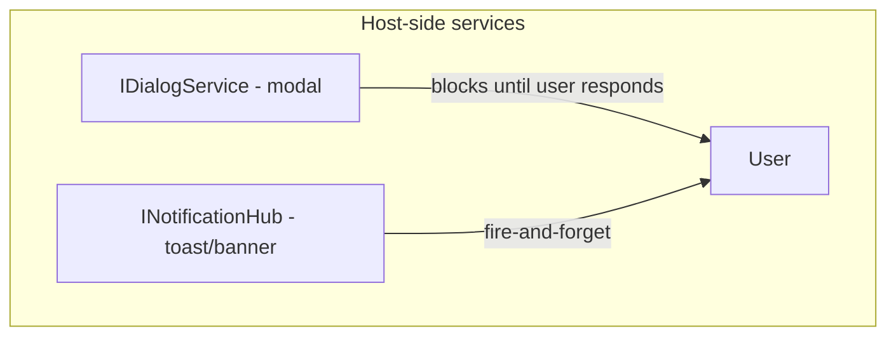
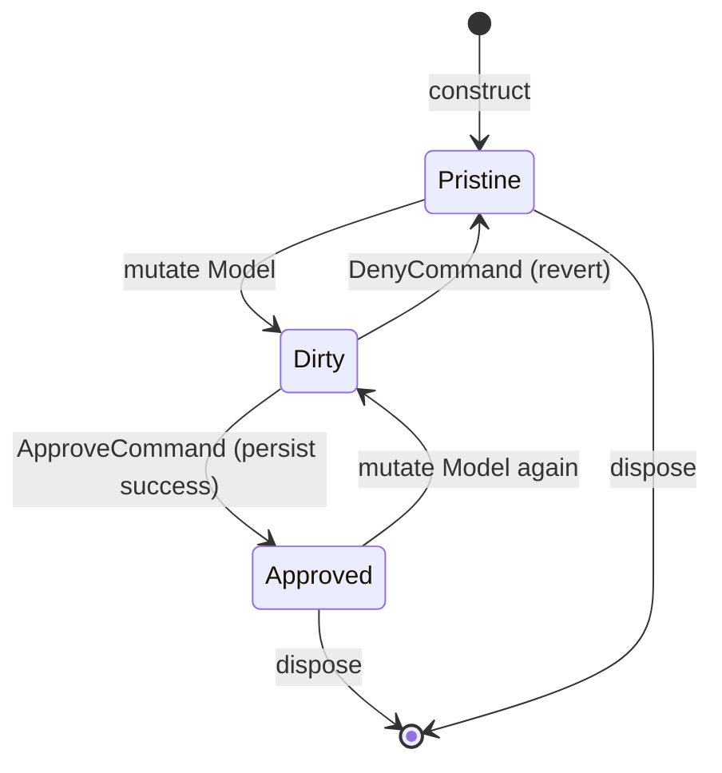

# VMx Absorption Audit — Stage 3 (Forms & Dialogs) Implementation Plan

> **For agentic workers:** REQUIRED SUB-SKILL: Use `superpowers:subagent-driven-development` to execute task-by-task. Steps use checkbox (`- [ ]`) syntax for tracking. This is the Stage 3 detail expansion of the master audit plan at `docs/superpowers/plans/2026-05-27-vmx-absorption-audit.md`.

**Goal:** Add `IDialogService` (host-side modal-interaction contract; chapter 19) and `FormVM<TM>` (snapshot/revert edit lifecycle; chapter 20) to the spec and all three flavors. Bundle in one stage because FormVM's Approve/Cancel UX naturally consumes IDialogService.

**Architecture:** Two new chapters (19, 20), two new ADRs (0029, 0030). Per-flavor `dialogs/` and `forms/` directories. NullDialogService follows ADR-0017 null-object convention. FormVM is ORM-agnostic — persist is a consumer-supplied delegate or `IFormPersister<TM>` collaborator. Integration test wires `ConfirmationDecoratorCommand` to `IDialogService.Confirm()`.

**Tech Stack:** Markdown spec + ADRs + mermaid diagrams; C# .NET with `Task<T>` async + xUnit; Python with `asyncio.Future` / `Awaitable[T]` + pytest + mypy strict; TypeScript with `Promise<T>` + vitest.

______________________________________________________________________

## Context (recap, for subagents picking up cold)

- **Branch:** `feat/v2.1-absorption-audit` (Stage 2 closed at commit `2341c76`; 99 commits on branch).
- **Spec version:** `2.1.0-dev`.
- **Latest ADR:** 0028 (HierarchicalVM). This stage adds 0029, 0030.
- **Latest conformance count:** 195 IDs. This stage adds ~18 (DIA-001..008 + FORM-001..010) → ~213.
- **Repo conventions:** see master plan §"Repository conventions". Key invariants: spec changes need an ADR in same PR; conformance IDs need stubs in every flavor in same PR; commits never include AI attribution; pre-commit may reformat (re-stage and re-commit, never `--amend`).

## Disambiguation prerequisite (from Stage 0 task 0.3)

The existing capability `Dialog.cs` / `dialog.py` / `dialog.ts` (defined in `spec/14-capabilities.md §2.4`) contains three VM-side participant interfaces: `IClosable`, `IApprovable`, `ICancelable`. These are unchanged by this stage. The new `IDialogService` is a host-side service for modal interactions (file pick, confirm prompt, notify). Different directories, different names, orthogonal responsibilities.

## Locked design decisions

### IDialogService (per ADR-0029)

1. **In core (not opt-in subpackage)** — user decision in audit proposal. Adds a small contract surface but no extra packaging.
1. **Four contract methods**:
   - `PickFileToOpen(filter?, title?) -> Task<Path?>` (cancellation returns null)
   - `PickFileToSave(filter?, title?, suggestedName?) -> Task<Path?>`
   - `Confirm(message, title?) -> Task<bool>`
   - `Notify(message, title?, severity?) -> Task` (severity: Info / Warning / Error)
1. **NullDialogService** per ADR-0017 convention — `PickFile*` returns null; `Confirm` returns `false` (safest default); `Notify` no-op.
1. **Host adapter packages live downstream** — this audit does not ship WPF / console / Avalonia adapters.
1. **Reentrancy** — not guaranteed; implementations may choose to queue or reject reentrant calls. Conformance test verifies the contract permits both.
1. **Confirm integration** — `ConfirmationDecoratorCommand` (per ADR-0012) takes a `Func<Task<bool>>`-shaped delegate; `IDialogService.Confirm` is a natural fit. The fluent extension `cmd.Confirm(hub, prompt)` from ADR-0027 (which uses notification hub) is paralleled by a new `cmd.Confirm(dialogService, prompt)` overload — landed in this stage.

### FormVM<TM> (per ADR-0030)

1. **Snapshot at construct** — `Snapshot: TM` (read-only after construct).
1. **Deep snapshot policy: configurable** — default is per-flavor idiomatic "shallow record copy" (C# `with` expression on records; Python `copy.deepcopy` is too aggressive — use `dataclass.replace` semantics or a `Snapshotter<TM>` delegate; TS `structuredClone` for plain object models). Custom snapshotter is opt-in via builder.
1. **`IsDirty: bool`** derived — structural inequality of `Model` vs `Snapshot`. Default equality is per-flavor idiomatic.
1. **`DenyCommand` (a.k.a. Cancel)** reverts `Model` to `Snapshot`, raises hub `PropertyChangedMessage("Model")` and a new `FormRevertedMessage`.
1. **`ApproveCommand`** invokes consumer-supplied `Func<TM, Task>` persister (or `IFormPersister<TM>` interface). On success, raises `OnApproved` and updates `Snapshot` to current `Model`. On failure, no state mutation; an exception propagates.
1. **`Approve.CanExecute = IsDirty` (strict mode)** — opt-in. Default mode: `Approve.CanExecute = true` (consumer-controlled).

## Files to be created or modified

### Created

- `spec/ADRs/0029-dialog-service-in-core.md`
- `spec/ADRs/0030-form-vm.md`
- `spec/19-dialogs.md`
- `spec/20-form-vm.md`
- `langs/csharp/src/VMx/Dialogs/IDialogService.cs`
- `langs/csharp/src/VMx/Dialogs/NullDialogService.cs`
- `langs/csharp/src/VMx/Dialogs/FileFilter.cs` (small value type)
- `langs/csharp/src/VMx/Dialogs/NotificationSeverity.cs` (enum: Info | Warning | Error)
- `langs/csharp/src/VMx/Forms/FormVM.cs`
- `langs/csharp/src/VMx/Forms/FormRevertedMessage.cs`
- `langs/csharp/src/VMx/Forms/IFormPersister.cs`
- `langs/csharp/tests/VMx.Conformance.Tests/DIA_001_to_008_DialogService_Tests.cs`
- `langs/csharp/tests/VMx.Conformance.Tests/FORM_001_to_010_FormVM_Tests.cs`
- `langs/csharp/tests/VMx.Tests/Dialogs/NullDialogServiceTests.cs`
- `langs/csharp/tests/VMx.Tests/Forms/FormVMTests.cs`
- `langs/python/src/vmx/dialogs/__init__.py`
- `langs/python/src/vmx/dialogs/dialog_service.py`
- `langs/python/src/vmx/dialogs/null_dialog_service.py`
- `langs/python/src/vmx/forms/__init__.py`
- `langs/python/src/vmx/forms/form_vm.py`
- `langs/python/src/vmx/messages/form_reverted.py`
- `langs/python/tests/conformance/test_dia_001_to_008_dialog_service.py`
- `langs/python/tests/conformance/test_form_001_to_010_form_vm.py`
- `langs/python/tests/unit/dialogs/test_null_dialog_service.py`
- `langs/python/tests/unit/forms/test_form_vm.py`
- `langs/typescript/src/dialogs/index.ts`
- `langs/typescript/src/dialogs/dialogService.ts`
- `langs/typescript/src/dialogs/nullDialogService.ts`
- `langs/typescript/src/forms/index.ts`
- `langs/typescript/src/forms/formVm.ts`
- `langs/typescript/src/messages/formReverted.ts`
- `langs/typescript/tests/conformance/dia-001-to-008-dialog-service.test.ts`
- `langs/typescript/tests/conformance/form-001-to-010-form-vm.test.ts`
- `langs/typescript/tests/unit/dialogs/nullDialogService.test.ts`
- `langs/typescript/tests/unit/forms/formVm.test.ts`

### Modified

- `spec/ADRs/README.md` (register 0029, 0030)
- `spec/README.md` (TOC + ID count → 213)
- `spec/12-conformance.md` (add DIA- and FORM- blocks)
- `spec/16-notifications.md` (paragraph distinguishing INotificationHub from IDialogService)
- `langs/csharp/src/VMx.Notifications/FluentNotificationExtensions.cs` (consider new `cmd.Confirm(dialogService, prompt)` overload, or place in core `FluentCommandExtensions.cs`)
- `langs/python/src/vmx/messages/__init__.py` (export FormRevertedMessage)
- `langs/typescript/src/messages/index.ts` (export FormRevertedMessage)
- `langs/typescript/src/index.ts` (top-level exports)
- `docs/superpowers/plans/2026-05-27-vmx-absorption-audit.md` (tick Stage 3 at close)

______________________________________________________________________

## Stage 3 progress tracker

- [x] **Substage 3A** — Spec foundation (ADR-0029 + ADR-0030 + chapters 19+20 + conformance IDs + stubs)
- [x] **Substage 3B** — Per-flavor IDialogService + NullDialogService (3 flavors)
- [x] **Substage 3C** — Per-flavor FormVM (3 flavors)
- [x] **Substage 3D** — Cross-chapter integration (16-notifications crossref + Confirm overload + integration test)
- [ ] **Substage 3E** — Stage 3 audit close (2 consecutive zero-finding passes)

______________________________________________________________________

# Substage 3A — Spec foundation

### Task 3A.1: Write ADR-0029 (Dialog service in core)

**Files:**

- Create: `spec/ADRs/0029-dialog-service-in-core.md`

- Modify: `spec/ADRs/README.md`

- [x] **Step 1: Write the ADR.**

```markdown
# ADR 0029 — Dialog service in core

**Status:** Accepted (2026-05-28)
**Spec version:** introduced in 2.1.0

## 1. Context

Both GuideArch versions (Silverlight and current) invented their own `DialogService` for file pickers, confirmation prompts, and toast-style notify. `My.Architecture.View` has an empty `IDialogueFactory` stub. v2.0 VMx has `INotificationHub` for fire-and-forget toast/banner but no contract for **modal** host interactions: file pick, confirm prompt, notify with severity.

`ConfirmationDecoratorCommand` (ADR-0012) takes a delegate-shaped `Func<Task<bool>>`; that pattern composes naturally with `IDialogService.Confirm`, but the audit proposal requires a first-class dialog contract too.

## 2. Options considered

1. Skip — consumers continue to invent their own.
1. Opt-in subpackage (`VMx.Dialogs`) — mirrors notification sub-package (ADR-0013).
1. In core — small contract surface, no extra packaging, discoverable.

## 3. Decision

Option 3 (user decision in audit proposal). `IDialogService` lands in core with four members:

- `PickFileToOpen(filter?, title?) -> Task<Path?>` — null on cancel
- `PickFileToSave(filter?, title?, suggestedName?) -> Task<Path?>` — null on cancel
- `Confirm(message, title?) -> Task<bool>` — false on cancel
- `Notify(message, title?, severity?) -> Task` — severity Info/Warning/Error

`NullDialogService` follows ADR-0017 convention: PickFile* returns null; Confirm returns false (safest default — non-destructive); Notify is no-op.

Host adapters (WPF/Avalonia/console/test) live downstream. Reentrancy is implementation-defined.

## 4. Consequences

- New chapter `spec/19-dialogs.md` defines the contract.
- Eight conformance IDs DIA-001..DIA-008.
- Per-flavor `dialogs/` directory: contract + null impl only.
- `spec/16-notifications.md` extended with a paragraph distinguishing INotificationHub (toast/banner) from IDialogService (modal).
- New fluent command extension `cmd.Confirm(dialogService, prompt)` overload alongside the existing `cmd.Confirm(hub, prompt)` (ADR-0027); both construct the same `Func<Task<bool>>`-shaped delegate.
```

Register in `spec/ADRs/README.md`.

- [x] **Step 2: Commit.**

```bash
git add spec/ADRs/0029-dialog-service-in-core.md spec/ADRs/README.md
git commit -m "spec(adr): add ADR-0029 Dialog service in core"
git log -1 --format='%B' | grep -i 'co-authored-by' && echo "BUG" || echo "clean"
```

If mdformat reformats: re-stage and re-commit (NEVER `--amend`).

### Task 3A.2: Write ADR-0030 (FormVM)

**Files:**

- Create: `spec/ADRs/0030-form-vm.md`

- Modify: `spec/ADRs/README.md`

- [x] **Step 1: Write the ADR.**

```markdown
# ADR 0030 — `FormVM<TM>` (snapshot/revert edit lifecycle, ORM-agnostic)

**Status:** Accepted (2026-05-28)
**Spec version:** introduced in 2.1.0

## 1. Context

VMx.old and My.Architecture.New both ship a `FormVM<TContext, TM, TVM>` coupled to specific ORMs (WCF RIA `DomainContext` / EF `DbContext`). The pattern is real and recurring: a ViewModel wraps a domain model with **edit lifecycle**: snapshot on construct, allow mutation, then either Approve (persist) or Deny (revert).

v2.x VMx is presentation- and ORM-agnostic. The legacy coupling to ORM must go.

## 2. Options considered

1. Skip — consumers reinvent.
1. Couple to a generic persister abstraction baked into VMx.
1. Decouple — persist is a consumer-supplied `Func<TM, Task>` delegate or an `IFormPersister<TM>` collaborator the consumer implements.

## 3. Decision

Option 3 (ORM-agnostic). `FormVM<TM>` members:

- `Model: TM` — live, editable
- `Snapshot: TM` — read-only after construct
- `IsDirty: bool` — derived from structural inequality
- `DenyCommand: ICommand` — reverts Model to Snapshot, raises hub messages
- `ApproveCommand: ICommand` — invokes persister delegate; on success updates Snapshot
- `OnApproved` event/observable — fires after successful persist

Snapshot policy: per-flavor idiomatic shallow copy (record `with` / `dataclass.replace` / `structuredClone`). Custom `Snapshotter<TM>` is opt-in via builder.

Strict mode (opt-in): `Approve.CanExecute = IsDirty`. Default: consumer-controlled.

## 4. Consequences

- New chapter `spec/20-form-vm.md` defines the contract.
- Ten conformance IDs FORM-001..FORM-010.
- New `FormRevertedMessage` per flavor.
- Per-flavor `forms/` directory.
- Integration with `IDialogService.Confirm` (ADR-0029) is a documented composition pattern, not a normative dependency.
```

Register in `spec/ADRs/README.md`.

- [x] **Step 2: Commit.**

```bash
git add spec/ADRs/0030-form-vm.md spec/ADRs/README.md
git commit -m "spec(adr): add ADR-0030 FormVM (snapshot/revert edit lifecycle)"
git log -1 --format='%B' | grep -i 'co-authored-by' && echo "BUG" || echo "clean"
```

### Task 3A.3: Write chapter 19 — Dialogs

**Files:**

- Create: `spec/19-dialogs.md`

- Modify: `spec/README.md`

- [x] **Step 1: Author the chapter.**

Sections: §1 Overview, §2 Contract surface, §3 NullDialogService, §4 IDialogService vs INotificationHub (with mermaid sequence diagram), §5 Reentrancy, §6 Cancellation, §7 ConfirmationDecoratorCommand integration, §8 Conformance.

Diagram for §4 (responsibility split):



- [x] **Step 2: Add chapter 19 to `spec/README.md` v2.1 additions.**

- [x] **Step 3: Commit.**

```bash
git add spec/19-dialogs.md spec/README.md
git commit -m "spec(ch): add chapter 19 IDialogService (host modal interactions)"
```

### Task 3A.4: Write chapter 20 — FormVM

**Files:**

- Create: `spec/20-form-vm.md`

- Modify: `spec/README.md`

- [x] **Step 1: Author the chapter.**

Sections: §1 Overview, §2 Shape (Model, Snapshot, IsDirty, DenyCommand, ApproveCommand, OnApproved), §3 Snapshot policy, §4 Dirty detection, §5 Lifecycle state diagram (mermaid), §6 IDialogService integration, §7 Hub messages (FormRevertedMessage, PropertyChangedMessage), §8 Strict mode, §9 Conformance.

State diagram for §5:



- [x] **Step 2: Add chapter 20 to `spec/README.md`.**

- [x] **Step 3: Commit.**

```bash
git add spec/20-form-vm.md spec/README.md
git commit -m "spec(ch): add chapter 20 FormVM (snapshot/revert edit lifecycle)"
```

### Task 3A.5: Add 8 DIA-NNN + 10 FORM-NNN conformance IDs

**Files:**

- Modify: `spec/12-conformance.md`

- Modify: `spec/README.md` (ID count 195 → 213)

- [x] **Step 1: Add DIA-001..DIA-008 entries to the catalog.**

| ID      | Coverage                                                                                                                                   |
| ------- | ------------------------------------------------------------------------------------------------------------------------------------------ |
| DIA-001 | `PickFileToOpen` contract (filter param, title param, returns Path or null on cancel)                                                      |
| DIA-002 | `PickFileToSave` contract (filter, title, suggestedName, returns Path or null)                                                             |
| DIA-003 | `Confirm` contract (message, optional title, returns bool — false on cancel)                                                               |
| DIA-004 | `Notify` contract (message, title, severity Info/Warning/Error, returns awaitable)                                                         |
| DIA-005 | `NullDialogService`: PickFile\* returns null; Confirm returns false; Notify no-op                                                          |
| DIA-006 | Reentrancy: implementation-defined; conformance test asserts both queueing-implementations and immediate-rejecting-implementations conform |
| DIA-007 | Cancellation: cancelling a pending dialog completes the awaitable with the cancellation result (null or false) without throwing            |
| DIA-008 | `ConfirmationDecoratorCommand` with `() => dialogService.Confirm(prompt)` constructs a valid command graph                                 |

- [x] **Step 2: Add FORM-001..FORM-010 entries.**

| ID       | Coverage                                                                                     |
| -------- | -------------------------------------------------------------------------------------------- |
| FORM-001 | Snapshot captured at construct (read-only thereafter)                                        |
| FORM-002 | Model mutation reflected in `IsDirty`                                                        |
| FORM-003 | `IsDirty` derivation via structural inequality                                               |
| FORM-004 | `DenyCommand` reverts Model to Snapshot                                                      |
| FORM-005 | `ApproveCommand` invokes persister delegate; on success Snapshot is updated to current Model |
| FORM-006 | `OnApproved` event/observable fires only after successful persist                            |
| FORM-007 | Persist failure (exception): no state mutation; exception propagates                         |
| FORM-008 | Hub messages on revert: `FormRevertedMessage` + `PropertyChangedMessage("Model")`            |
| FORM-009 | Strict mode: `Approve.CanExecute` is false when not dirty (opt-in)                           |
| FORM-010 | Integration with `IDialogService.Confirm` in a `DenyCommand.Confirm(prompt)`-wrapped form    |

- [x] **Step 3: Update `spec/README.md` ID count from 195 to 213.**

- [x] **Step 4: Commit.**

```bash
git add spec/12-conformance.md spec/README.md
git commit -m "spec(conf): add DIA-001..008 and FORM-001..010 conformance IDs"
```

### Task 3A.6: Add DIA-/FORM- stubs in all three flavors

**Files:**

- Create: `langs/csharp/tests/VMx.Conformance.Tests/DIA_001_to_008_DialogService_Tests.cs`

- Create: `langs/csharp/tests/VMx.Conformance.Tests/FORM_001_to_010_FormVM_Tests.cs`

- Create: `langs/python/tests/conformance/test_dia_001_to_008_dialog_service.py`

- Create: `langs/python/tests/conformance/test_form_001_to_010_form_vm.py`

- Create: `langs/typescript/tests/conformance/dia-001-to-008-dialog-service.test.ts`

- Create: `langs/typescript/tests/conformance/form-001-to-010-form-vm.test.ts`

- [x] **Step 1: Read existing stub pattern** (e.g., the HIER- stub file landed in Substage 2A for reference).

- [x] **Step 2: Create the 6 stub files** (3 flavors × 2 ID prefixes). Each contains the matching number of stubs (8 DIA / 10 FORM) using the recognized markers:

- C#: `[Fact(Skip = "DIA-NNN not yet implemented"), Trait("Conformance", "DIA-NNN")]`

- Python: `@pytest.mark.conformance("DIA-NNN")` + `@pytest.mark.skip(reason="DIA-NNN not yet implemented")`

- TS: `describe("DIA-NNN", ...)` with `it.todo(...)`

- [x] **Step 3: Run conformance coverage tool.**

```bash
uv --project langs/python run python tools/check-conformance-coverage.py --require csharp --require python --require typescript
```

Expected: 213/213 in all 3 flavors.

- [x] **Step 4: Commit.**

```bash
git add langs/csharp/tests/VMx.Conformance.Tests/DIA_001_to_008_*.cs \
        langs/csharp/tests/VMx.Conformance.Tests/FORM_001_to_010_*.cs \
        langs/python/tests/conformance/test_dia_001_to_008_*.py \
        langs/python/tests/conformance/test_form_001_to_010_*.py \
        langs/typescript/tests/conformance/dia-001-to-008-*.test.ts \
        langs/typescript/tests/conformance/form-001-to-010-*.test.ts
git commit -m "test(conf): add DIA- and FORM- stubs in all three flavors"
```

- [x] **Step 5: Tick Substage 3A checkboxes; commit `docs(plan): tick Substage 3A`.**

______________________________________________________________________

# Substage 3B — Per-flavor IDialogService implementation

This substage implements `IDialogService` + `NullDialogService` in all three flavors. The contract is small (4 methods) and the null impl is trivial. The conformance tests (DIA-001..008) drive the TDD.

### Task 3B.1: C# IDialogService + NullDialogService

**Files:**

- Create: `langs/csharp/src/VMx/Dialogs/IDialogService.cs`

- Create: `langs/csharp/src/VMx/Dialogs/NullDialogService.cs`

- Create: `langs/csharp/src/VMx/Dialogs/FileFilter.cs`

- Create: `langs/csharp/src/VMx/Dialogs/NotificationSeverity.cs`

- Modify: `langs/csharp/tests/VMx.Conformance.Tests/DIA_001_to_008_DialogService_Tests.cs` (real tests)

- Create: `langs/csharp/tests/VMx.Tests/Dialogs/NullDialogServiceTests.cs`

- [x] **Step 1: Replace DIA-001 stub with real failing test.**

```csharp
[Fact]
[Trait("Conformance", "DIA-001")]
public async Task DIA_001_PickFileToOpen_Contract()
{
    var sut = new NullDialogService();
    var result = await sut.PickFileToOpen();
    result.Should().BeNull();  // NullDialogService cancels by default
}
```

- [x] **Step 2: Run test, verify FAIL** (IDialogService / NullDialogService don't exist).

- [x] **Step 3: Create the contract.**

`langs/csharp/src/VMx/Dialogs/NotificationSeverity.cs`:

```csharp
namespace VMx.Dialogs;

public enum NotificationSeverity { Info, Warning, Error }
```

`langs/csharp/src/VMx/Dialogs/FileFilter.cs`:

```csharp
namespace VMx.Dialogs;

public sealed record FileFilter(string Description, IReadOnlyList<string> Extensions);
```

`langs/csharp/src/VMx/Dialogs/IDialogService.cs`:

```csharp
namespace VMx.Dialogs;

using System.IO;
using System.Threading.Tasks;

public interface IDialogService
{
    Task<string?> PickFileToOpen(FileFilter? filter = null, string? title = null);
    Task<string?> PickFileToSave(FileFilter? filter = null, string? title = null, string? suggestedName = null);
    Task<bool> Confirm(string message, string? title = null);
    Task Notify(string message, string? title = null, NotificationSeverity severity = NotificationSeverity.Info);
}
```

`langs/csharp/src/VMx/Dialogs/NullDialogService.cs`:

```csharp
namespace VMx.Dialogs;

using System.Threading.Tasks;

public sealed class NullDialogService : IDialogService
{
    public Task<string?> PickFileToOpen(FileFilter? filter = null, string? title = null)
        => Task.FromResult<string?>(null);

    public Task<string?> PickFileToSave(FileFilter? filter = null, string? title = null, string? suggestedName = null)
        => Task.FromResult<string?>(null);

    public Task<bool> Confirm(string message, string? title = null)
        => Task.FromResult(false);

    public Task Notify(string message, string? title = null, NotificationSeverity severity = NotificationSeverity.Info)
        => Task.CompletedTask;
}
```

- [x] **Step 4: Run test, verify PASS.**

- [x] **Step 5: Implement DIA-002..DIA-008** one by one. Each conformance test:

- DIA-002: `PickFileToSave` returns null in null impl.

- DIA-003: `Confirm` returns false in null impl.

- DIA-004: `Notify` completes without error.

- DIA-005: combined verification of all null-impl returns above.

- DIA-006: reentrancy — implementation-defined; the test should exercise both queueing and rejecting behaviors and verify both conform. NullDialogService is trivially reentrant (no shared state); the test can stub a queueing implementation and a rejecting implementation to verify both are valid.

- DIA-007: cancellation — the test invokes a `CancellationToken`-aware impl and verifies the returned awaitable completes with the cancellation result without throwing.

- DIA-008: `ConfirmationDecoratorCommand(() => dialogService.Confirm("ok?"), innerCmd)` constructs a valid command graph; CanExecute and Execute behave as documented.

- [x] **Step 6: Add unit tests** in `NullDialogServiceTests.cs` for: default Severity, null filter/title, multiple successive calls.

- [x] **Step 7: Run tooling.**

```bash
cd langs/csharp && dotnet build && dotnet test --filter "Conformance~DIA-" && dotnet format --verify-no-changes
```

- [x] **Step 8: Commit.**

```bash
git add langs/csharp/src/VMx/Dialogs/ langs/csharp/tests/VMx.Conformance.Tests/DIA_001_to_008_DialogService_Tests.cs langs/csharp/tests/VMx.Tests/Dialogs/NullDialogServiceTests.cs
git commit -m "feat(csharp,dia): implement IDialogService + NullDialogService (DIA-001..008)"
git log -1 --format='%B' | grep -i 'co-authored-by' && echo "BUG" || echo "clean"
```

### Task 3B.2: Python IDialogService + NullDialogService

**Files:**

- Create: `langs/python/src/vmx/dialogs/__init__.py`

- Create: `langs/python/src/vmx/dialogs/dialog_service.py`

- Create: `langs/python/src/vmx/dialogs/null_dialog_service.py`

- Modify: `langs/python/tests/conformance/test_dia_001_to_008_dialog_service.py`

- Create: `langs/python/tests/unit/dialogs/test_null_dialog_service.py`

- [x] **Step 1: Replace DIA-001 stub with real failing test.**

```python
import pytest
from typing import Any


@pytest.mark.conformance("DIA-001")
@pytest.mark.asyncio
async def test_dia_001_pick_file_to_open_contract() -> None:
    from vmx.dialogs import NullDialogService
    sut = NullDialogService()
    result = await sut.pick_file_to_open()
    assert result is None
```

If the project doesn't use `pytest-asyncio`, use `asyncio.run` instead.

- [x] **Step 2: Run test, verify FAIL.**

- [x] **Step 3: Create the contract and null impl.**

`langs/python/src/vmx/dialogs/dialog_service.py`:

```python
"""IDialogService contract (chapter 19, ADR-0029)."""

from __future__ import annotations

from abc import ABC, abstractmethod
from dataclasses import dataclass
from enum import Enum
from typing import Sequence


class NotificationSeverity(Enum):
    INFO = "info"
    WARNING = "warning"
    ERROR = "error"


@dataclass(frozen=True)
class FileFilter:
    description: str
    extensions: Sequence[str]


class DialogService(ABC):
    """Host-side modal interactions. See ADR-0029."""

    @abstractmethod
    async def pick_file_to_open(
        self,
        filter: FileFilter | None = None,
        title: str | None = None,
    ) -> str | None: ...

    @abstractmethod
    async def pick_file_to_save(
        self,
        filter: FileFilter | None = None,
        title: str | None = None,
        suggested_name: str | None = None,
    ) -> str | None: ...

    @abstractmethod
    async def confirm(
        self,
        message: str,
        title: str | None = None,
    ) -> bool: ...

    @abstractmethod
    async def notify(
        self,
        message: str,
        title: str | None = None,
        severity: NotificationSeverity = NotificationSeverity.INFO,
    ) -> None: ...
```

`langs/python/src/vmx/dialogs/null_dialog_service.py`:

```python
"""NullDialogService — null-object impl per ADR-0017."""

from __future__ import annotations

from vmx.dialogs.dialog_service import DialogService, FileFilter, NotificationSeverity


class NullDialogService(DialogService):
    async def pick_file_to_open(
        self, filter: FileFilter | None = None, title: str | None = None
    ) -> str | None:
        return None

    async def pick_file_to_save(
        self,
        filter: FileFilter | None = None,
        title: str | None = None,
        suggested_name: str | None = None,
    ) -> str | None:
        return None

    async def confirm(self, message: str, title: str | None = None) -> bool:
        return False

    async def notify(
        self,
        message: str,
        title: str | None = None,
        severity: NotificationSeverity = NotificationSeverity.INFO,
    ) -> None:
        return None
```

Export from `__init__.py`:

```python
"""IDialogService (chapter 19)."""

from vmx.dialogs.dialog_service import DialogService, FileFilter, NotificationSeverity
from vmx.dialogs.null_dialog_service import NullDialogService

__all__ = ["DialogService", "FileFilter", "NotificationSeverity", "NullDialogService"]
```

- [x] **Step 4: Run test, verify PASS.**

- [x] **Step 5: Implement DIA-002..008** analogous to C# (Step 5 above).

- [x] **Step 6: Add unit tests** at `langs/python/tests/unit/dialogs/test_null_dialog_service.py`.

- [x] **Step 7: Run tooling.**

```bash
cd langs/python && uv run pytest tests/conformance/test_dia_001_to_008_dialog_service.py tests/unit/dialogs/ && uv run mypy --strict src/vmx && uv run ruff check && uv run ruff format --check
```

- [x] **Step 8: Commit.**

```bash
git add langs/python/src/vmx/dialogs/ langs/python/tests/conformance/test_dia_001_to_008_*.py langs/python/tests/unit/dialogs/
git commit -m "feat(python,dia): implement DialogService + NullDialogService (DIA-001..008)"
```

### Task 3B.3: TypeScript IDialogService + NullDialogService

**Files:**

- Create: `langs/typescript/src/dialogs/index.ts`

- Create: `langs/typescript/src/dialogs/dialogService.ts`

- Create: `langs/typescript/src/dialogs/nullDialogService.ts`

- Modify: `langs/typescript/src/index.ts` (re-export)

- Modify: `langs/typescript/tests/conformance/dia-001-to-008-dialog-service.test.ts`

- Create: `langs/typescript/tests/unit/dialogs/nullDialogService.test.ts`

- [x] **Step 1: Replace DIA-001 stub with real failing test.**

```typescript
import { describe, expect, it } from "vitest";
import { NullDialogService } from "../../src/dialogs";

describe("DIA-001", () => {
  it("PickFileToOpen returns null in null impl", async () => {
    const sut = new NullDialogService();
    const result = await sut.pickFileToOpen();
    expect(result).toBeNull();
  });
});
```

- [x] **Step 2: Run test, verify FAIL.**

- [x] **Step 3: Create the contract and null impl.**

`langs/typescript/src/dialogs/dialogService.ts`:

```typescript
export type NotificationSeverity = "info" | "warning" | "error";

export interface FileFilter {
  readonly description: string;
  readonly extensions: readonly string[];
}

export interface IDialogService {
  pickFileToOpen(filter?: FileFilter | null, title?: string | null): Promise<string | null>;
  pickFileToSave(filter?: FileFilter | null, title?: string | null, suggestedName?: string | null): Promise<string | null>;
  confirm(message: string, title?: string | null): Promise<boolean>;
  notify(message: string, title?: string | null, severity?: NotificationSeverity): Promise<void>;
}
```

`langs/typescript/src/dialogs/nullDialogService.ts`:

```typescript
import type { IDialogService, FileFilter, NotificationSeverity } from "./dialogService.js";

export class NullDialogService implements IDialogService {
  async pickFileToOpen(_filter?: FileFilter | null, _title?: string | null): Promise<string | null> {
    return null;
  }
  async pickFileToSave(
    _filter?: FileFilter | null,
    _title?: string | null,
    _suggestedName?: string | null,
  ): Promise<string | null> {
    return null;
  }
  async confirm(_message: string, _title?: string | null): Promise<boolean> {
    return false;
  }
  async notify(
    _message: string,
    _title?: string | null,
    _severity?: NotificationSeverity,
  ): Promise<void> {
    return;
  }
}
```

`langs/typescript/src/dialogs/index.ts`:

```typescript
export type { IDialogService, FileFilter, NotificationSeverity } from "./dialogService.js";
export { NullDialogService } from "./nullDialogService.js";
```

Re-export from `langs/typescript/src/index.ts`.

- [x] **Step 4: Run test, verify PASS.**

- [x] **Step 5: Implement DIA-002..008** analogous to C# / Python.

- [x] **Step 6: Unit tests** at `langs/typescript/tests/unit/dialogs/nullDialogService.test.ts`.

- [x] **Step 7: Run tooling.**

```bash
cd langs/typescript && npm run typecheck && npm run lint && npm test -- dialogs
```

- [x] **Step 8: Commit.**

```bash
git add langs/typescript/src/dialogs/ langs/typescript/src/index.ts langs/typescript/tests/
git commit -m "feat(typescript,dia): implement IDialogService + NullDialogService (DIA-001..008)"
```

- [x] **Step 9: Tick Substage 3B checkboxes; commit `docs(plan): tick Substage 3B`.**

______________________________________________________________________

# Substage 3C — Per-flavor FormVM implementation

This substage implements `FormVM<TM>` in all three flavors. The contract has 5 members + snapshot policy + integration hooks. The conformance tests (FORM-001..010) drive TDD.

### Task 3C.1: C# FormVM

**Files:**

- Create: `langs/csharp/src/VMx/Forms/FormVM.cs`

- Create: `langs/csharp/src/VMx/Forms/FormRevertedMessage.cs`

- Create: `langs/csharp/src/VMx/Forms/IFormPersister.cs`

- Modify: `langs/csharp/tests/VMx.Conformance.Tests/FORM_001_to_010_FormVM_Tests.cs` (real tests)

- Create: `langs/csharp/tests/VMx.Tests/Forms/FormVMTests.cs` (unit tests)

- [x] **Step 1: Replace FORM-001 stub with real failing test.**

```csharp
public sealed record Person(string Name, int Age);

[Fact]
[Trait("Conformance", "FORM-001")]
public void FORM_001_Snapshot_Captured_At_Construct()
{
    var initial = new Person("Alice", 30);
    var sut = new FormVM<Person>(initial, async _ => { });
    sut.Snapshot.Should().Be(initial);
    sut.Model.Should().Be(initial);
    sut.IsDirty.Should().BeFalse();
}
```

- [x] **Step 2: Run test, verify FAIL.**

- [x] **Step 3: Create the FormVM implementation.**

`langs/csharp/src/VMx/Forms/IFormPersister.cs`:

```csharp
namespace VMx.Forms;

using System.Threading.Tasks;

public interface IFormPersister<TM>
{
    Task PersistAsync(TM model);
}
```

`langs/csharp/src/VMx/Forms/FormRevertedMessage.cs`:

```csharp
namespace VMx.Forms;

using VMx.Messages;

public sealed record FormRevertedMessage(object Source) : IMessage
{
    public string SenderName => Source.GetType().Name;
}
```

`langs/csharp/src/VMx/Forms/FormVM.cs`:

```csharp
namespace VMx.Forms;

using System;
using System.Threading.Tasks;
using VMx.Commands;
using VMx.Components;
using VMx.Messages;

public sealed class FormVM<TM> : ComponentVM<TM> where TM : notnull
{
    private readonly Func<TM, Task> _persister;
    private TM _snapshot;
    private TM _model;
    private readonly bool _strict;
    private readonly Func<TM, TM>? _snapshotter;

    public FormVM(TM initial, Func<TM, Task> persister, bool strict = false, Func<TM, TM>? snapshotter = null)
        : base(initial)
    {
        _snapshotter = snapshotter;
        _snapshot = _snapshotter?.Invoke(initial) ?? initial;
        _model = initial;
        _persister = persister;
        _strict = strict;

        DenyCommand = new RelayCommand(() => { Revert(); }, () => true);
        ApproveCommand = new RelayCommand(async () => { await ApproveAsync(); }, () => !_strict || IsDirty);
    }

    public TM Model => _model;
    public TM Snapshot => _snapshot;
    public bool IsDirty => !Equals(_model, _snapshot);

    public ICommand DenyCommand { get; }
    public ICommand ApproveCommand { get; }

    public event EventHandler<TM>? OnApproved;

    public void SetModel(TM newModel)
    {
        _model = newModel;
        RaisePropertyChanged(nameof(Model));
        RaisePropertyChanged(nameof(IsDirty));
        ApproveCommand.RaiseCanExecuteChanged();
    }

    private void Revert()
    {
        _model = _snapshotter?.Invoke(_snapshot) ?? _snapshot;
        Hub.Publish(new FormRevertedMessage(this));
        RaisePropertyChanged(nameof(Model));
        RaisePropertyChanged(nameof(IsDirty));
        ApproveCommand.RaiseCanExecuteChanged();
    }

    private async Task ApproveAsync()
    {
        await _persister(_model);
        _snapshot = _snapshotter?.Invoke(_model) ?? _model;
        RaisePropertyChanged(nameof(Snapshot));
        RaisePropertyChanged(nameof(IsDirty));
        ApproveCommand.RaiseCanExecuteChanged();
        OnApproved?.Invoke(this, _model);
    }
}
```

(Adapt to the actual `ComponentVM<TM>` / `RelayCommand` / `IMessage` / Hub APIs in the repo. Read those first.)

- [x] **Step 4: Run test, verify PASS.**

- [x] **Step 5: Implement FORM-002..010** one by one.

FORM-002 (mutation tracked):

```csharp
[Fact]
[Trait("Conformance", "FORM-002")]
public void FORM_002_Model_Mutation_Tracked()
{
    var initial = new Person("Alice", 30);
    var sut = new FormVM<Person>(initial, async _ => { });
    sut.SetModel(initial with { Age = 31 });
    sut.IsDirty.Should().BeTrue();
    sut.Model.Age.Should().Be(31);
    sut.Snapshot.Age.Should().Be(30);
}
```

FORM-003 (IsDirty structural inequality): similar shape.

FORM-004 (Deny reverts):

```csharp
[Fact]
[Trait("Conformance", "FORM-004")]
public void FORM_004_Deny_Reverts_To_Snapshot()
{
    var initial = new Person("Alice", 30);
    var sut = new FormVM<Person>(initial, async _ => { });
    sut.SetModel(initial with { Age = 31 });
    sut.DenyCommand.Execute(null);
    sut.Model.Should().Be(initial);
    sut.IsDirty.Should().BeFalse();
}
```

FORM-005 (Approve persists + snapshot updates):

```csharp
[Fact]
[Trait("Conformance", "FORM-005")]
public async Task FORM_005_Approve_Persists_And_Updates_Snapshot()
{
    var initial = new Person("Alice", 30);
    Person? persisted = null;
    var sut = new FormVM<Person>(initial, async m => { persisted = m; });
    var updated = initial with { Age = 31 };
    sut.SetModel(updated);

    sut.ApproveCommand.Execute(null);
    await Task.Delay(50);  // let the async persister complete

    persisted.Should().Be(updated);
    sut.Snapshot.Should().Be(updated);
    sut.IsDirty.Should().BeFalse();
}
```

FORM-006 (OnApproved): subscribe to event, assert it fires.

FORM-007 (Persist failure no mutation):

```csharp
[Fact]
[Trait("Conformance", "FORM-007")]
public async Task FORM_007_Persist_Failure_No_Mutation()
{
    var initial = new Person("Alice", 30);
    var sut = new FormVM<Person>(initial, async _ => throw new InvalidOperationException("bang"));
    var updated = initial with { Age = 31 };
    sut.SetModel(updated);
    var beforeApprove = sut.Snapshot;
    try { sut.ApproveCommand.Execute(null); await Task.Delay(50); } catch { }
    sut.Snapshot.Should().Be(beforeApprove);  // unchanged
    sut.IsDirty.Should().BeTrue();  // still dirty
}
```

FORM-008 (Hub messages on revert): use a stub hub, assert FormRevertedMessage published.

FORM-009 (Strict mode):

```csharp
[Fact]
[Trait("Conformance", "FORM-009")]
public void FORM_009_Strict_Approve_Can_Execute_Only_When_Dirty()
{
    var initial = new Person("Alice", 30);
    var sut = new FormVM<Person>(initial, async _ => { }, strict: true);
    sut.ApproveCommand.CanExecute(null).Should().BeFalse();
    sut.SetModel(initial with { Age = 31 });
    sut.ApproveCommand.CanExecute(null).Should().BeTrue();
}
```

FORM-010 (Integration with IDialogService.Confirm):

```csharp
[Fact]
[Trait("Conformance", "FORM-010")]
public async Task FORM_010_DenyConfirmed_Via_DialogService()
{
    var initial = new Person("Alice", 30);
    var sut = new FormVM<Person>(initial, async _ => { });
    sut.SetModel(initial with { Age = 31 });

    var dialog = new NullDialogService();  // returns false on Confirm
    var confirmedDeny = sut.DenyCommand.Confirm(() => dialog.Confirm("Revert?"));

    confirmedDeny.Execute(null);
    await Task.Delay(50);
    sut.IsDirty.Should().BeTrue();  // Not reverted because Confirm returned false (NullDialogService default)
}
```

(Note: `cmd.Confirm(Func<Task<bool>>)` already exists from ADR-0027; the FORM-010 test uses that.)

- [x] **Step 6: Add unit tests** in `FormVMTests.cs` for edge cases (re-approve same snapshot, nested mutations, multiple snapshots, equality for value vs reference models).

- [x] **Step 7: Run tooling.**

```bash
cd langs/csharp && dotnet build && dotnet test && dotnet format --verify-no-changes
```

- [x] **Step 8: Commit.**

```bash
git add langs/csharp/src/VMx/Forms/ langs/csharp/tests/VMx.Conformance.Tests/FORM_001_to_010_*.cs langs/csharp/tests/VMx.Tests/Forms/
git commit -m "feat(csharp,form): implement FormVM<TM> (FORM-001..010)"
```

### Task 3C.2: Python FormVM

Mirror C# work:

**Files:**

- Create: `langs/python/src/vmx/forms/__init__.py`

- Create: `langs/python/src/vmx/forms/form_vm.py`

- Create: `langs/python/src/vmx/messages/form_reverted.py`

- Modify: `langs/python/src/vmx/messages/__init__.py` (export)

- Modify: `langs/python/tests/conformance/test_form_001_to_010_form_vm.py`

- Create: `langs/python/tests/unit/forms/test_form_vm.py`

- [x] **Step 1: Real test for FORM-001:**

```python
from dataclasses import dataclass

import pytest


@dataclass(frozen=True)
class Person:
    name: str
    age: int


@pytest.mark.conformance("FORM-001")
def test_form_001_snapshot_at_construct() -> None:
    from vmx.forms import FormVM

    initial = Person("Alice", 30)

    async def persist(_: Person) -> None:
        pass

    sut: FormVM[Person] = FormVM(initial, persist)
    assert sut.snapshot == initial
    assert sut.model == initial
    assert sut.is_dirty is False
```

- [x] **Step 2: Run test, verify FAIL.**

- [x] **Step 3: Create `form_vm.py` and `form_reverted.py`.**

`langs/python/src/vmx/messages/form_reverted.py`:

```python
"""FormRevertedMessage (ADR-0030)."""

from __future__ import annotations

from dataclasses import dataclass
from typing import Any


@dataclass(frozen=True)
class FormRevertedMessage:
    sender: Any

    @property
    def sender_name(self) -> str:
        return type(self.sender).__name__
```

`langs/python/src/vmx/forms/form_vm.py`:

```python
"""FormVM[TM] (chapter 20, ADR-0030)."""

from __future__ import annotations

from collections.abc import Awaitable, Callable
from typing import Any, Generic, TypeVar

from vmx.commands import ICommand, RelayCommand
from vmx.components import ComponentVM
from vmx.messages.form_reverted import FormRevertedMessage

TM = TypeVar("TM")


class FormVM(ComponentVM[TM], Generic[TM]):
    def __init__(
        self,
        initial: TM,
        persister: Callable[[TM], Awaitable[None]],
        *,
        strict: bool = False,
        snapshotter: Callable[[TM], TM] | None = None,
    ) -> None:
        super().__init__(initial)
        self._snapshotter = snapshotter
        self._snapshot: TM = snapshotter(initial) if snapshotter else initial
        self._model: TM = initial
        self._persister = persister
        self._strict = strict

    @property
    def model(self) -> TM:
        return self._model

    @property
    def snapshot(self) -> TM:
        return self._snapshot

    @property
    def is_dirty(self) -> bool:
        return self._model != self._snapshot

    def set_model(self, new_model: TM) -> None:
        self._model = new_model

    def revert(self) -> None:
        self._model = self._snapshotter(self._snapshot) if self._snapshotter else self._snapshot
        # publish FormRevertedMessage via hub (per-flavor hub API)

    async def approve(self) -> None:
        await self._persister(self._model)
        self._snapshot = self._snapshotter(self._model) if self._snapshotter else self._model
```

(Adapt to actual hub / RelayCommand API.)

- [x] **Step 4: Run test, verify PASS.**

- [x] **Step 5: Implement FORM-002..010** analogous to C#.

- [x] **Step 6: Unit tests at `tests/unit/forms/test_form_vm.py`.**

- [x] **Step 7: Run tooling.**

```bash
cd langs/python && uv run pytest && uv run mypy --strict src/vmx && uv run ruff check && uv run ruff format --check
```

- [x] **Step 8: Commit.**

```bash
git add langs/python/src/vmx/forms/ langs/python/src/vmx/messages/ langs/python/tests/conformance/test_form_001_to_010_*.py langs/python/tests/unit/forms/
git commit -m "feat(python,form): implement FormVM[TM] (FORM-001..010)"
```

### Task 3C.3: TypeScript FormVM

Mirror C# work:

**Files:**

- Create: `langs/typescript/src/forms/index.ts`

- Create: `langs/typescript/src/forms/formVm.ts`

- Create: `langs/typescript/src/messages/formReverted.ts`

- Modify: `langs/typescript/src/messages/index.ts` (export)

- Modify: `langs/typescript/src/index.ts` (re-export)

- Modify: `langs/typescript/tests/conformance/form-001-to-010-form-vm.test.ts`

- Create: `langs/typescript/tests/unit/forms/formVm.test.ts`

- [x] **Step 1: Real test for FORM-001.**

```typescript
import { describe, expect, it } from "vitest";
import { FormVM } from "../../src/forms";

interface Person { readonly name: string; readonly age: number }

describe("FORM-001", () => {
  it("Snapshot captured at construct", () => {
    const initial: Person = { name: "Alice", age: 30 };
    const sut = new FormVM<Person>({
      initial,
      persister: async () => {},
    });
    expect(sut.snapshot).toEqual(initial);
    expect(sut.model).toEqual(initial);
    expect(sut.isDirty).toBe(false);
  });
});
```

- [x] **Step 2: Run test, verify FAIL.**

- [x] **Step 3: Create `formVm.ts` and `formReverted.ts`.**

`langs/typescript/src/messages/formReverted.ts`:

```typescript
export class FormRevertedMessage<T> {
  constructor(public readonly sender: T) {}
  get senderName(): string {
    return (this.sender as { constructor: { name: string } }).constructor.name;
  }
}
```

`langs/typescript/src/forms/formVm.ts`:

```typescript
import { ComponentVMBase } from "../components/componentVm.js";

export interface FormVMOptions<TM> {
  initial: TM;
  persister: (model: TM) => Promise<void>;
  strict?: boolean;
  snapshotter?: (model: TM) => TM;
  name?: string;
}

export class FormVM<TM> extends ComponentVMBase {
  #snapshot: TM;
  #model: TM;
  readonly #persister: (model: TM) => Promise<void>;
  readonly #strict: boolean;
  readonly #snapshotter: ((m: TM) => TM) | undefined;

  constructor(opts: FormVMOptions<TM>) {
    super({ name: opts.name ?? new.target.name });
    this.#snapshotter = opts.snapshotter;
    this.#snapshot = this.#snapshotter ? this.#snapshotter(opts.initial) : opts.initial;
    this.#model = opts.initial;
    this.#persister = opts.persister;
    this.#strict = opts.strict ?? false;
  }

  get model(): TM { return this.#model; }
  get snapshot(): TM { return this.#snapshot; }

  get isDirty(): boolean {
    // Use structural equality via JSON for plain objects;
    // consumers can override by providing a custom snapshotter + equality elsewhere.
    return JSON.stringify(this.#model) !== JSON.stringify(this.#snapshot);
  }

  setModel(newModel: TM): void {
    this.#model = newModel;
  }

  revert(): void {
    this.#model = this.#snapshotter ? this.#snapshotter(this.#snapshot) : this.#snapshot;
  }

  async approve(): Promise<void> {
    await this.#persister(this.#model);
    this.#snapshot = this.#snapshotter ? this.#snapshotter(this.#model) : this.#model;
  }
}
```

(Adapt to actual `ComponentVMBase` API.)

`langs/typescript/src/forms/index.ts`:

```typescript
export { FormVM } from "./formVm.js";
export type { FormVMOptions } from "./formVm.js";
```

Re-export from `langs/typescript/src/index.ts`.

- [x] **Step 4: Run test, verify PASS.**

- [x] **Step 5: Implement FORM-002..010** analogous to C# / Python.

- [x] **Step 6: Unit tests.**

- [x] **Step 7: Run tooling.**

```bash
cd langs/typescript && npm run typecheck && npm run lint && npm test -- forms
```

- [x] **Step 8: Commit.**

```bash
git add langs/typescript/src/forms/ langs/typescript/src/messages/ langs/typescript/src/index.ts langs/typescript/tests/
git commit -m "feat(typescript,form): implement FormVM<TM> (FORM-001..010)"
```

- [x] **Step 9: Tick Substage 3C checkboxes; commit `docs(plan): tick Substage 3C`.**

______________________________________________________________________

# Substage 3D — Cross-chapter integration + Confirm-overload + integration test

### Task 3D.1: Extend `spec/16-notifications.md`

**Files:**

- Modify: `spec/16-notifications.md`

- [x] **Step 1: Add a subsection distinguishing INotificationHub from IDialogService.**

Find the appropriate location in chapter 16 (probably §1 Overview or end of chapter). Add:

```markdown
## N. Distinction from `IDialogService`

`INotificationHub` carries **fire-and-forget** notifications: toast/banner messages that the user may dismiss but is not required to respond to. The hub is hot — subscribers see messages as they happen.

`IDialogService` (chapter 19) is for **modal** host interactions where the consumer awaits a user response (file pick, confirm Yes/No, severity-tagged notify). The dialog service is request/response.

A consumer-facing notification that requires user action goes through `IDialogService.Confirm`; an informational toast goes through `INotificationHub.Post`. The two services are orthogonal and may both be injected.
```

- [x] **Step 2: Commit.**

```bash
git add spec/16-notifications.md
git commit -m "spec(ch): distinguish INotificationHub from IDialogService (chapter 16)"
```

### Task 3D.2: Add `cmd.Confirm(dialogService, prompt)` overload to fluent commands

**Files:**

- Modify: `langs/csharp/src/VMx/Commands/FluentCommandExtensions.cs` (add `Confirm(IDialogService, string)` overload)

- Modify: `langs/python/src/vmx/commands/fluent.py` (add `confirm_with_dialog_service(command, dialog_service, prompt)` function)

- Modify: `langs/typescript/src/commands/fluent.ts` (add `confirmWithDialogService(command, dialogService, prompt)` function)

- [x] **Step 1: Read existing `confirm` / `confirmWithHub` overloads in each flavor** to mirror style.

- [x] **Step 2: Add new overload/function in each flavor.**

C#:

```csharp
public static ICommand Confirm(this ICommand command, IDialogService dialogService, string prompt)
    => command.Confirm(() => dialogService.Confirm(prompt));
```

Python:

```python
def confirm_with_dialog_service(
    command: ICommand,
    dialog_service: DialogService,
    prompt: str,
) -> ICommand:
    async def confirm_callback() -> bool:
        return await dialog_service.confirm(prompt)
    return confirm(command, confirm_callback)
```

TS:

```typescript
export function confirmWithDialogService(
  command: ICommand,
  dialogService: IDialogService,
  prompt: string,
): ICommand {
  return confirm(command, () => dialogService.confirm(prompt));
}
```

- [x] **Step 3: Run all 3 flavor test suites to ensure no regressions.**

- [x] **Step 4: Commit.**

```bash
git add langs/csharp/src/VMx/Commands/FluentCommandExtensions.cs langs/python/src/vmx/commands/fluent.py langs/typescript/src/commands/fluent.ts
git commit -m "feat(cmd): add cmd.Confirm(dialogService, prompt) fluent overload"
```

### Task 3D.3: Tick Substage 3D checkboxes

- [x] Commit: `docs(plan): tick Substage 3D — cross-chapter integration`

______________________________________________________________________

# Substage 3E — Stage 3 audit close

Follow the established pattern: 4 parallel audits (csharp / python / typescript / spec/docs), fix findings, re-audit until 2 consecutive zero-finding passes, own spot-check between agent runs.

### Task 3E.1: Audit pass A

- [ ] Dispatch 4 parallel audit subagents or 1 combined audit subagent (per Stage 1/2 close pattern).
- [ ] Aggregate findings.
- [ ] Fix all Critical + Important; consider Minors.
- [ ] Verdict: CLEAN advances counter to 1/2.

### Task 3E.2: Own spot-check

- [ ] Run key invariants yourself:
  ```bash
  grep -c '^### DIA-' spec/12-conformance.md   # expect 8
  grep -c '^### FORM-' spec/12-conformance.md  # expect 10
  uv --project langs/python run python tools/check-conformance-coverage.py --require csharp --require python --require typescript
  for sha in $(git log main..HEAD --format='%H'); do msg=$(git log -1 $sha --format='%B'); echo "$msg" | grep -qi 'co-authored-by\|claude.com\|anthropic' && echo "BAD: $sha"; done
  ```

### Task 3E.3: Audit pass B

- [ ] Dispatch fresh combined audit subagent.
- [ ] Verify zero findings.
- [ ] Counter advances to 2/2 — Stage 3 CLOSED.

### Task 3E.4: Tick Stage 3 box in master plan

- [ ] Edit `docs/superpowers/plans/2026-05-27-vmx-absorption-audit.md`:

  ```
  - [ ] **Stage 3** — Forms & Dialogs (C4 `FormVM`, C2 `IDialogService`)
  ```

  to:

  ```
  - [x] **Stage 3** — Forms & Dialogs (C4 `FormVM`, C2 `IDialogService`)
  ```

- [ ] Commit: `docs(plan): close Stage 3 (Forms & Dialogs) — 2 consecutive clean audit passes`

- [ ] Spawn Stage 4 detailed plan via `superpowers:writing-plans` skill.

______________________________________________________________________

## Self-review checklist

1. **Spec coverage:** All 18 IDs (DIA-001..008 + FORM-001..010) map to a step in Substages 3B/3C. ✓
1. **Two ADRs:** 0029 + 0030, both in §3A. ✓
1. **Two chapters:** 19 + 20, both in §3A. ✓
1. **Diagrams:** §3A.3 (dialog vs notification mermaid), §3A.4 (FormVM state mermaid). ✓
1. **Cross-chapter:** §3D.1 extends ch.16. ✓
1. **Integration:** §3D.2 adds the `cmd.Confirm(dialogService, prompt)` overload; FORM-010 is the integration conformance test. ✓
1. **Disambiguation:** prerequisite note at top of plan. ✓
1. **Audit gates:** 2 consecutive zero-finding passes per user's strict-clean-pass-gate. ✓
1. **No placeholders:** every step has actual code or a concrete command. ✓
1. **Type consistency:** FormVM uses `Model`/`Snapshot`/`IsDirty`/`DenyCommand`/`ApproveCommand`/`OnApproved` consistently across flavors (with idiomatic casing). ✓
1. **No AI attribution:** every commit step ends with the grep verification. ✓
