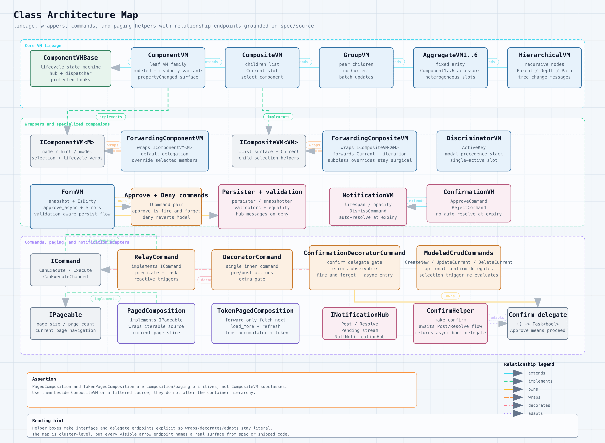

# Class Architecture

The class map groups the main VMx families: lifecycle base types, VM hierarchy
primitives, wrappers, commands, services, state helpers, collections, and the
opt-in notifications layer.

Support links: [HTML](../../assets/diagrams/class-architecture.html),
[SVG](../../assets/diagrams/class-architecture.svg),
[PNG](../../assets/diagrams/class-architecture.png)

## Use This Page When

- you want to see which concepts are peers
- you need to separate base primitives from extension layers
- you are deciding whether a wrapper, helper, or core VM family fits better
