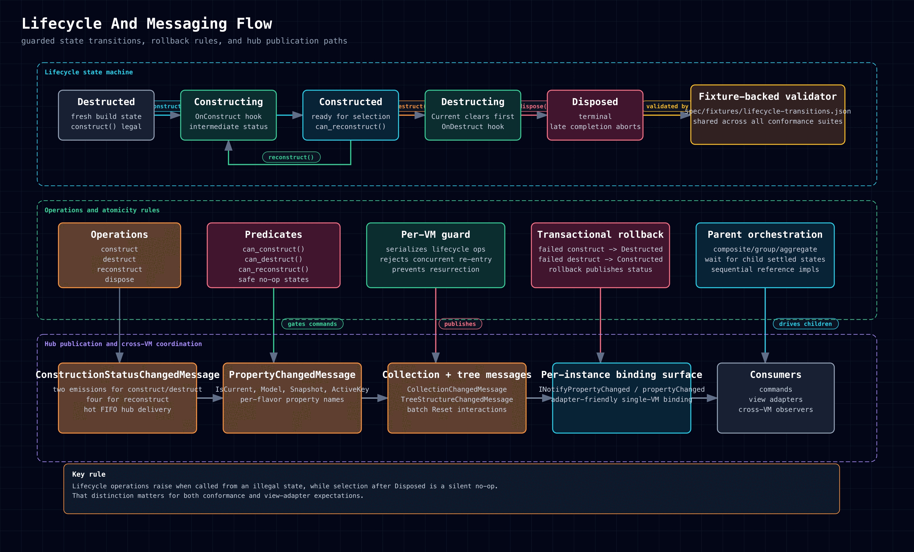
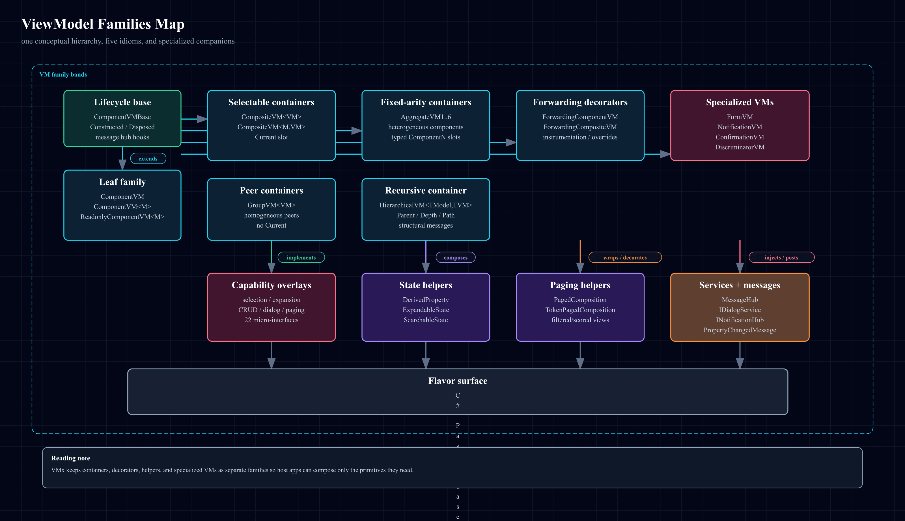
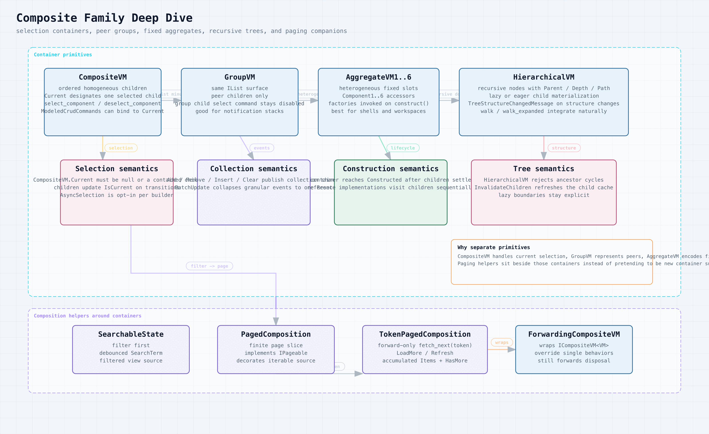
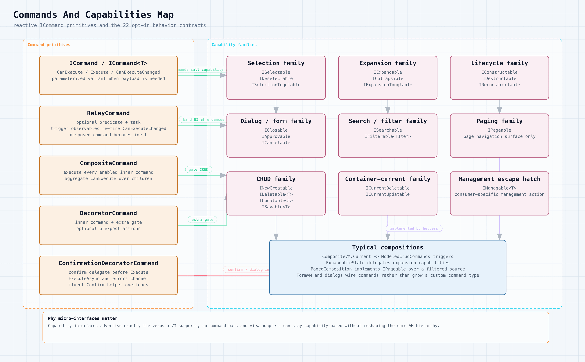
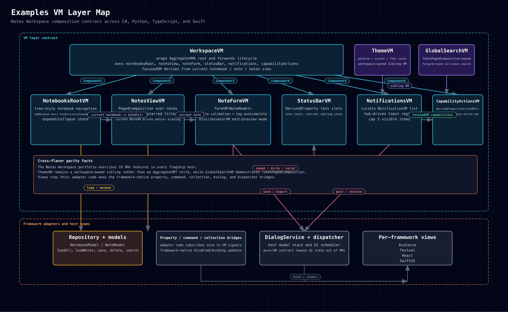

# Diagram Gallery

The gallery collects the current documentation diagrams in one place. Embedded
images use PNG for GitHub-native rendering, with SVG and HTML as supporting
links.

Example-app diagrams have their own page:
[[Example Diagram Gallery|Examples/Example-Diagram-Gallery]].

## Architecture

### VMx System Architecture

[HTML](../../assets/diagrams/system-architecture.html) |
[SVG](../../assets/diagrams/system-architecture.svg) |
[PNG](../../assets/diagrams/system-architecture.png)

### Class Architecture Map

[HTML](../../assets/diagrams/class-architecture.html) |
[SVG](../../assets/diagrams/class-architecture.svg) |
[PNG](../../assets/diagrams/class-architecture.png)

### Lifecycle And Messaging Flow

[HTML](../../assets/diagrams/lifecycle-messaging.html) |
[SVG](../../assets/diagrams/lifecycle-messaging.svg) |
[PNG](../../assets/diagrams/lifecycle-messaging.png)

## Primitives And Examples

### ViewModel Families Map

[HTML](../../assets/diagrams/viewmodel-families.html) |
[SVG](../../assets/diagrams/viewmodel-families.svg) |
[PNG](../../assets/diagrams/viewmodel-families.png)

### Composite Family Deep Dive

[HTML](../../assets/diagrams/composite-family.html) |
[SVG](../../assets/diagrams/composite-family.svg) |
[PNG](../../assets/diagrams/composite-family.png)

### Commands And Capabilities Map

[HTML](../../assets/diagrams/commands-capabilities.html) |
[SVG](../../assets/diagrams/commands-capabilities.svg) |
[PNG](../../assets/diagrams/commands-capabilities.png)

### Forms Dialogs And Notifications Flow

[HTML](../../assets/diagrams/forms-dialogs-notifications.html) |
[SVG](../../assets/diagrams/forms-dialogs-notifications.svg) |
[PNG](../../assets/diagrams/forms-dialogs-notifications.png)

### Examples VM Layer Map

[HTML](../../assets/diagrams/examples-vm-layer.html) |
[SVG](../../assets/diagrams/examples-vm-layer.svg) |
[PNG](../../assets/diagrams/examples-vm-layer.png)

### Rust TUI Notes Showcase VM Layer

[HTML](../../assets/diagrams/rust-tui-notes-showcase.html) |
[SVG](../../assets/diagrams/rust-tui-notes-showcase.svg) |
[PNG](../../assets/diagrams/rust-tui-notes-showcase.png)
