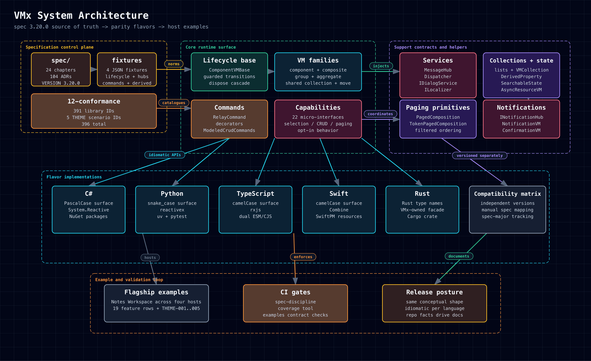

# System Architecture

This view shows the boundary between VMx and the host application.

Support links: [HTML](../../assets/diagrams/system-architecture.html),
[SVG](../../assets/diagrams/system-architecture.svg),
[PNG](../../assets/diagrams/system-architecture.png)

## What VMx Owns

- lifecycle and hierarchy primitives
- commands, capabilities, and helper state
- services such as message hub and dispatcher

## What Your App Owns

- domain models
- UI bindings and rendering
- platform-specific host adapters
