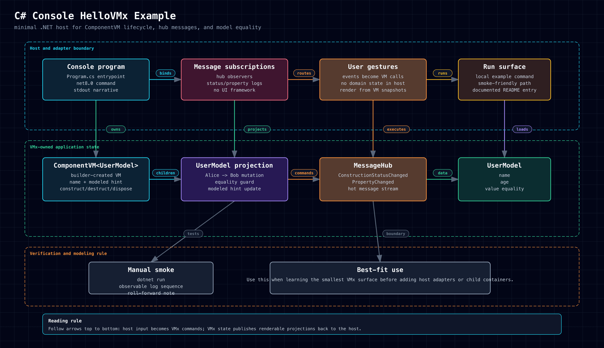
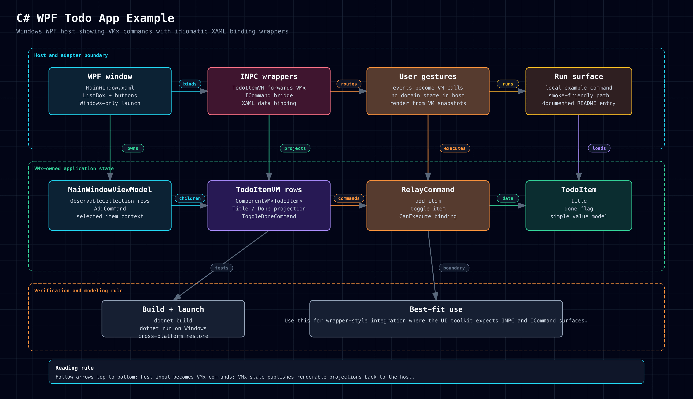
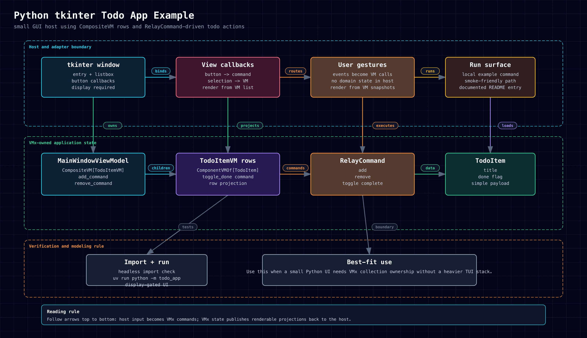
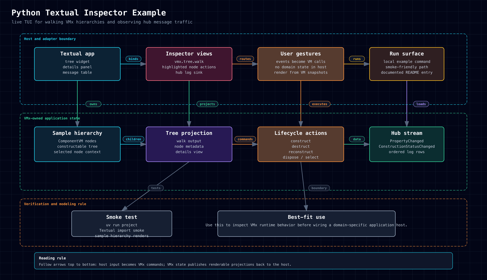
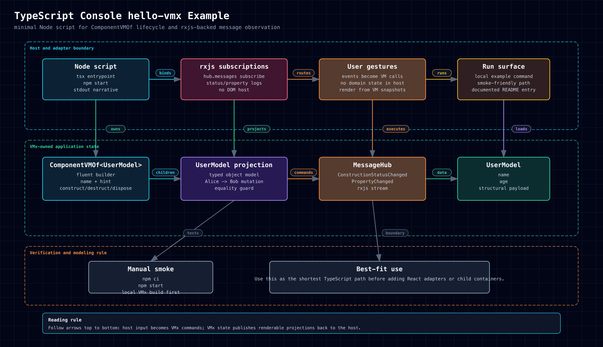
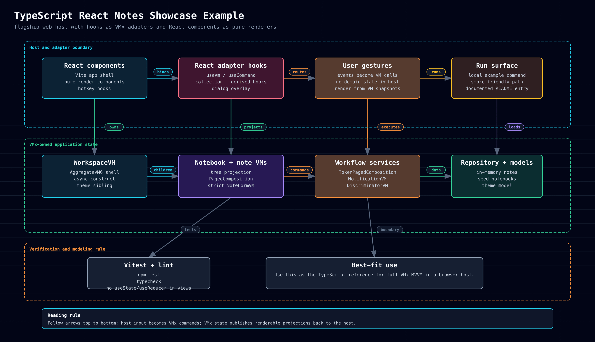
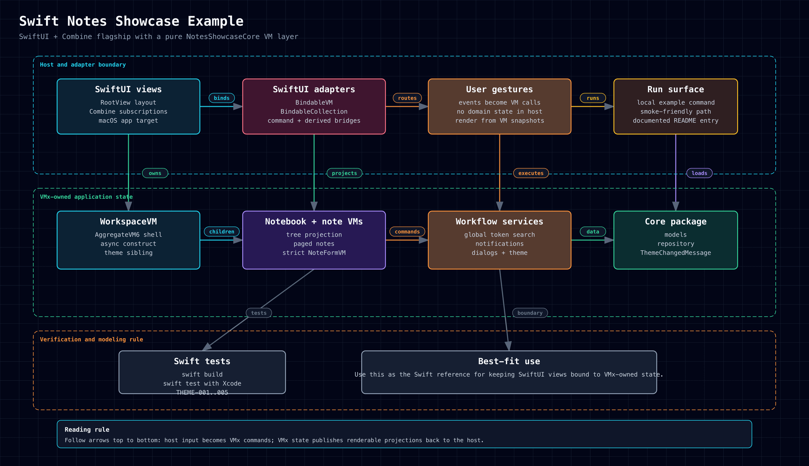
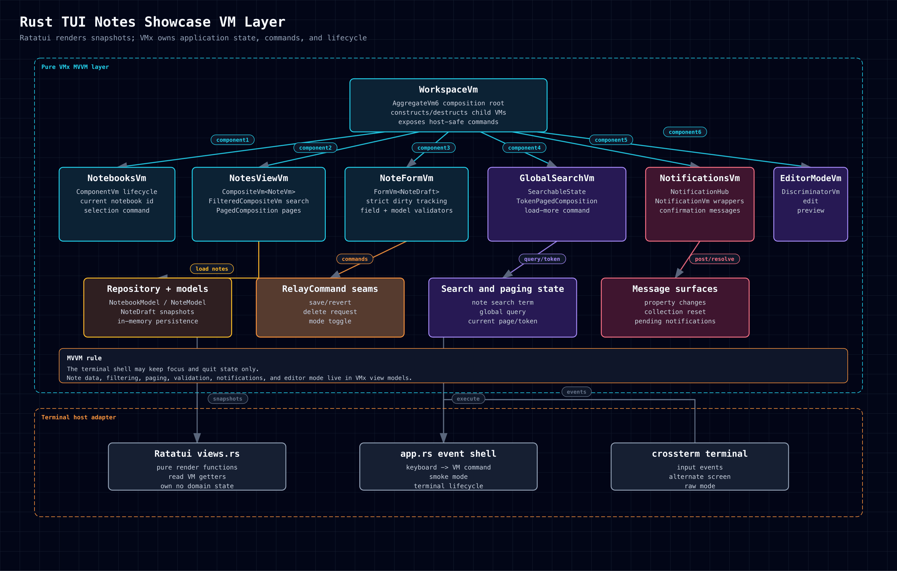

# Example Diagram Gallery

This gallery shows one generated architecture diagram for every committed VMx
example app. Embedded images use PNG for GitHub-native rendering, with SVG and
HTML as supporting links.

## C#

### C# Console HelloVMx

[HTML](../../assets/diagrams/csharp-console-hello-vmx.html) |
[SVG](../../assets/diagrams/csharp-console-hello-vmx.svg) |
[PNG](../../assets/diagrams/csharp-console-hello-vmx.png)

### C# WPF Todo App

[HTML](../../assets/diagrams/csharp-wpf-todo-app.html) |
[SVG](../../assets/diagrams/csharp-wpf-todo-app.svg) |
[PNG](../../assets/diagrams/csharp-wpf-todo-app.png)

### C# Avalonia Notes Showcase

[HTML](../../assets/diagrams/csharp-avalonia-notes-showcase.html) |
[SVG](../../assets/diagrams/csharp-avalonia-notes-showcase.svg) |
[PNG](../../assets/diagrams/csharp-avalonia-notes-showcase.png)

## Python

### Python Console hello_vmx

[HTML](../../assets/diagrams/python-console-hello-vmx.html) |
[SVG](../../assets/diagrams/python-console-hello-vmx.svg) |
[PNG](../../assets/diagrams/python-console-hello-vmx.png)

### Python tkinter Todo App

[HTML](../../assets/diagrams/python-tk-todo-app.html) |
[SVG](../../assets/diagrams/python-tk-todo-app.svg) |
[PNG](../../assets/diagrams/python-tk-todo-app.png)

### Python Textual Inspector

[HTML](../../assets/diagrams/python-textual-inspector.html) |
[SVG](../../assets/diagrams/python-textual-inspector.svg) |
[PNG](../../assets/diagrams/python-textual-inspector.png)

### Python Textual Notes Showcase

[HTML](../../assets/diagrams/python-textual-notes-showcase.html) |
[SVG](../../assets/diagrams/python-textual-notes-showcase.svg) |
[PNG](../../assets/diagrams/python-textual-notes-showcase.png)

## TypeScript

### TypeScript Console hello-vmx

[HTML](../../assets/diagrams/typescript-console-hello-vmx.html) |
[SVG](../../assets/diagrams/typescript-console-hello-vmx.svg) |
[PNG](../../assets/diagrams/typescript-console-hello-vmx.png)

### TypeScript React Notes Showcase

[HTML](../../assets/diagrams/typescript-react-notes-showcase.html) |
[SVG](../../assets/diagrams/typescript-react-notes-showcase.svg) |
[PNG](../../assets/diagrams/typescript-react-notes-showcase.png)

## Swift

### Swift Notes Showcase

[HTML](../../assets/diagrams/swift-notes-showcase.html) |
[SVG](../../assets/diagrams/swift-notes-showcase.svg) |
[PNG](../../assets/diagrams/swift-notes-showcase.png)

## Rust

### Rust Console hello-vmx

[HTML](../../assets/diagrams/rust-console-hello-vmx.html) |
[SVG](../../assets/diagrams/rust-console-hello-vmx.svg) |
[PNG](../../assets/diagrams/rust-console-hello-vmx.png)

### Rust TUI Notes Showcase

[HTML](../../assets/diagrams/rust-tui-notes-showcase.html) |
[SVG](../../assets/diagrams/rust-tui-notes-showcase.svg) |
[PNG](../../assets/diagrams/rust-tui-notes-showcase.png)
