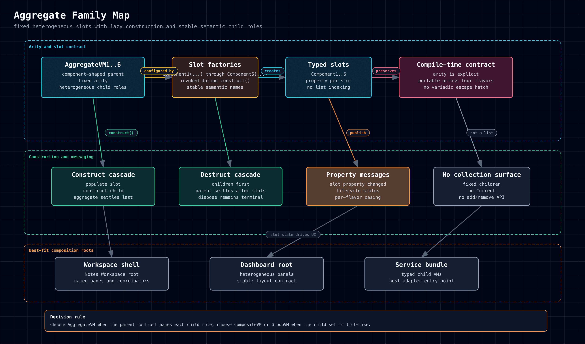

# Aggregate Family

Use `AggregateVM1..6` when a parent owns a fixed set of heterogeneous child
roles.

Support links: [HTML](../../../assets/diagrams/aggregate-family.html),
[SVG](../../../assets/diagrams/aggregate-family.svg),
[PNG](../../../assets/diagrams/aggregate-family.png)

## Best Fit

- workspace shells
- dashboards
- composition roots with named child slots

## Guidance

Choose aggregate when the child count and semantic roles are fixed by design,
not when the shape is list-like.

## Related Pages

- [[Composite Family|Framework-Primitives/ViewModel-Families/Composite-Family]]
- [[Notes Workspace|Examples/Notes-Workspace]]
