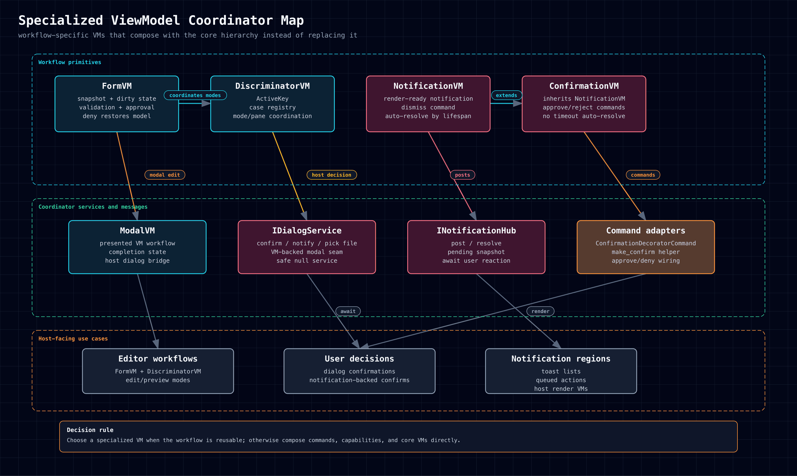
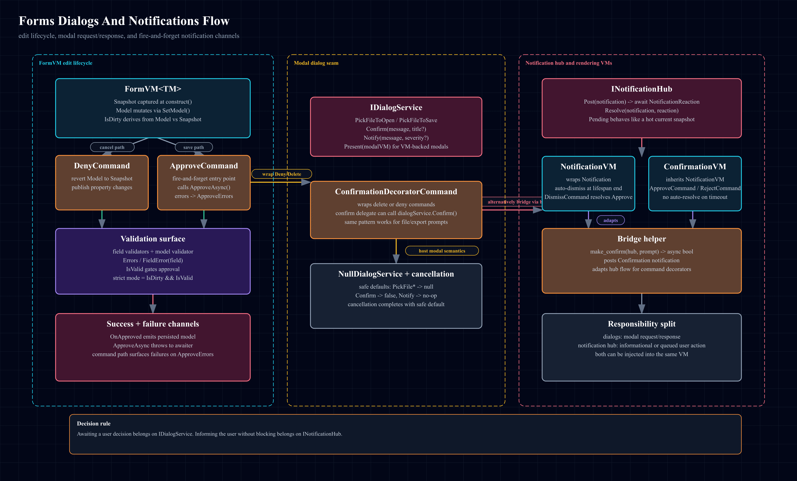

# Specialized ViewModels & Coordinators

Specialized primitives package recurring workflows that deserve their own
state, commands, or completion model.

Support links: [HTML](../../../../assets/diagrams/specialized-vm-family.html),
[SVG](../../../../assets/diagrams/specialized-vm-family.svg),
[PNG](../../../../assets/diagrams/specialized-vm-family.png)

Support links: [HTML](../../../../assets/diagrams/forms-dialogs-notifications.html),
[SVG](../../../../assets/diagrams/forms-dialogs-notifications.svg),
[PNG](../../../../assets/diagrams/forms-dialogs-notifications.png)

## Pages In This Section

- [[FormVM|Framework-Primitives/ViewModel-Families/Specialized/FormVM]]
- [[DiscriminatorVM|Framework-Primitives/ViewModel-Families/Specialized/DiscriminatorVM]]
- [[ConfirmationVM|Framework-Primitives/ViewModel-Families/Specialized/ConfirmationVM]]
- [[ModalVM|Framework-Primitives/ViewModel-Families/Specialized/ModalVM]]
- [[NotificationVM|Framework-Primitives/ViewModel-Families/Specialized/NotificationVM]]
