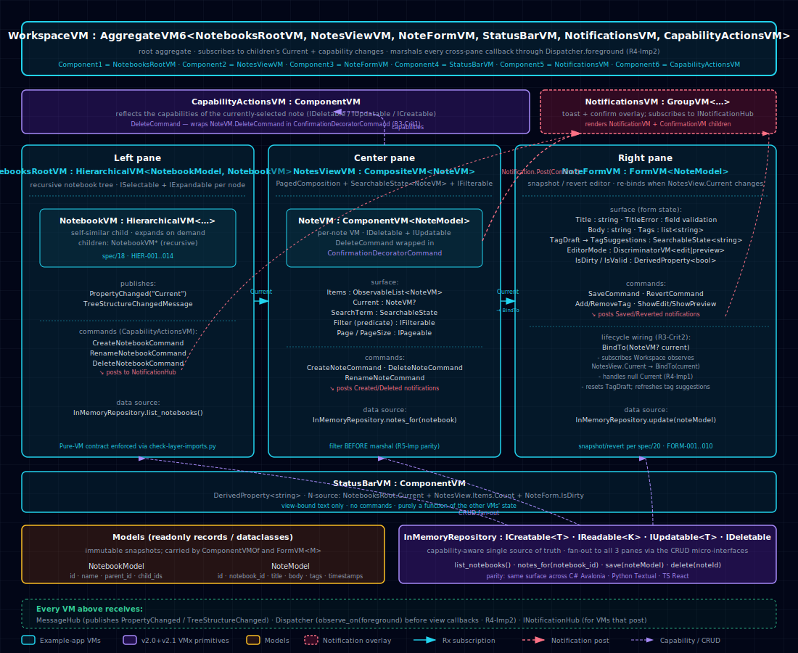

# Notes Workspace — cross-flavor parity matrix

The Notes Workspace is the VMx flagship example portfolio: one scenario
(`spec/proposals/2026-05-29-notes-showcase-scenario.md`), three idiomatic
implementations sharing one language-neutral VM API. This document is the
single-page proof that every spec feature in scope is exercised by every
flavor.

## 1. VM hierarchy

The diagram below is the canonical visual of the example's VM tree —
derived from the scenario contract, so it applies identically to all three
flavor implementations (names appear in their language-neutral form per
ADR-0006). The same diagram is linked from each flavor's NotesShowcase
README.

The diagram source is at
[`assets/notes-showcase-vm-hierarchy.svg`](assets/notes-showcase-vm-hierarchy.svg);
a browsable HTML version with summary cards is at
[`assets/notes-showcase-vm-hierarchy.html`](assets/notes-showcase-vm-hierarchy.html).

## 2. Flavors

- **C# / Avalonia 11 on .NET 8** — `examples/csharp/avalonia/NotesShowcase/`
- **Python / Textual ≥ 0.80** — `examples/python/textual/notes_showcase/`
- **TypeScript / React 18 + Vite** — `examples/typescript/react/notes-showcase/`

Each column reports whether the indicated flavor exercises the indicated VMx
spec feature inside its `viewmodels/` layer and surfaces it through its
`views/` layer (including the bridge adapter under `views/adapter/`). A `✓`
means the feature is wired end-to-end — VM emits, adapter forwards, view
renders, headless smoke covers it.

| #   | Spec feature (chapter / capability)                   | C# / Avalonia | Python / Textual | TypeScript / React |
| --- | ----------------------------------------------------- | ------------- | ---------------- | ------------------ |
| 1   | `HierarchicalVM` (ch. 18) — notebooks tree[^hier]     | ✓             | ✓                | ✓                  |
| 2   | `CompositeVM.Current` (ch. 6) — notes selection       | ✓             | ✓                | ✓                  |
| 3   | `ComponentVM<M>` modeled (ch. 5) — `NoteVM`/`NotebookVM` | ✓          | ✓                | ✓                  |
| 4   | `FormVM` snapshot/revert (ch. 20) — note editor       | ✓             | ✓                | ✓                  |
| 5   | `DerivedProperty` (ch. 15) — status bar, `isDirty`, capability actions | ✓ | ✓        | ✓                  |
| 6   | `RelayCommand` reactive `canExecute` (ch. 4) — Save / Revert / Delete | ✓ | ✓         | ✓                  |
| 7   | `SearchableState` + `IFilterable<TItem>` (§14.5–14.6) — title search + starred filter | ✓ | ✓ | ✓               |
| 8   | `IPageable` + `PagedComposition` (§14.10, ch. 21) — notes pagination | ✓ | ✓             | ✓                  |
| 9   | `INotificationHub` + `NotificationVM` (ch. 16) — toast region | ✓     | ✓                | ✓                  |
| 10  | Async `construct()` + dispatcher (ch. 2, 11) — workspace load + notebook switch + save | ✓ | ✓ | ✓        |
| 11  | `TreeStructureChangedMessage` (ch. 18) — add notebook re-publishes tree | ✓ | ✓             | ✓                  |
| 12  | `ConfirmationDecoratorCommand` (ch. 4) — delete confirm | ✓           | ✓                | ✓                  |
| 13  | `IDialogService` (ch. 19) — export → save-file dialog | ✓             | ✓                | ✓                  |
| 14  | Capability-aware UI (§14.4) — capability action bar   | ✓             | ✓                | ✓                  |
| 15  | `AggregateVM6` (ch. 8 — new in 2.2.0) — `WorkspaceVM` composes 6 children | ✓ | ✓           | ✓                  |
| 16  | `ThemeVM` scenario contract (proposal 2026-06-02, v2.4.0) — palette + accent + font scale + high contrast as a VM[^theme] | ✓ | ✓ | ✓ |

[^theme]: ThemeVM ships in v2.4.0 as a standalone scenario VM in each flavor's
    `viewmodels/` (plus a per-framework `ThemeAdapter` in `views/adapter/`).
    Composition into `WorkspaceVM` as a 7th aggregate child is **deferred to a
    follow-up release** pending the `AggregateVM7` core-library extension — see
    `spec/proposals/2026-06-02-theme-vm-scenario.md` §8 and ADR-0036 §2.C / §4
    decision #3. No host page is wired to the theme seam yet — consumers
    exercising it construct a `ThemeVM` (+ per-framework `ThemeAdapter`)
    directly, as the THEME tests do. The `THEME-001..005` scenario IDs are tested in
    `examples/<lang>/.../tests/` (not in `langs/<flavor>/tests/conformance/`)
    and are exempt from the library-coverage gate via the `_SCENARIO_PREFIXES`
    set in `tools/check-conformance-coverage.py`.

## 3. Reading the matrix

- **Parity is enforced.** Each flavor ships a `tests/views/` headless smoke
  test that boots the app and asserts the main view rendered, plus per-VM
  unit tests under `tests/viewmodels/` mirroring the VM API. The Pure-VM
  contract checks (`tools/check-*-views.*`) keep view code declarative so
  these `✓` marks are not load-bearing on incidental view-side state.
- **`AggregateVM6` (row 15)** is the spec extension this portfolio drove —
  added via ADR-0034 as a non-breaking minor bump (`spec-v2.2.0`) so that
  `WorkspaceVM` could compose its six heterogeneous children without a
  synthetic chrome wrapper.
- **Screenshots.** Reference screenshots will live in
  [`assets/notes-showcase/`](../assets/notes-showcase/) once captured (one
  PNG per flavor, captured manually). They are owner-driven and pending —
  see [`assets/notes-showcase/README.md`](../assets/notes-showcase/README.md)
  for the placeholder note and capture convention.

[^hier]: All three flavors implement an equivalent flat-collection +
    parent-id navigation pattern instead of subclassing
    `HierarchicalVM<TModel, TVM>` directly, because the canonical class
    materializes children eagerly from a factory at construct time
    (awkward for dynamic add). The observable contract —
    `TreeStructureChangedMessage` emission on add/remove, `current`
    selection, and `walk()` / `childrenOf()` accessors — is preserved
    identically across all three flavors, so capability dispatch and
    spec-level tree messaging behave the same way as a canonical
    `HierarchicalVM`. Per-flavor source notes:
    `examples/csharp/avalonia/NotesShowcase/ViewModels/NotebooksRootVM.cs`,
    `examples/python/textual/notes_showcase/src/notes_showcase/viewmodels/notebooks_root_vm.py`,
    and
    `examples/typescript/react/notes-showcase/src/viewmodels/notebooksRootVM.ts`.

## 4. Cross-references

- Scenario contract: [`spec/proposals/2026-05-29-notes-showcase-scenario.md`](../spec/proposals/2026-05-29-notes-showcase-scenario.md)
- ADR-0034: [`spec/ADRs/0034-aggregate-vm6.md`](../spec/ADRs/0034-aggregate-vm6.md)
- Per-flavor READMEs:
  [`examples/csharp/avalonia/NotesShowcase/README.md`](csharp/avalonia/NotesShowcase/README.md),
  [`examples/python/textual/notes_showcase/README.md`](python/textual/notes_showcase/README.md),
  [`examples/typescript/react/notes-showcase/README.md`](typescript/react/notes-showcase/README.md)
