# 16 — Notifications (sub-package)

The notifications sub-package provides a UI-agnostic, async notification /
confirmation hub. It is **opt-in**: the core `vmx` package does not depend on
it, and consumers must import the sub-package explicitly to use it.

Per ADR-0013, the distribution shape is per-flavor:

- **C#**: separate assembly `VMx.Notifications` (depends on `VMx`)
- **Python**: subpackage `vmx.notifications` (same distribution as `vmx`)
- **TypeScript**: subpath export `vmx/notifications` (same package as `vmx`)
- **Swift**: module namespace in the `VMx` package
- **Rust**: opt-in notification types in `vmx-rs`, using the VMx-owned hot-stream
  and executor-neutral completion facades

The asymmetry preserves "opt-in, no core surface impact" without forcing a
TypeScript monorepo restructure.

## 1. Primitives

### 1.1 `NotificationType`

An enum with three members:

| Value          | Intent                                         |
| -------------- | ---------------------------------------------- |
| `Error`        | Something failed; user attention required.     |
| `Notification` | Informational; user acknowledgement is enough. |
| `Confirmation` | A decision is required (Approve/Reject).       |

### 1.2 `NotificationReaction`

An enum with three members:

| Value     | Meaning                                              |
| --------- | ---------------------------------------------------- |
| `Pending` | Default; the notification has not been resolved yet. |
| `Approve` | User accepted / acknowledged the notification.       |
| `Reject`  | User declined the notification.                      |

### 1.3 `Notification`

An immutable value object:

```
Notification:
    Type    : NotificationType
    Message : string
```

Notifications are identity-distinct: two `Notification` values with identical
`Type` and `Message` are still different instances (one user's posting can be
queued and resolved independently of another's).

## 2. `INotificationHub` contract

```
INotificationHub:
    Post(notification: Notification) : Task<NotificationReaction>
    Resolve(notification: Notification, reaction: NotificationReaction) : void
    Pending : Observable<list<Notification>>       # current pending list (BehaviorSubject-like)
```

Rust represents `Task<T>` with `AsyncValue<T>`, a cloneable completion handle
that implements `Future<Output = T>` and also offers blocking `wait()` for hosts
without an async runtime. `Post` MUST return an unresolved handle and resolve it
only from `Resolve` or hub disposal; reading the current `Pending` reaction is
not an awaitable implementation (ADR-0106).

### 2.1 `Post` semantics

- Adds `notification` to the pending list.
- Emits a new `Pending` value (the updated list).
- Returns an awaitable that completes when `Resolve(notification, …)` is
  called for this exact instance. The completed value is the
  `NotificationReaction` passed to `Resolve`.
- Posting the same `notification` instance while it is still pending is
  implementation-defined; implementations SHOULD return the existing
  awaitable rather than silently dropping it. Callers wanting two
  independent posts MUST construct two `Notification` instances (see the
  identity-distinctness rule above). A future minor version may strengthen
  this to a normative no-op and add a covering conformance ID.

### 2.2 `Resolve` semantics

- Removes `notification` from the pending list.
- Emits a new `Pending` value.
- Completes the awaitable returned by the original `Post` call with the
  given `NotificationReaction`.
- Resolving a notification that is not in the pending list is a no-op (it
  was already resolved or never posted).

### 2.3 `Pending`

- A hot observable that emits the current pending list whenever it changes.
- New subscribers immediately receive the current snapshot (BehaviorSubject-like).
- Implementations MAY emit an immutable copy of the list, or a stable
  reference; consumers MUST NOT mutate the emitted list.

## 3. Null variant — `NullNotificationHub`

Per the convention from ADR-0017, `NullNotificationHub` is the null-object
variant:

- `Post(notification)` returns a task that completes with `Approve` immediately.
- `Resolve(notification, reaction)` is a no-op.
- `Pending` is an observable that emits the empty list once and completes.

## 4. Bridging command decorators

The notifications package SHOULD also expose a small helper that adapts an
`INotificationHub` confirmation flow to the `ConfirmDelegate` shape used by
`ConfirmationDecoratorCommand` (see spec/04-commands.md §Decorators):

```
make_confirm(hub: INotificationHub, prompt: string) -> Func<Task<bool>>
```

The helper posts a `Notification(Confirmation, prompt)`, awaits resolution,
and returns `true` iff the resolution is `Approve`. This is the canonical
way to wire a UI-driven confirmation gate through the notification hub.

## 5. Distinction from `IDialogService`

`INotificationHub` carries **fire-and-forget** notifications: toast/banner
messages that the user may dismiss but is not required to respond to. The hub
is hot — subscribers see messages as they happen.

`IDialogService` (chapter 19) is for **modal** host interactions where the
consumer awaits a user response (file pick, confirm Yes/No, severity-tagged
notify). The dialog service is request/response.

A consumer-facing notification that requires user action goes through
`IDialogService.Confirm`; an informational toast goes through
`INotificationHub.Post`. The two services are orthogonal and may both be
injected.

## 6. `NotificationVM`

Render-side ViewModel that consumes a `Notification` and exposes UI-bindable
state with a timed auto-dismiss lifecycle.

```
NotificationVM:
    Notification    : Notification     # the consumed data object
    Lifespan        : TimeSpan         # default 60 s; injected at construction
    RemainingTime   : TimeSpan         # decays toward 0 via injected scheduler
    Opacity         : double           # derived: RemainingTime / Lifespan; clamped [0.0, 1.0]
    IsResolved      : bool             # true once the hub notification is resolved
    DismissCommand  : ICommand         # resolves hub with Approve; cancels timer
```

Auto-dismiss: when `RemainingTime` reaches zero, the VM resolves the hub
notification with `NotificationReaction.Approve`. Manual `DismissCommand`
invocation cancels the lifespan timer so the auto-fire path cannot
double-resolve.

Scheduler is injected at construction. Production code passes the default
system scheduler; tests pass a `TestScheduler` / fake clock for deterministic
time advancement.

### 6.1 Lifespan timeline

```mermaid
gantt
    title NotificationVM lifecycle (60 s default)
    dateFormat X
    axisFormat %Ss
    section Visible
    Full opacity (1.0)       :a1, 0, 1
    Linear decay 1.0 → 0.0  :a2, 1, 60
    section Resolved
    Auto-dismiss (Approve)   :milestone, 60, 1
```



## 7. `ConfirmationVM`

Extends `NotificationVM` with explicit Approve/Reject actions and a longer
default lifespan suitable for prompts that require a user decision.

```
ConfirmationVM (extends NotificationVM):
    Lifespan        : TimeSpan         # default 300 s (overrides NotificationVM default)
    ApproveCommand  : ICommand         # resolves hub with NotificationReaction.Approve
    RejectCommand   : ICommand         # resolves hub with NotificationReaction.Reject
```

Auto-dismiss behavior: `ConfirmationVM` does **NOT** auto-resolve on lifespan
expiry. A timeout means "user did not decide"; the notification remains pending
until explicit action. Consumers may compose a different timeout policy
externally.

`DismissCommand` (inherited) still resolves with `Approve` and cancels the
timer if the consumer provides a dismiss affordance.

### 7.1 Lifespan comparison

Both VM types use a countdown timer, but differ in what happens at expiry:

```mermaid
gantt
    title NotificationVM vs ConfirmationVM lifespan
    dateFormat X
    axisFormat %Ss
    section NotificationVM (60 s default)
    Opacity decay       :a1, 0, 60
    Auto-dismiss        :milestone, 60, 1
    section ConfirmationVM (300 s default)
    Awaiting decision   :b1, 0, 300
    Timer expires (no auto-resolve) :milestone, 300, 1
```



Key difference: `NotificationVM` auto-resolves (`Approve`) at timer expiry;
`ConfirmationVM` does not — it stays pending until the user takes an explicit
action (`ApproveCommand`, `RejectCommand`, or `DismissCommand`).

## 8. Patterns

### 8.1 Service-as-VM adapter (recipe)

Hub state — e.g., `INotificationHub.Pending` — can be projected into a
`CompositeVM<Notification, NotificationVM>` by supplying the observable
collection of pending notifications as the composite's source and
`NotificationVM` construction as the child factory.

Per-flavor idiomatic sketch (showing the actual modeled-composite builder
methods — see chapter 10 for the full surface):

```
pending = []                                          # cache, fed by the subscription
hub.Pending.Subscribe(items => pending = items)       # Pending is an observable — no snapshot accessor

CompositeVM<Notification, NotificationVM>.Builder()
    .ChildrenModels(() => pending)                    # cached snapshot
    .ChildModelToChildViewModel(notif =>              # notification → VM
        new NotificationVM(notif, hub, scheduler))
    .Services(hub, dispatcher)
    .Build()
```

This pattern generalises to any service whose state is an observable collection
of items. It is a documented composition recipe, not a normative spec addition —
no new spec primitive is introduced.

## 9. Conformance

`NOTIF-001` through `NOTIF-010` in `12-conformance.md` cover the
`INotificationHub` contract, the null variant, the type/reaction enums, and
the command-decorator bridge.

`NOTIF-011` through `NOTIF-016` cover the rendering VMs (`NotificationVM` and
`ConfirmationVM`) introduced in spec v2.1 (ADR-0031).

`NOTIF-017` (added in v2.5.0 via ADR-0037) covers hub disposal: disposing the
hub resolves every in-flight `Post` awaitable with
`NotificationReaction.Pending`, completes the `Pending` observable, turns
subsequent `Post` calls into immediately-`Pending` results that do not
enqueue, makes subsequent `Resolve` calls no-ops, and is idempotent. These
were previously C#-only shutdown semantics; all flavors now share them.

`DISP-003` adds concurrent/re-entrant at-most-once teardown for the hub, while
`DISP-004` covers repeated rendering-VM/interaction-owner disposal. Both retain
the existing first-resolution and post-dispose rules (ADR-0084).
