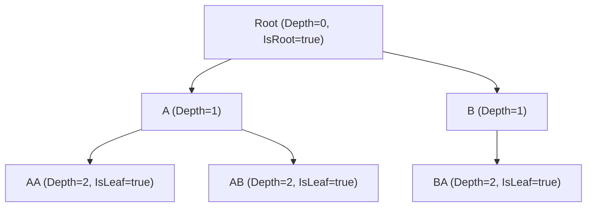
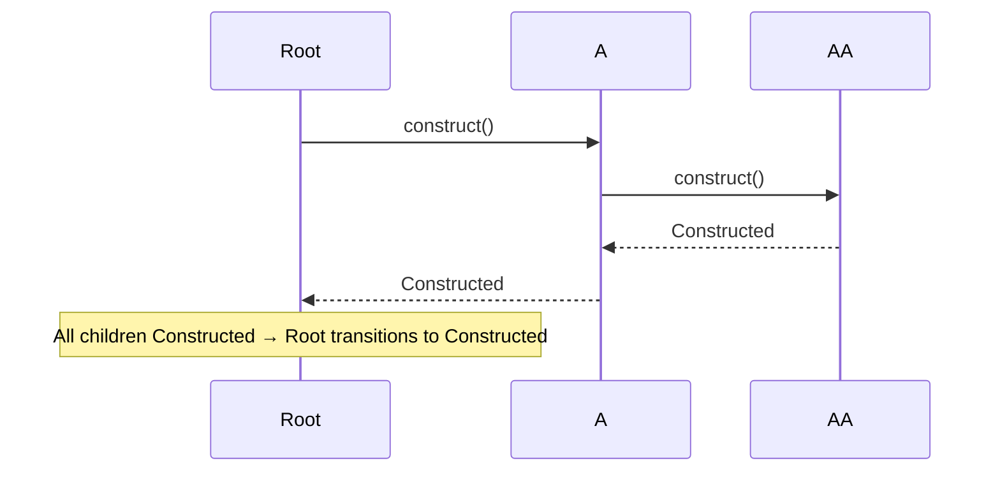

# 18 — `HierarchicalVM<TModel, TVM>`

A **first-class recursive tree-structured ViewModel**. Each node may contain
children of the same VM type. Use for domains that are natively recursive: file
directories, comment threads, org charts, nested taxonomies, decision trees.

See [ADR-0028](ADRs/0028-hierarchical-vm.md) for the design rationale and the
six resolved design questions.

## 1. Overview

`HierarchicalVM<TModel, TVM>` is a recursive specialization of the VM hierarchy.
Each instance carries a `Model` (the domain payload), a lazy or eager list of
`Children` of the same concrete VM type, and structural metadata (`Parent`,
`Depth`, `Path`, `IsRoot`, `IsLeaf`, `IsFirst`, `IsLast`).

Unlike manually recursing `CompositeVM<M, VM>` (chapter 06), `HierarchicalVM`
provides:

- built-in parent / depth / path bookkeeping,
- depth-first construction order mirroring `LIFE-013`,
- hub messages for structural mutations,
- clean integration with `walk`/`walk_expanded` (chapter 13) and opt-in
  capability composition (chapter 14).

## 2. Shape

`HierarchicalVM<TModel, TVM>` is a recursive generic type. `TVM` is the concrete
subclass; the recursive constraint is enforced per flavor (ADR-0028 §3.2).

```
HierarchicalVM<TModel, TVM>:
    Model    : TModel                  # per-node domain model
    Parent   : TVM?                    # null when IsRoot
    Children : IReadOnlyList<TVM>      # lazy by default; eager via builder
    Depth    : int                     # 0 for root; Parent.Depth + 1 otherwise
    Path     : IReadOnlyList<TVM>      # materialized snapshot: root, …, self
    IsRoot   : bool                    # Parent is null
    IsLeaf   : bool                    # Children.Count == 0
    IsFirst  : bool                    # Parent.Children[0] == self (false when IsRoot)
    IsLast   : bool                    # Parent.Children[^1] == self (false when IsRoot)
```

`Model` is the per-node domain model; the recursive-children factory function is
supplied by the consumer at construction time.

Example tree (three levels):



## 3. Construction order

**Depth-first.** A parent's `Status` transitions to `Constructed` only after
every descendant has reached `Constructed`. Mirrors the dispose order
(`LIFE-013`); preserves the invariant "children exist before parent reports
ready".

Lazy children do NOT participate in construction order until materialized. A node
with un-materialized children is `Constructed` once it has called `construct()`
itself; the children construct lazily on first access.

Sequence for a two-level eager tree:



## 4. Lazy vs eager children

Default: **lazy.** `Children` is materialized on first access by invoking the
children factory delegate.

Builder option `WithEagerChildren()` flips to **eager**: the entire tree is
materialized at construct time using depth-first traversal. Eager mode is required
if the consumer wants depth-first construction to apply to the whole tree at
startup.

## 5. Hub messages

Two messages flow on `IMessageHub`:

- **`PropertyChangedMessage`** — emitted on `Parent` change (and any other
  `IReadable<T>` properties on the node), per chapter 03 rules.
- **`TreeStructureChangedMessage`** (defined in §6) — emitted on structural
  mutations: add, remove, or reparent of descendants.

## 6. `TreeStructureChangedMessage`

```
TreeStructureChangedMessage:
    Source   : HierarchicalVM          # the node whose subtree changed
    Change   : Added | Removed | Reparented
    Affected : HierarchicalVM          # the node added/removed/reparented
    Index    : int                     # index in Children list (-1 for Reparented if N/A)
```

## 7. Integration

- **`walk` / `walk_expanded`** (chapter 13): `HierarchicalVM` is a natural input.
  `walk` yields depth-first descendants including the root. Order is
  `parent → children[0] → children[0].children[0] → … → children[1] → …`.
- **`ExpandableState`** (chapter 14 §2.2): consumers may compose
  `ExpandableState<TVM>` to gate lazy child materialization on `Expand()`
  (`IExpandable`). `HierarchicalVM` does NOT auto-implement `IExpandable` — per
  ADR-0028 §3.6 and ADR-0010, capabilities are opt-in.
- **`SearchableState`** (chapter 14 §2.5): consumers may compose
  `SearchableState<TVM>` to provide a filtered view of a tree. The filter
  operates on the materialized portion.
- **`ModeledCrudCommands`** (chapter 14 §2.7): tree mutations (Create / Update /
  Delete on a node's children) compose with the existing `CreateNewCommand`,
  `UpdateCurrentCommand`, `DeleteCurrentCommand` helpers.

## 8. Conformance

- `HIER-001` — Recursive generic constraint compiles per flavor with the bound
  type parameter.
- `HIER-002` — `Parent` is null for the root and a `TVM` reference for every
  non-root node.
- `HIER-003` — `Depth` derivation: root is 0; child is parent + 1.
- `HIER-004` — `Path` materialization: returns a read-only sequence
  `root, …, self`; identity-equal to a fresh recompute when nothing changed.
- `HIER-005` — `IsLeaf` and `IsRoot` derivation match `Parent`/`Children`
  state.
- `HIER-006` — `IsFirst` and `IsLast` position predicates.
- `HIER-007` — Default lazy child loading: `Children` is not materialized until
  first access.
- `HIER-008` — Eager child loading: `WithEagerChildren()` builder option
  materializes the full tree at construct.
- `HIER-009` — Depth-first construction: a parent reports `Constructed` only
  after every (eager) descendant.
- `HIER-010` — `PropertyChangedMessage` on `Parent` change.
- `HIER-011` — `TreeStructureChangedMessage` on add / remove / reparent.
- `HIER-012` — `walk_expanded` honors lazy boundaries when an `ExpandableState`
  gate is composed.
- `HIER-013` — Composition with `SearchableState` filters the materialized
  portion.
- `HIER-014` — Composition with `ModeledCrudCommands` mutates the tree.
