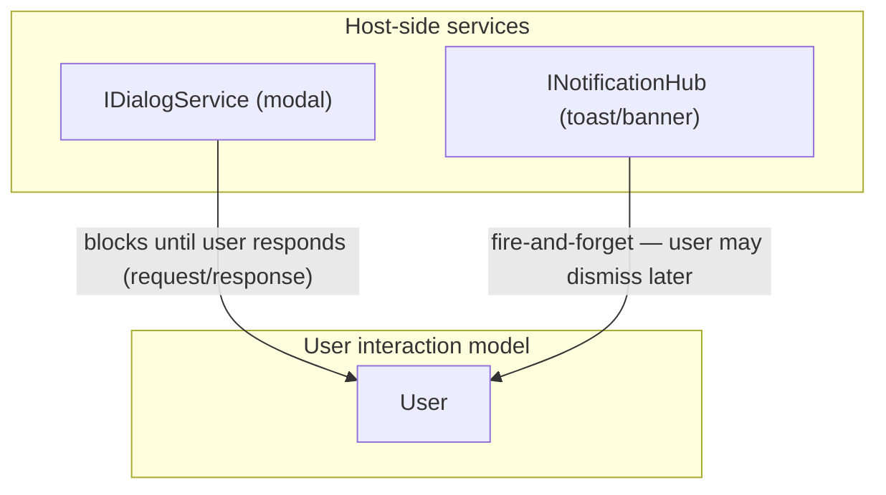

# 19 — `IDialogService` (host modal interactions)

A **host-side service contract for modal interactions**: file pick, confirm prompt,
and severity-tagged notify. See [ADR-0029](ADRs/0029-dialog-service-in-core.md) for
the decision rationale.

## 1. Overview

`IDialogService` provides a single, testable seam for all interactions that require
the host (OS, UI framework) to block until the user responds. It lives in core — not
in an opt-in sub-package — because the contract surface is small (four methods) and
the null implementation is always needed in tests.

Contrast with `INotificationHub` (chapter 16), which is fire-and-forget. See §4 for
the responsibility-split diagram.

## 2. Contract surface

```
IDialogService:
    PickFileToOpen(filter?, title?) -> Task<Path?>
    PickFileToSave(filter?, title?, suggestedName?) -> Task<Path?>
    Confirm(message, title?) -> Task<bool>
    Notify(message, title?, severity?) -> Task
```

Supporting types:

```
FileFilter:
    description : string          # human-readable label (e.g., "Image files")
    extensions  : list<string>    # e.g., ["*.png", "*.jpg"]

NotificationSeverity:
    Info | Warning | Error
```

### 2.1 Method semantics

- **`PickFileToOpen`** — presents a host file-open dialog. Returns the selected path
  as a string, or `null` if the user cancels or no file is chosen.
- **`PickFileToSave`** — presents a host file-save dialog. Returns the selected path,
  or `null` on cancel.
- **`Confirm`** — presents a host confirmation prompt. Returns `true` when the user
  confirms, `false` when the user cancels or dismisses.
- **`Notify`** — presents a host notification with the given severity. Returns when
  the notification is acknowledged or dismissed. Severity defaults to `Info`.

All four methods are `async` (return an awaitable). Callers must `await` them.

## 3. `NullDialogService`

`NullDialogService` is the null-object implementation per ADR-0017. It is the default
for tests and headless environments:

| Method           | Return value | Rationale                                          |
| ---------------- | ------------ | -------------------------------------------------- |
| `PickFileToOpen` | `null`       | No host available; treat as user cancel            |
| `PickFileToSave` | `null`       | No host available; treat as user cancel            |
| `Confirm`        | `false`      | Safest default — avoids triggering destructive ops |
| `Notify`         | _(no-op)_    | Notifications have no side-effects in null impl    |

## 4. `IDialogService` vs `INotificationHub`



The rule of thumb:

- **Awaiting a decision?** Use `IDialogService` (`Confirm`, `PickFile*`).
- **Informing without waiting?** Use `INotificationHub` (`Post`).
- **Both can be injected** into the same ViewModel; they are orthogonal.

See also `spec/16-notifications.md §5` for the companion distinction paragraph.

## 5. Reentrancy

Reentrancy is **implementation-defined**. A host adapter may:

- Queue reentrant calls (show one dialog at a time, queue the rest), or
- Reject reentrant calls immediately (return `null` / `false` synchronously), or
- Allow overlapping dialogs if the host supports it.

`NullDialogService` is trivially reentrant (stateless).

Conformance test `DIA-006` verifies that both queueing and rejecting implementations
conform to the contract; neither is normatively required.

## 6. Cancellation

When a pending dialog call is cancelled via a `CancellationToken` (where supported):

- The awaitable **completes** with the cancellation result (`null` for `PickFile*`,
  `false` for `Confirm`).
- The awaitable does **not** throw `OperationCanceledException` unless the
  host adapter explicitly opts into that behavior.

This keeps callers simple: when an implementation surfaces cancellation, the
awaited `PickFile*` returns `null` and `Confirm` returns `false` on cancel
rather than requiring a try/catch.

## 7. `ConfirmationDecoratorCommand` integration

`IDialogService.Confirm` composes naturally with `ConfirmationDecoratorCommand`
(chapter 04 §8 / ADR-0012), which accepts a `Func<Task<bool>>` guard delegate:

```
// Pseudo-code (per-flavor idiomatic)
var safeDelete = deleteCommand.Confirm(() => dialogService.Confirm("Delete this item?"));
```

The fluent overload `cmd.Confirm(dialogService, prompt)` (ADR-0027 / ADR-0029) is
syntactic sugar for the above and is tested in `DIA-008`.

## 8. Conformance

- `DIA-001` — `PickFileToOpen` contract: accepts optional filter and title; returns
  a path string or `null` on cancel.
- `DIA-002` — `PickFileToSave` contract: accepts optional filter, title, and
  `suggestedName`; returns a path string or `null` on cancel.
- `DIA-003` — `Confirm` contract: accepts message and optional title; returns `bool`
  — `false` on cancel.
- `DIA-004` — `Notify` contract: accepts message, optional title, optional severity
  (`Info`/`Warning`/`Error`); returns awaitable that completes without error.
- `DIA-005` — `NullDialogService`: `PickFile*` returns `null`; `Confirm` returns
  `false`; `Notify` is no-op.
- `DIA-006` — Reentrancy: both queueing and immediate-rejecting implementations
  conform to the contract.
- `DIA-007` — Cancellation: cancelling a pending dialog completes the awaitable
  with the cancellation result (`null` or `false`) without throwing.
- `DIA-008` — `ConfirmationDecoratorCommand` with `() => dialogService.Confirm(prompt)`
  constructs a valid command graph that behaves per ADR-0012.
