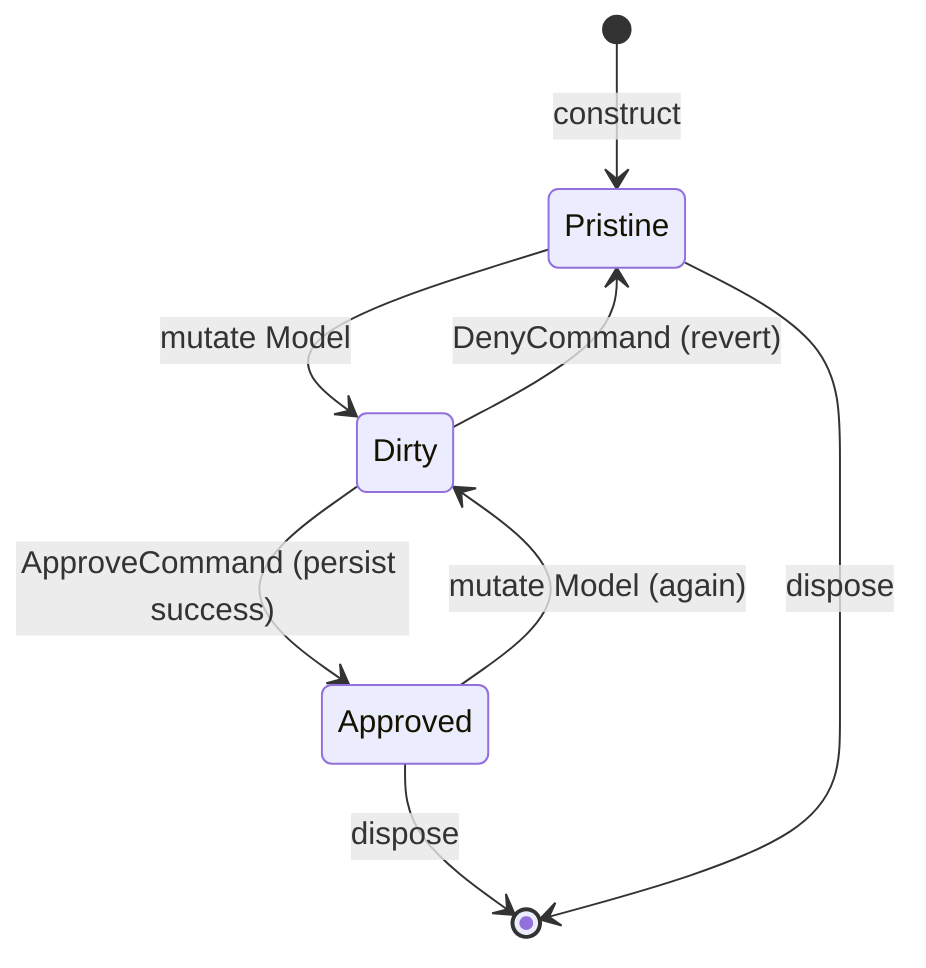

# 20 — `FormVM<TM>` (snapshot/revert edit lifecycle)

A **ViewModel that wraps a mutable domain model with an edit lifecycle**: snapshot on
construct, allow mutation, then either Approve (persist) or Deny (revert). See
[ADR-0030](ADRs/0030-form-vm.md) for the design rationale and the ORM-agnostic
decision.

## 1. Overview

`FormVM<TM>` is for any UI pattern that lets a user edit an entity and then either
save or cancel. It eliminates the recurring boilerplate of snapshot/dirty/revert that
appears in every CRUD screen.

Key properties:

- **ORM-agnostic** — the persist step is a consumer-supplied delegate or
  `IFormPersister<TM>` collaborator.
- **Snapshot at construct** — `Snapshot` is captured once and is immutable after
  that (until a successful `ApproveCommand` updates it). C#, Python, and
  TypeScript use deep-copy defaults; Swift uses identity copy for unconstrained
  generic models and relies on value semantics for struct/enum models
  (ADR-0077). The snapshot mechanism is injectable in every flavor.
- **`IsDirty`** is derived automatically from structural inequality of `Model` vs
  `Snapshot`, using an **injectable equality function** (default: a structural
  deep-equal — §4).
- **`DenyCommand`** (Cancel) reverts `Model` to `Snapshot` and publishes hub
  messages.
- **`ApproveCommand`** (Save) invokes the persister; on success updates `Snapshot`
  and raises `OnApproved`. A persister failure on the fire-and-forget command path
  is surfaced on `ApproveErrors` (§8).
- **Validation** (opt-in): field/model validators produce `Errors`; approval is
  disabled while invalid (§5).
- **Strict mode** (opt-in): `ApproveCommand.CanExecute = IsValid && IsDirty`.

### 1.1 Relationship to `ComponentVM<M>`, validation, and persistence

`FormVM<TM>` is **not** a thin alias of `ComponentVM<M>` + `OnModelChanged`
(`05-component-vm.md` §3.2). A `ComponentVM<M>` exposes a settable model and a
post-set callback; `FormVM<TM>` adds an entire **edit lifecycle** on top — a
snapshot captured at construct (§3), automatic `IsDirty` derivation (§4), a
revert path (`DenyCommand`), and a guarded persist path with success/error
channels (`ApproveCommand` / `OnApproved` / `ApproveErrors`, §8). The two are
orthogonal: `ComponentVM<M>` is the model-bearing leaf VM; `FormVM<TM>` is the
snapshot/revert/approve workflow that a consumer reaches for when editing then
committing or discarding an entity. ADR-0030 records the rationale for shipping
it as its own type rather than a `ComponentVM<M>` recipe.

**Validation is declarative and opt-in.** `FormVM<TM>` accepts field validators
and one model-level validator. Validators produce field-name keyed string errors;
when no validators are supplied, `Errors` is empty and `IsValid == true`. This is
intentionally smaller than a persistence or schema framework: consumers can still
compose `DerivedProperty<T>` for richer UI state, but the common save-gating and
field-error pattern lives on the form.

**Persistence is a consumer concern.** The persist step is a consumer-supplied
delegate or `IFormPersister<TM>` collaborator (§2) — this seam *is* the framework's
persistence integration point. Per `00-overview.md` §2, navigation routing,
persistence, and serialization are explicitly out of scope as framework
concerns; a flagship owning its own `INoteRepository` is by design, not a gap. A
generalized `IRepository<T>` port and a command-level **undo/redo** stack (the
inverse of the fire-only commands of chapter 04) are likewise recorded as
**deferred future work** in ADR-0051: both would be new opt-in sub-packages, not
clarifications, and neither is introduced here.

## 2. Shape

```
FormVM<TM>:
    Model          : TM            # live working copy; mutate via SetModel (no direct assignment)
    Snapshot       : TM            # read-only after construct (until next approve)
    IsDirty        : bool          # Model != Snapshot (structural equality)
    DenyCommand    : ICommand      # reverts Model to Snapshot; publishes hub messages
    ApproveCommand : ICommand      # invokes persister; updates Snapshot on success
    OnApproved     : event/obs     # fires the persisted value after successful persist
    ApproveErrors  : observable    # surfaces a persister failure from the command path
    Errors         : map<string,string> # current field-name validation errors
    IsValid        : bool          # Errors is empty
    ErrorsChanged  : observable    # fires only when the effective error map changes

    SetModel(newModel : TM) -> void   # mutator (per-flavor idiomatic name)
    ApproveAsync() -> Task            # awaitable entry-point for the persist flow
    FieldError(field : string) -> string? # current error for a single field
```

`ApproveCommand` invokes `ApproveAsync` internally; consumers may either bind the
command or call the awaitable directly when finer control is needed.

The two entry points have **different failure semantics**, because `ICommand`'s
`Execute` returns `void` (chapter 04 §1) and therefore has no channel to propagate
a persister failure to its caller:

- **`ApproveAsync()` is awaitable.** A persister failure propagates to the awaiting
  caller (the returned `Task`/awaitable faults). No state is mutated, `OnApproved`
  does not fire, and nothing is emitted on `ApproveErrors`.
- **`ApproveCommand.Execute()` is fire-and-forget.** It schedules the persist via
  `ApproveAsync` and returns immediately; a persister failure cannot propagate to
  the caller. Rather than discarding the faulted task — which silently swallows the
  error and, on some runtimes, surfaces only as an unobserved-exception warning at
  GC — the failure is emitted on the **`ApproveErrors`** observable (§8). On
  success the command path is identical to the awaitable path (snapshot advances,
  `OnApproved` fires).

Constructor parameters (per-flavor idiomatic; order matches shipped C# / Python
constructors — also catalogued in ADR-0009 §"FormVM<TM> constructor shape"):

```
FormVM(
    initial     : TM,
    persister   : Func<TM, Task>,   # or IFormPersister<TM>
    hub?        : IMessageHub,      # optional hub; default is the null hub
    strict?     : bool = false,
    snapshotter?: Func<TM, TM>,     # custom snapshot function (opt-in; defaults vary — §3)
    validators?: map<string, Func<TM, string?>>,
    model_validator?: Func<TM, map<string, string?>>,
    reset_on_approved?: Func<TM, TM> # optional post-persist reset — §5.1
)
```

TypeScript additionally accepts an `equals?: (a, b) => boolean` option — the
injectable dirty-tracking equality predicate (default: a structural deep-equal —
§4). C# and Python derive dirty state from the model's own idiomatic value
equality (`object.Equals` / `__eq__`), so the equality hook is the model type's
own concern there rather than a separate constructor parameter.

## 3. Snapshot policy

The default snapshot is flavor-idiomatic. C#, Python, and TypeScript provide a
deep value-copy by default, so the snapshot does not share nested mutable state
with the live `Model`. Swift's unconstrained generic `Model` cannot be deep-copied
universally without adding a breaking protocol constraint, so Swift's default
snapshotter is identity copy and relies on Swift value semantics for struct/enum
models (ADR-0077). Swift reference models that need nested-state isolation must
inject an explicit snapshotter.

| Flavor     | Default mechanism                                                            |
| ---------- | ---------------------------------------------------------------------------- |
| C#         | `System.Text.Json` serialize → deserialize round-trip (BCL-only; deep clone) |
| Python     | `copy.deepcopy` — deep clone                                                 |
| TypeScript | `structuredClone` — structured deep clone (Date/Map/Set/typed-array aware)   |
| Swift      | Identity copy; value models copy by assignment, reference models inject copy |

The **snapshotter remains injectable**: a consumer whose model type the default
deep-copy cannot handle — JSON-unrepresentable members (delegates, cyclic graphs,
non-default-constructible types) in C#, unpicklable/live-handle objects under
`deepcopy` in Python, values `structuredClone` cannot clone in TypeScript, or
Swift reference models needing deep isolation — supplies a custom
`snapshotter: Func<TM, TM>` at construction (or via the builder). An injected
snapshotter always overrides the default. The snapshotter is also applied when
`DenyCommand` restores from `Snapshot`, ensuring consistent copy semantics in both
directions.

## 4. Dirty detection

`IsDirty` is derived from structural (value) inequality:

```
IsDirty = (Model != Snapshot)
```

Each flavor uses its idiomatic value-equality, which is overridable:

- C#: `object.Equals` (record types provide structural equality by default).
  Override by defining the model's own equality (`record`, `Equals`/`==`).
- Python: `__eq__` (`@dataclass(eq=True)` / `@dataclass(frozen=True)` by default).
  Override by defining the model's own `__eq__`.
- TypeScript: an **injectable structural deep-equality predicate**. Plain objects
  have no idiomatic value equality, so the default is a structural deep-equal
  (not `JSON.stringify`) supplied by the framework, and a custom `equals(a, b)`
  predicate may be injected at construction (or via the builder) to compare on a
  subset of fields or with reference semantics.
- Swift: `==` for `Equatable` models through the constrained initializer/build
  path. Non-`Equatable` class models default to reference identity; non-`Equatable`
  value models default to "changed" unless the consumer injects `equals`.

The TypeScript default deep-equal is the dirty-tracking counterpart of the
default `structuredClone` snapshotter — it compares to the same depth the
snapshotter clones, so snapshot and comparison stay internally consistent. Unlike
the `JSON.stringify` comparison used before v3 it:

- **never throws** on `BigInt` (compared with `===`) or on circular references
  (guarded with a visited-pair set) — the previous `JSON.stringify` path *crashed*
  on both;
- compares `Date` by instant, `Map`/`Set` by contents, `RegExp` by source/flags,
  binary buffers/views by concrete constructor and visible bytes, and arrays and
  plain objects by value — the previous path was *silently wrong* on several of
  these (`JSON.stringify` renders every `Map`/`Set` as `{}` and stringifies
  `Date`, so distinct values compared equal); binary comparison closes the
  empty-enumerable `ArrayBuffer`/`DataView` gap clarified by ADR-0113;
- preserves an `undefined`-valued key as distinct from a missing key (matching what
  `structuredClone` preserves), and treats `NaN` as equal to `NaN` and `+0`/`-0` as
  equal, for stable dirty-tracking;
- is no longer **key-order sensitive**: two objects with the same fields/values
  compare as clean regardless of key-insertion order, so FORM-003's
  structurally-equal guarantee ("same fields/values, different object reference")
  now holds unconditionally in TypeScript (the pre-v3 `JSON.stringify` caveat in
  ADR-0037 is retired by ADR-0048).

`Map`/`Set` membership uses the engine's native `has` (SameValueZero), so
object-typed keys/members compare by reference — adequate for the primitive-keyed
models dirty-tracking targets; a consumer needing deep key comparison injects a
custom `equals`.

## 5. Validation

Validation is optional. A form with no validators starts valid and behaves like
the pre-validation shape except that `ApproveCommand.CanExecute` also checks
`IsValid`.

Two validator forms are supported:

- **Field validators**: keyed by the flavor-idiomatic field/property name
  (`"Name"` / `"name"` / `"name"`). Each receives the whole model and returns a
  string error or null/none when valid.
- **Model validator**: receives the whole model and returns a field-name keyed
  map of string errors. Null/none values remove a field error. The model
  validator runs after field validators, so it can refine or clear field errors.

`Errors` exposes the current effective error map. `FieldError(field)` returns one
entry from that map. `ErrorsChanged` emits a fresh error map only when validation
changes the effective map; a model mutation that leaves errors identical emits
nothing.

Validation runs at construction, on an accepted unequal `SetModel`, and after
`DenyCommand` reverts the model. An equal candidate is rejected before validation
under §5.2. `ApproveCommand.CanExecute` returns `false` while invalid, regardless
of strict mode. `ApproveAsync` is a no-op while invalid and does not invoke the
persister.

`SetModel` first applies the lifecycle admission rule from chapter 02 §7. If the
form is already disposed, it returns before null checks or equality, model or
snapshot mutation, dirty-state evaluation, validation, command-state work, or
notification. The model, snapshot, errors, dirty/valid state, and command state
remain unchanged. A call admitted before disposal retains the ordinary behavior
described above.

### 5.1 Declarative reset after approval (spec v3.7, ADR-0087)

The builder and constructor accept an optional flavor-idiomatic
`resetOnApproved` / `reset_on_approved` callback. It receives the model captured
at the start of approval—the same value passed to the persister and later
published by `OnApproved`—and returns the value that should become the next
pristine form state. Rust uses its idiomatic fallible `VmxResult<TM>` return so
callback failure has the same observable contract as an exception in the other
flavors.

The success sequence is normative:

1. capture the approved model;
1. persist that captured value exactly once;
1. after persistence succeeds and the post-await disposal guard passes, call
   `resetOnApproved(captured)` exactly once;
1. apply the configured snapshotter twice to the reset value, preparing an
   independent live model and snapshot before committing either;
1. atomically replace `Model` and `Snapshot`, recompute validation, and publish
   any resulting error/can-execute changes;
1. publish `OnApproved(captured)`.

Consequently an `OnApproved` observer sees the reset model, reset snapshot,
recomputed validation, and `IsDirty == false`, while the event payload remains
the model that was persisted. In strict mode the pristine reset disables
approval. The reset is an authoritative post-success transition: a `SetModel`
that races the in-flight persistence is overwritten by the reset, but neither
the callback input nor the `OnApproved` payload changes from the captured
persisted value.

If the callback or either snapshot preparation fails, persistence has already
succeeded but the reset transaction does not mutate `Model`, `Snapshot`, or
validation and `OnApproved` does not fire. The awaitable approve path propagates
that one failure to its caller and emits nothing on `ApproveErrors`; the
fire-and-forget command path emits it exactly once on `ApproveErrors`. Consumers
must treat retries as potentially repeating an already-successful persistence.

The callback does not run for invalid approval, persister failure or
cancellation, disposal before or during persistence, or deny/revert. When the
option is absent, existing approval semantics remain unchanged.

### 5.2 Model assignment transaction (spec v3.12, ADR-0092)

`SetModel` applies one synchronous transaction in this order:

1. apply the disposal admission rule before candidate inspection;
1. reject null in flavors whose public model contract has a null guard;
1. compare the candidate with the live `Model` using the same equality mechanism
   as §4;
1. return without replacing the live value, validation, command work, or
   notification when equal;
1. capture the previous dirty and valid state;
1. install the candidate as the live `Model`;
1. rerun validation and emit `ErrorsChanged` only for an effective error-map
   change;
1. invalidate `ApproveCommand` when the existing strict/validity rules require
   it; and
1. publish exactly one model `PropertyChangedMessage` on the configured hub.

The property name follows the flavor idiom: `"Model"` in C# and `"model"` in
Python, TypeScript, Swift, and Rust. The sender is the form. FormVM does not add a
separate local property-change stream.

Hub publication is last. A synchronous subscriber therefore reads the accepted
model, errors, validity, dirty state, and approve-command state as one settled
form state. If that subscriber re-enters `SetModel` with another unequal value,
the nested call completes its own state work and publishes once; the outer call
performs no state work after its send returns. One message is published for each
accepted unequal assignment.

The null/default hub keeps null-object behavior: the local edit transaction still
settles and no exception is raised. Validator failures retain their existing
flavor behavior; this contract does not add rollback. Intentional publication of
an equal/current FormVM model is outside this method by decision (ADR-0093).

## 6. Lifecycle state diagram



Notes:

- `Pristine` means `IsDirty == false`; `Dirty` means `IsDirty == true`.
- `Approved` is a transient state: `Snapshot` advances to equal `Model`, so
  `IsDirty` becomes `false` immediately after `OnApproved`.
- After approval, a subsequent mutation transitions back to `Dirty`.

## 7. `IDialogService` integration

`IDialogService` (chapter 19) is a natural collaborator: wrapping `DenyCommand` with
`ConfirmationDecoratorCommand` (chapter 04 §8) allows "Are you sure you want to
discard changes?" prompts:

```
// Pseudo-code (per-flavor idiomatic)
var confirmDeny = denyCommand.Confirm(() => dialogService.Confirm("Discard changes?"));
```

This is a **documented composition pattern** only — `FormVM` does not depend on
`IDialogService`. Conformance test `FORM-010` exercises this integration.

## 8. Hub messages

An accepted unequal `SetModel` publishes one model `PropertyChangedMessage` after
the edit transaction is settled (§5.2). Equal and disposed assignments publish
nothing.

`DenyCommand` publishes two messages on the message hub (chapter 03) after
reverting and revalidating:

1. **`FormRevertedMessage`** — `{ sender: FormVM }` — signals that the form was
   reverted to its snapshot.
1. **`PropertyChangedMessage("Model" / "model")`** — one standard property-change
   notification for `Model`, using the flavor idiom per chapter 03 §2 rules.

`ApproveCommand` does not publish hub messages directly; two observables carry the
approve outcome instead (see *Approve signals* below). A configured
`resetOnApproved` may replace the live model as part of that outcome but does not
publish a model property message.

### 8.1. `FormRevertedMessage`

```
FormRevertedMessage:
    sender      : FormVM          # the FormVM that was reverted
    sender_name : string          # per-flavor: type name of sender
```

### 8.2. Approve signals: `OnApproved` and `ApproveErrors`

- **`OnApproved`** — fires exactly once after a *successful* persist. It carries
  the value that was **actually persisted**: the `Model` captured at the start of
  the approve flow, *before* the persister await. If `SetModel` is called while a
  persist is in flight, the snapshot still advances to the persisted value (leaving
  the form `IsDirty` against the newer, un-persisted model), and `OnApproved`
  reports the persisted value — never the racing newer one. This is **uniform
  across flavors**: before v3, C# emitted the captured (pre-await) value while
  Python and TypeScript emitted the live post-await `Model`; C#, Python,
  TypeScript, Swift, and Rust now emit the
  captured persisted value (ADR-0048 resolves the ADR-0009 divergence note for
  `OnApproved`). With `resetOnApproved`, the authoritative reset replaces the
  racing model before this event and the observer sees the pristine reset state
  while still receiving the captured persisted value (§5.1, ADR-0087).
- **`ApproveErrors`** (`ApproveErrors` / `approve_errors` / `approveErrors`) — an
  observable that surfaces the persister exception when the **fire-and-forget
  command path** (`ApproveCommand.Execute()`) fails (§2). Because `Execute` returns
  `void`, the failure cannot propagate to the caller, so it is emitted here rather
  than swallowed with the discarded faulted task. It emits **only** on the command
  path; the awaitable `ApproveAsync()` path instead throws to its awaiter and emits
  nothing on this channel. The observable **completes on `Dispose()`**, and a
  persister failure that lands *after* `Dispose()` is dropped (not emitted). A
  successful persist emits nothing on `ApproveErrors`.

## 9. Strict mode

Strict mode (opt-in via `strict = true` at construction):

- `ApproveCommand.CanExecute` returns `false` when `IsValid == false` or
  `IsDirty == false`.
- Prevents saving an unchanged form.

Default mode (strict = false):

- `ApproveCommand.CanExecute` returns `false` only while `IsValid == false`.
- Allows re-saving without a change (e.g., triggering a re-sync).

## 10. Disposal

`Dispose()` completes and disposes the `OnApproved` and `ApproveErrors`
observables and the command surface. A disposed form is **inert** (added in
v2.5.0 via ADR-0038; the guards shipped in all flavors as v2.5.0 maintenance):

- `ApproveCommand.Execute()` / the awaitable approve entry point are full
  no-ops — in particular the **persister delegate is never invoked**, since
  it is an external side effect.
- `DenyCommand.Execute()` is a full no-op: no model revert, no hub messages.
- `SetModel(...)` is a full no-op before candidate validation or equality: no
  model/snapshot/error mutation, validator call, dirty/command recomputation, or
  signal emission.
- A `Dispose()` that lands *during* an in-flight persist suppresses the
  post-await state mutation and emissions (the persister itself, already
  running, completes normally). A persister *failure* that lands after
  `Dispose()` is likewise dropped — it is **not** re-surfaced on `ApproveErrors`
  (which has already completed).
- `Dispose()` is idempotent.

## 11. Conformance

- `FORM-001` — Snapshot captured at construct; `Model == Snapshot`; `IsDirty == false` immediately after construction.
- `FORM-002` — Mutating `Model` reflects in `IsDirty == true`; `Snapshot` is
  unchanged.
- `FORM-003` — `IsDirty` uses structural inequality: equal value objects produce
  `IsDirty == false`; structurally different objects produce `IsDirty == true`.
- `FORM-004` — `DenyCommand` reverts `Model` to `Snapshot`; `IsDirty == false`
  after revert.
- `FORM-005` — `ApproveCommand` invokes the persister delegate; on success `Snapshot`
  is updated to the current `Model` value.
- `FORM-006` — `OnApproved` event/observable fires only after a successful persist,
  carrying the persisted value (the model captured before the persister await,
  uniform across flavors — §8); it does not fire when the persister throws.
- `FORM-007` — When the persister throws, no state mutation occurs: `Snapshot` and
  `Model` remain unchanged, `IsDirty` is still `true`.
- `FORM-008` — `DenyCommand` publishes exactly one `FormRevertedMessage` followed
  by exactly one flavor-idiomatic model `PropertyChangedMessage` on the hub.
- `FORM-009` — Strict mode: `ApproveCommand.CanExecute == false` when
  `IsDirty == false`; becomes `true` when `IsDirty == true`.
- `FORM-010` — Integration with `IDialogService.Confirm`: wrapping `DenyCommand`
  with a confirmation guard prevents revert when the user cancels the prompt.
- `FORM-011` — `FormVMBuilder<TM>.Build()` validates required `Initial` and
  `Persister`; missing either raises `BuilderValidationError` /
  `BuilderValidationException` with a message identifying the missing field
  (added in v2.3 via ADR-0035).
- `FORM-012` — `FormVMBuilder<TM>` repeated identical `Build()` calls produce
  independent instances that share the same configured `Initial` / `Persister`
  / optional fields, each starting at `IsDirty == false`.
- `FORM-013` — `FormVMBuilder<TM>` field defaults applied when not set:
  `Hub` defaults to the flavor's `NullMessageHub` singleton, `Snapshot` to
  the flavor's default snapshotter output (§3), and `Strict` to `false` (so
  `ApproveCommand.CanExecute()` returns `true` regardless of `IsDirty`).
- `FORM-014` — A disposed form is inert: approve does not invoke the
  persister; deny does not revert the model (§10).
- `FORM-015` — A persister failure on the fire-and-forget command path is
  surfaced on `ApproveErrors` rather than swallowed: invoking
  `ApproveCommand.Execute()` with a rejecting persister emits the persister
  exception on `ApproveErrors`, no state is mutated (`IsDirty` stays `true`),
  and `OnApproved` does not fire (§2, §8; added in v3 via ADR-0048).
- `FORM-016` — A field validator populates `FieldError(field)` and `Errors`.
- `FORM-017` — A model validator can populate one or more field-name errors.
- `FORM-018` — `IsValid` is `false` when `Errors` is non-empty and `true`
  when empty.
- `FORM-019` — An invalid form disables `ApproveCommand` and `ApproveAsync`
  does not invoke the persister.
- `FORM-020` — Validation reruns after `SetModel`.
- `FORM-021` — `ErrorsChanged` fires only on effective error-map changes.
- `FORM-022` — `FormVMBuilder<TM>` registers validators immutably.
- `FORM-023` — Clearing validation errors enables approval when all other
  gates pass.
- `FORM-024` — A configured post-approve reset runs after persistence and before
  `OnApproved`; the callback and event receive the captured persisted model,
  while the observer sees the pristine reset state (§5.1).
- `FORM-025` — Reset uses the configured snapshotter twice for independent live
  and snapshot values, recomputes validation, and leaves strict approval
  disabled while pristine (§5.1).
- `FORM-026` — A reset callback failure occurs after successful persistence but
  commits no reset state, publishes no `OnApproved`, and reaches exactly one
  failure observer: the awaiter or `ApproveErrors` command channel (§5.1).
- `FORM-027` — Reset does not run for invalid approval, persister failure or
  cancellation, or deny/revert (§5.1).
- `FORM-028` — Disposal during persistence suppresses the reset callback and all
  post-persist state/notification work (§5.1, §10).
- `FORM-029` — Reset is authoritative over a racing `SetModel` and remains based
  on the captured persisted value (§5.1).
- `FORM-030` — An accepted unequal `SetModel` settles model, validation, and
  approve-command state before publishing exactly one idiomatic model hub
  message. Equal/disposed assignments are inert; re-entrant assignments publish
  once each; null/default hubs are safe; deny stays one ordered pair; approval
  reset publishes no model property message (§5.2, §8).

`DISP-004` adds the cross-cutting assertion that repeated disposal completes
owned form channels and commands at most once while preserving `FORM-014`.
`DISP-014` covers post-disposal modeled assignment for both forms and modeled
components.
