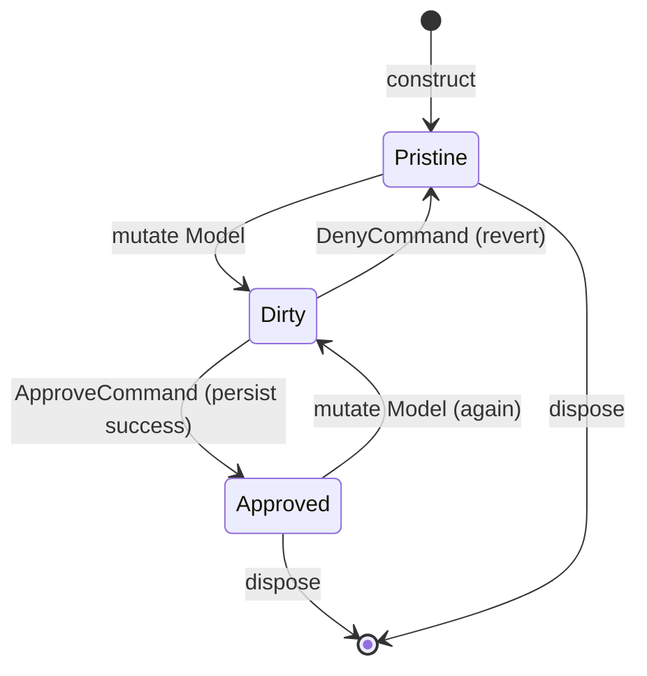

# 20 — `FormVM<TM>` (snapshot/revert edit lifecycle)

A **ViewModel that wraps a mutable domain model with an edit lifecycle**: snapshot on
construct, allow mutation, then either Approve (persist) or Deny (revert). See
[ADR-0030](ADRs/0030-form-vm.md) for the design rationale and the ORM-agnostic
decision.

## 1. Overview

`FormVM<TM>` is for any UI pattern that lets a user edit an entity and then either
save or cancel. It eliminates the recurring boilerplate of snapshot/dirty/revert that
appears in every CRUD screen.

Key properties:

- **ORM-agnostic** — the persist step is a consumer-supplied delegate or
  `IFormPersister<TM>` collaborator.
- **Snapshot at construct** — `Snapshot` is captured once and is immutable after that
  (until a successful `ApproveCommand` updates it).
- **`IsDirty`** is derived automatically from structural inequality of `Model` vs
  `Snapshot`.
- **`DenyCommand`** (Cancel) reverts `Model` to `Snapshot` and publishes hub
  messages.
- **`ApproveCommand`** (Save) invokes the persister; on success updates `Snapshot`
  and raises `OnApproved`.
- **Strict mode** (opt-in): `ApproveCommand.CanExecute = IsDirty`.

## 2. Shape

```
FormVM<TM>:
    Model          : TM            # live, editable (read-only; mutate via SetModel)
    Snapshot       : TM            # read-only after construct (until next approve)
    IsDirty        : bool          # Model != Snapshot (structural equality)
    DenyCommand    : ICommand      # reverts Model to Snapshot; publishes hub messages
    ApproveCommand : ICommand      # invokes persister; updates Snapshot on success
    OnApproved     : event/obs     # fires after successful persist

    SetModel(newModel : TM) -> void   # mutator (per-flavor idiomatic name)
    ApproveAsync() -> Task            # awaitable entry-point for the persist flow
```

`ApproveCommand` invokes `ApproveAsync` internally; consumers may either bind the
command or call the awaitable directly when finer control is needed.

Constructor parameters (per-flavor idiomatic; order matches shipped C# / Python
constructors — also catalogued in ADR-0009 §"FormVM<TM> constructor shape"):

```
FormVM(
    initial     : TM,
    persister   : Func<TM, Task>,   # or IFormPersister<TM>
    hub?        : IMessageHub,      # optional hub; default is the null hub
    strict?     : bool = false,
    snapshotter?: Func<TM, TM>      # custom snapshot function (opt-in)
)
```

## 3. Snapshot policy

The default snapshot is a **per-flavor idiomatic value-copy**. The C# and
Python defaults are shallow (nested mutable references are shared between
`Model` and `Snapshot`); the TypeScript default is a structured deep clone
(nested references are independent). Consumers whose model has nested
mutable state should pick a snapshotter that matches the semantics they
want — see the row notes:

| Flavor     | Default mechanism                                                                 |
| ---------- | --------------------------------------------------------------------------------- |
| C#         | reflective `MemberwiseClone` — shallow (equivalent to `with {}` for record types) |
| Python     | `copy.copy` (`__copy__` if defined, else shallow attribute copy) — shallow        |
| TypeScript | `structuredClone` (plain object models) — structured deep clone                   |

Consumers whose model type requires a different strategy supply a custom
`snapshotter: Func<TM, TM>` at construction time. The snapshotter is also applied
when `DenyCommand` restores from `Snapshot`, ensuring consistent copy semantics.

## 4. Dirty detection

`IsDirty` is derived from structural (value) inequality:

```
IsDirty = (Model != Snapshot)
```

Each flavor uses its idiomatic equality operator/method:

- C#: `object.Equals` (record types use structural equality by default).
- Python: `__eq__` (`@dataclass(eq=True)` or `@dataclass(frozen=True)` by default).
- TypeScript: JSON serialization comparison (`JSON.stringify`) for plain objects.
  Caveat (clarified in v2.5.0 via ADR-0037): `JSON.stringify` is
  key-order sensitive — two structurally-equal objects whose keys were
  assigned in different orders compare as *dirty*. FORM-003's "equal value
  objects" guarantee therefore holds for same-shaped literals (the common
  snapshot/revert flow, where snapshots are produced by the snapshotter
  from the model itself); consumers needing order-insensitive comparison
  should supply a custom `snapshotter`/model normalization.

## 5. Lifecycle state diagram



Notes:

- `Pristine` means `IsDirty == false`; `Dirty` means `IsDirty == true`.
- `Approved` is a transient state: `Snapshot` advances to equal `Model`, so
  `IsDirty` becomes `false` immediately after `OnApproved`.
- After approval, a subsequent mutation transitions back to `Dirty`.

## 6. `IDialogService` integration

`IDialogService` (chapter 19) is a natural collaborator: wrapping `DenyCommand` with
`ConfirmationDecoratorCommand` (chapter 04 §8) allows "Are you sure you want to
discard changes?" prompts:

```
// Pseudo-code (per-flavor idiomatic)
var confirmDeny = denyCommand.Confirm(() => dialogService.Confirm("Discard changes?"));
```

This is a **documented composition pattern** only — `FormVM` does not depend on
`IDialogService`. Conformance test `FORM-010` exercises this integration.

## 7. Hub messages

`DenyCommand` publishes two messages on the message hub (chapter 03) after reverting:

1. **`FormRevertedMessage`** — `{ sender: FormVM }` — signals that the form was
   reverted to its snapshot.
1. **`PropertyChangedMessage("Model")`** — standard property-change notification for
   `Model`, per chapter 03 §2 rules.

`ApproveCommand` does not publish hub messages directly; the `OnApproved`
event/observable serves as the signal.

### `FormRevertedMessage`

```
FormRevertedMessage:
    sender      : FormVM          # the FormVM that was reverted
    sender_name : string          # per-flavor: type name of sender
```

## 8. Strict mode

Strict mode (opt-in via `strict = true` at construction):

- `ApproveCommand.CanExecute` returns `false` when `IsDirty == false`.
- Prevents saving an unchanged form.

Default mode (strict = false):

- `ApproveCommand.CanExecute` is always `true` (consumer-controlled).
- Allows re-saving without a change (e.g., triggering a re-sync).

## 9. Conformance

- `FORM-001` — Snapshot captured at construct; `Model == Snapshot`; `IsDirty == false` immediately after construction.
- `FORM-002` — Mutating `Model` reflects in `IsDirty == true`; `Snapshot` is
  unchanged.
- `FORM-003` — `IsDirty` uses structural inequality: equal value objects produce
  `IsDirty == false`; structurally different objects produce `IsDirty == true`.
- `FORM-004` — `DenyCommand` reverts `Model` to `Snapshot`; `IsDirty == false`
  after revert.
- `FORM-005` — `ApproveCommand` invokes the persister delegate; on success `Snapshot`
  is updated to the current `Model` value.
- `FORM-006` — `OnApproved` event/observable fires only after a successful persist;
  it does not fire when the persister throws.
- `FORM-007` — When the persister throws, no state mutation occurs: `Snapshot` and
  `Model` remain unchanged, `IsDirty` is still `true`.
- `FORM-008` — `DenyCommand` publishes `FormRevertedMessage` and
  `PropertyChangedMessage("Model")` on the hub.
- `FORM-009` — Strict mode: `ApproveCommand.CanExecute == false` when
  `IsDirty == false`; becomes `true` when `IsDirty == true`.
- `FORM-010` — Integration with `IDialogService.Confirm`: wrapping `DenyCommand`
  with a confirmation guard prevents revert when the user cancels the prompt.
- `FORM-011` — `FormVMBuilder<TM>.Build()` validates required `Initial` and
  `Persister`; missing either raises `BuilderValidationError` /
  `BuilderValidationException` with a message identifying the missing field
  (added in v2.3 via ADR-0035).
- `FORM-012` — `FormVMBuilder<TM>` repeated identical `Build()` calls produce
  independent instances that share the same configured `Initial` / `Persister`
  / optional fields, each starting at `IsDirty == false`.
- `FORM-013` — `FormVMBuilder<TM>` field defaults applied when not set:
  `Hub` defaults to the flavor's `NullMessageHub` singleton, `Snapshot` to
  the default shallow-copy of `Initial`, and `Strict` to `false` (so
  `ApproveCommand.CanExecute()` returns `true` regardless of `IsDirty`).
